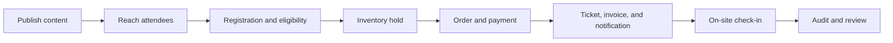
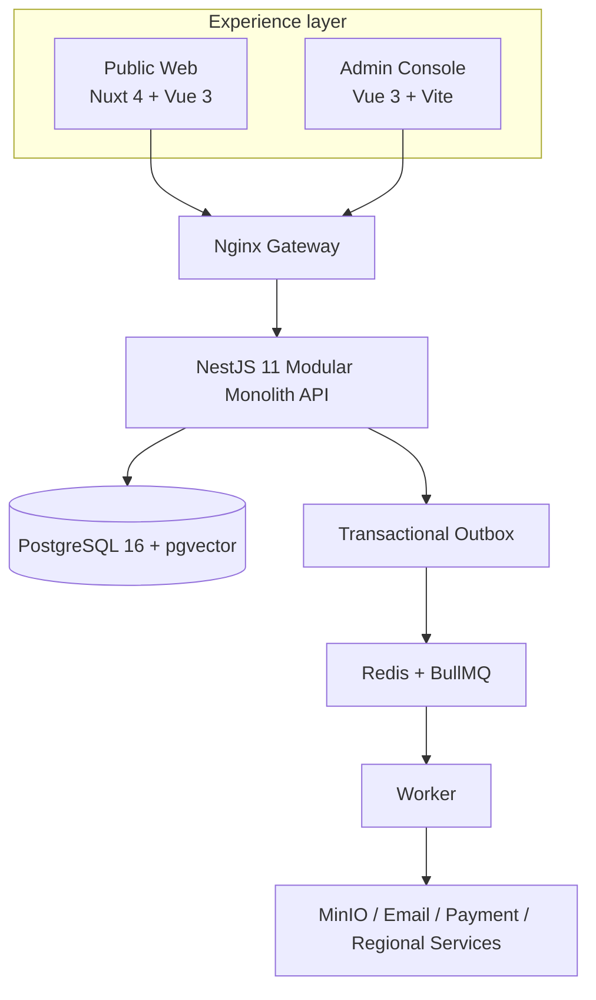

# TokEMS

[简体中文](README.md) | English

[](LICENSE)
[](https://github.com/yaojingang/TokEMS/actions/workflows/ci.yml)
[](CHANGELOG.md)

An open-source, self-hosted conference operations platform for event websites, registration, ticketing, orders, invoicing, notifications, and check-in.

TokEMS is built for conference organizers, operations teams, and event technology providers. It brings content publishing, attendee journeys, transactions, on-site delivery, organization permissions, and audit records into one system.

> `v0.1.0` is an early preview for local evaluation, customization, and pre-production validation. Production deployments require region-specific security, compliance, payment, messaging, backup, and monitoring configuration. The admin console is currently Simplified Chinese-first, with English support on the near-term roadmap.

## Project overview

TokEMS covers the conference journey from content publishing to on-site verification. The public site handles content and registration, the API owns business state such as organizations, inventory, orders, and tickets, and the Worker runs notifications, waitlist jobs, exports, and other asynchronous work.

The [full visual report](docs/tokems-visual-report.html) covers use cases, system design, technology, product areas, security controls, deployment, and the internationalization roadmap. It is a self-contained HTML file that can be downloaded, opened locally, or printed to PDF.

### Where it fits

| Scenario                       | What TokEMS provides                                                                                |
| ------------------------------ | --------------------------------------------------------------------------------------------------- |
| Medium and large conferences   | One workflow for the event site, registration, paid tickets, notifications, invoicing, and check-in |
| Organizers running many events | Multi-organization isolation, fine-grained RBAC, reusable templates, rollback, and audit records    |
| Event technology providers     | Self-hosted deployment, modular applications, shared contracts, and payment or messaging boundaries |
| Busy or unreliable venues      | Device tokens, QR verification, duplicate detection, offline batch sync, and multi-device testing   |

### Current project size

These numbers come from [`docs/generated/project-inventory.json`](docs/generated/project-inventory.json) and are checked by `pnpm docs:check`.

| Public pages | Admin views | API controllers | API operations | Database tables | Migrations | Test files |
| -----------: | ----------: | --------------: | -------------: | --------------: | ---------: | ---------: |
|           13 |          31 |              25 |            207 |              66 |         51 |        116 |

### End-to-end workflow



### System architecture



Immutable release snapshots keep public content stable while ticket inventory stays live. Locks, signatures, hashes, time windows, and idempotency keys protect order holds, payment callbacks, waitlist claims, and offline check-in.

## Features

| Area               | Available today                                                                                                                              |
| ------------------ | -------------------------------------------------------------------------------------------------------------------------------------------- |
| Event website      | Template-driven pages, release snapshots, schedules, speakers, ticket types, FAQ, registration, attendee account, and responsive layouts     |
| Registration       | Versioned forms and terms, inventory holds, idempotent registration, protected order access, payment callbacks, refunds, and digital tickets |
| Waitlist           | Sellout queue, ordered invitations, timed inventory holds, single-use purchase tokens, and automatic expiry                                  |
| Admin console      | Events, templates, users, registrations, orders, invoices, notifications, system settings, release rollback, and audit management            |
| Templates          | Structured and HTML templates, shared drafts, immutable versions, image assets, upgrades, and release snapshots                              |
| Invoicing          | Requests, billing details, review, issuance, file delivery, cancellation, refund adjustments, and asynchronous export                        |
| On-site operations | Device enrollment, device tokens, QR check-in, offline batch sync, and duplicate check-in detection                                          |
| Platform           | Multi-organization isolation, fine-grained RBAC, Outbox delivery, rate limits, object storage, Swagger, and audit logs                       |

## Technology

- Web: Nuxt 4 and Vue 3
- Admin: Vue 3 and Vite
- API: NestJS 11, Fastify, and Zod
- Worker: BullMQ and Redis
- Data: PostgreSQL 16, pgvector, and Drizzle ORM
- Infrastructure: Docker Compose, Nginx, MinIO, and Mailpit
- Tooling: TypeScript, pnpm, Turborepo, Vitest, and Playwright

## Repository layout

```text
apps/
  web/        Public event site, registration, orders, tickets, and attendee account
  admin/      Conference operations console
  api/        REST API and Swagger documentation
  worker/     Notifications, waitlist jobs, asset tasks, and asynchronous exports
packages/
  contracts/  Zod contracts, TypeScript types, and demo data
  database/   Drizzle schema, SQL migrations, and seeds
  html-template/ HTML template parsing, validation, and publishing
  integrations/  Payment and notification integrations
  security/   Sessions, CSRF, OTP, and encrypted integration credentials
  ui/         Shared design tokens
docs/         Architecture, API, operations, and internationalization documents
tooling/      Deployment, acceptance, and data maintenance scripts
```

## Run locally

Requirements: Node.js 24+, pnpm 11+, and Docker Desktop.

```bash
pnpm install
pnpm docker:deploy
```

The deployment command builds the application images, starts dependencies, applies database migrations, seeds demo data, and runs service-level checks. Default services bind to loopback addresses only.

| Service       | URL                                       |
| ------------- | ----------------------------------------- |
| Event website | <http://localhost:8088>                   |
| Admin console | <http://admin.localhost:8088/admin/login> |
| API           | <http://localhost:8088/api/v1>            |
| Swagger       | <http://localhost:8088/api/docs>          |
| MinIO Console | <http://localhost:19001>                  |
| Mailpit       | <http://localhost:8025>                   |

Local admin credentials:

```text
Username: admin
Password: admin
```

The public site accepts any valid mainland China mobile number with the fixed code `123456` in local mode. These simplified credentials only work with `DEPLOYMENT_MODE=local`. Production mode rejects local authentication and simulated payments.

To change ports or local settings:

```bash
cp .env.example .env
pnpm docker:deploy
```

For source development, run `pnpm dev`. The web app, admin console, and API listen on `localhost:3000`, `localhost:3200/admin/`, and `localhost:4100` by default.

## Commands

```bash
pnpm check                 # Lint, types, tests, builds, and documentation inventory
pnpm audit:security        # Audit high-severity dependency issues
pnpm docker:verify         # Verify container services
pnpm test:persistent       # Verify persistent business workflows
pnpm test:operations       # Verify admin and release workflows
pnpm test:waitlist         # Verify waitlist and inventory handoff
pnpm test:checkin-load     # Verify concurrent device check-in
pnpm test:visual           # Verify key desktop and mobile flows
```

## Internationalization status

TokEMS is intended for conference teams worldwide. The `v0.1.0` interface is primarily Simplified Chinese, and the first payment, SMS, and mobile number flows target mainland China. The admin console will support `zh-CN` and `en-US` first. Event websites, notification templates, time zones, currencies, addresses, and regional integrations will follow.

See the [internationalization roadmap](docs/internationalization.md) for scope and release gates.

## Production checklist

- Replace database, Redis, object storage, session, and encryption secrets from `.env`.
- Disable simplified authentication, fixed verification codes, and simulated payments.
- Configure HTTPS, trusted proxies, persistent backups, monitoring, and alerts.
- Review privacy, payment, tax, messaging, and data residency requirements for each deployment region.
- Back up the database and apply versioned migrations in order before upgrades.

See the [operations guide](docs/operations.md) for deployment details.

## Documentation

- [Architecture and design decisions](docs/architecture.md)
- [Admin information architecture](docs/admin-architecture.md)
- [REST API summary](docs/api.md)
- [Attendee account system](docs/user-system.md)
- [Operations, migrations, and releases](docs/operations.md)
- [Internationalization roadmap](docs/internationalization.md)
- [Security policy](SECURITY.md)
- [Community support](SUPPORT.md)
- [Contributing guide](CONTRIBUTING.md)

## Contributing

Use [GitHub Discussions](https://github.com/yaojingang/TokEMS/discussions) for deployment and usage questions. Read the [support guide](SUPPORT.md), [contributing guide](CONTRIBUTING.md), and [Code of Conduct](CODE_OF_CONDUCT.md) before opening an issue or pull request. Report security issues privately by following the [security policy](SECURITY.md).

## License

TokEMS is licensed under the [GNU Affero General Public License v3.0 only](LICENSE). If you provide a modified TokEMS service over a network, the license requires you to offer the corresponding source code to its users.
