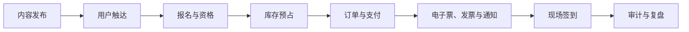
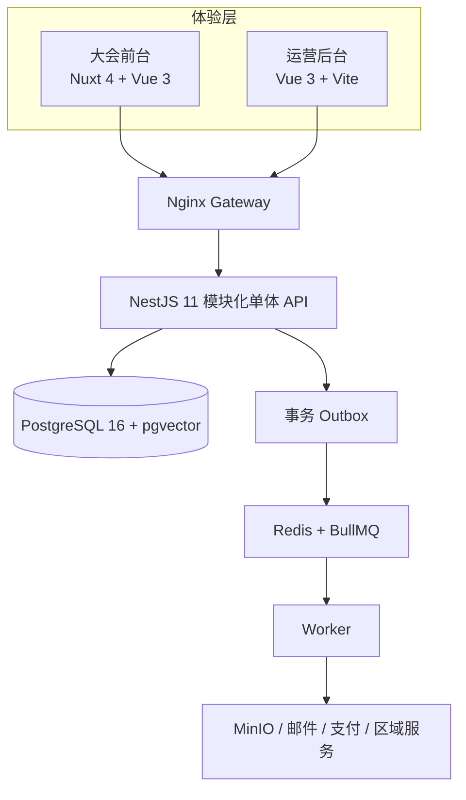

# TokEMS

简体中文 | [English](README.en.md)

[](LICENSE)
[](https://github.com/yaojingang/TokEMS/actions/workflows/ci.yml)
[](CHANGELOG.md)

开源、自托管的一体化大会运营平台，覆盖大会官网、报名、票务、订单、发票、通知和现场签到。

TokEMS 面向大会主办方、活动运营团队和技术服务商。团队可以在一个系统内管理内容发布、参会者旅程、交易履约与现场协作，并保留完整的组织权限和审计记录。

> 当前版本为 `v0.1.0` 早期预览版，适合本地评估、二次开发和预发布验证。生产部署需要结合实际地区与供应商完成安全、合规、支付、通知、备份和监控配置。管理后台当前以简体中文为主，英文界面列入近期路线图。

## 项目全景

TokEMS 沿着大会从内容发布到现场核验的完整流程设计。公开站承接内容和报名，API 维护组织、库存、订单与票据等业务事实，Worker 处理通知、候补、导出和其他异步任务。

[完整可视化分析报告](docs/tokems-visual-report.html)包含适用场景、技术原理、技术栈、功能域、安全控制、部署拓扑和全球化路线。报告为单文件 HTML，可下载后直接打开或打印为 PDF。

### 适用场景

| 场景               | TokEMS 提供的能力                                              |
| ------------------ | -------------------------------------------------------------- |
| 中大型行业大会     | 官网、报名、付费票、通知、发票和现场签到在同一套业务流程中协作 |
| 多活动组织方       | 多组织隔离、细粒度 RBAC、模板复用、发布回滚和审计记录          |
| 活动技术服务商     | 自托管部署、模块化应用、共享契约，以及支付和通知集成边界       |
| 高峰现场与弱网环境 | 设备令牌、二维码核销、重复检测、离线批次同步和多设备并发验收   |

### 当前工程规模

以下数据由 [`docs/generated/project-inventory.json`](docs/generated/project-inventory.json) 生成，并由 `pnpm docs:check` 校验。

| 公开站页面 | 管理端视图 | API Controllers | API Operations | 数据库表 | 数据库迁移 | 测试文件 |
| ---------: | ---------: | --------------: | -------------: | -------: | ---------: | -------: |
|         10 |         34 |              23 |            175 |       60 |         39 |       42 |

### 端到端业务链路



### 系统架构



公开页面通过不可变发布快照保持稳定，票务库存继续实时计算。订单预占、支付回调、候补领取和离线签到分别使用锁、签名、哈希、时间窗口和幂等约束维护状态一致性。

## 已实现能力

| 产品域   | 当前能力                                                                                                     |
| -------- | ------------------------------------------------------------------------------------------------------------ |
| 大会官网 | 模板驱动页面、发布快照、议程、嘉宾、票种、FAQ、报名流程、个人中心和响应式布局                                |
| 报名交易 | 版本化表单与条款、库存保留、幂等报名、订单访问令牌、微信 Native/JSAPI/H5 三通道支付、支付回调、退款和电子票  |
| 支付入口 | 大会主站与 `PAYMENT_PUBLIC_URL`（如 `/pay/hui`）双入口；OAuth 与 H5 回跳走支付域，稳定 notify 固定在主站 API |
| 候补队列 | 售罄入队、顺序邀约、限时名额保留、一次性购买令牌和过期递补                                                   |
| 运营后台 | 大会、模板、用户、报名、订单、发票、通知、系统设置、发布回滚和审计管理                                       |
| 模板系统 | 结构化模板与 HTML 模板、草稿协作、不可变版本、图片资产、升级和发布快照                                       |
| 发票管理 | 申请、资料补充、审核、开具、文件发送、作废、退款调整和异步导出                                               |
| 现场运营 | 设备登记、设备令牌、二维码核销、离线批次同步和重复核销识别                                                   |
| 平台基础 | 多组织隔离、细粒度 RBAC、Outbox、限流、对象存储、Swagger 和审计日志                                          |

## 技术栈

- 前台：Nuxt 4、Vue 3
- 管理后台：Vue 3、Vite
- API：NestJS 11、Fastify、Zod
- Worker：BullMQ、Redis
- 数据：PostgreSQL 16、pgvector、Drizzle ORM
- 基础设施：Docker Compose、Nginx、MinIO、Mailpit
- 工程：TypeScript、pnpm、Turborepo、Vitest、Playwright

## 仓库结构

```text
apps/
  web/        大会前台、报名、订单、电子票和个人中心
  admin/      大会运营管理台
  api/        REST API 与 Swagger 文档
  worker/     通知、候补、资产任务和异步导出
packages/
  contracts/  Zod 契约、TypeScript 类型和示例数据
  database/   Drizzle Schema、SQL 迁移和种子数据
  html-template/ HTML 模板解析、校验与发布
  integrations/  支付和通知集成
  security/   会话、CSRF、验证码和敏感载荷加密
  ui/         跨端设计令牌
docs/         架构、接口、运行手册和国际化规划
tooling/      部署、验收和数据维护脚本
```

## 本地启动

环境要求：Node.js 24+、pnpm 11+、Docker Desktop。

```bash
pnpm install
pnpm docker:deploy
```

部署脚本会构建应用镜像、启动依赖服务、执行数据库迁移与种子初始化，并完成服务级验收。默认服务只绑定本机回环地址。

| 服务          | 地址                                      |
| ------------- | ----------------------------------------- |
| 大会前台      | <http://localhost:8088>                   |
| 运营后台      | <http://admin.localhost:8088/admin/login> |
| API           | <http://localhost:8088/api/v1>            |
| Swagger       | <http://localhost:8088/api/docs>          |
| MinIO Console | <http://localhost:19001>                  |
| Mailpit       | <http://localhost:8025>                   |

本地后台演示账号：

```text
用户名：admin
密码：admin
```

本地前台可使用任意有效的中国大陆手机号和固定验证码 `123456`。这些简化凭据仅在 `DEPLOYMENT_MODE=local` 下生效，生产模式会拒绝本地认证与模拟支付配置。

需要自定义端口或本地配置时：

```bash
cp .env.example .env
pnpm docker:deploy
```

源码开发可运行 `pnpm dev`。前台、后台和 API 默认分别监听 `localhost:3000`、`localhost:3200/admin/` 和 `localhost:4100`。

## 常用命令

```bash
pnpm check                 # lint、类型、单元测试、构建和文档清单
pnpm audit:security        # 高危依赖审计
pnpm docker:verify         # 容器服务验收
pnpm test:persistent       # 持久化业务链路验收
pnpm test:operations       # 运营后台与保存生效流程验收
pnpm test:waitlist         # 候补与名额递补验收
pnpm test:checkin-load     # 多设备并发核销验收
pnpm test:visual           # 前后台视觉与交互验收
```

## 全球化与语言支持

TokEMS 的产品定位面向全球大会运营团队。`v0.1.0` 的界面语言以简体中文为主，首批支付、短信和手机号流程按中国大陆场景实现。管理后台会先支持 `zh-CN` 与 `en-US`，随后扩展大会前台、通知模板、时区、货币、地址和区域集成。

完整方案见[国际化规划](docs/internationalization.md)。

## 生产部署提醒

- 替换 `.env` 中的数据库、Redis、对象存储、会话和加密密钥。
- 关闭简化认证、固定验证码与模拟支付。
- 配置 HTTPS、受信代理、持久化备份和监控告警。
- 按所在地区评估隐私、支付、税务、短信和数据驻留要求。
- 升级前备份数据库，并按顺序执行版本化迁移。

运行细节见[运行与发布手册](docs/operations.md)。

## 文档

- [系统架构与设计决策](docs/architecture.md)
- [后台管理信息架构](docs/admin-architecture.md)
- [后台默认大会入口与工作区升级计划](docs/admin-event-workspace-upgrade-plan.md)
- [报名详情统一运营工作台最终方案](docs/admin-registration-detail-unified-operations-plan-final.md)
- [REST API 摘要](docs/api.md)
- [普通用户系统](docs/user-system.md)
- [运行、迁移与发布](docs/operations.md)
- [国际化规划](docs/internationalization.md)
- [安全策略](SECURITY.md)
- [社区支持](SUPPORT.md)
- [贡献指南](CONTRIBUTING.md)

## 参与贡献

部署交流和使用问题请前往 [GitHub Discussions](https://github.com/yaojingang/TokEMS/discussions)。提交 Issue 或 Pull Request 前，请先阅读[社区支持](SUPPORT.md)、[贡献指南](CONTRIBUTING.md)和[行为准则](CODE_OF_CONDUCT.md)。安全问题请按[安全策略](SECURITY.md)私下报告。

## 许可证

TokEMS 使用 [GNU Affero General Public License v3.0 only](LICENSE) 发布。通过网络向用户提供修改后的 TokEMS 服务时，需要按许可证要求提供对应源代码。
