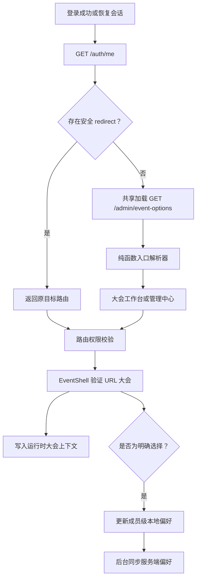

# TokEMS 后台默认大会入口与工作区升级计划

> 状态：代码与自动化验收已完成，待灰度发布｜版本：v3.0（最终实施版）｜评审日期：2026-08-03｜适用范围：TokEMS 运营后台｜发布方式：3 个可独立发布和回滚的阶段

## 方案结论

后台继续保留两个清晰的工作范围：

- **管理中心**负责大会列表、用户、模板和组织设置。
- **大会工作台**负责一场大会的配置、内容、报名、发票、订单、通知和现场执行。

管理员登录后优先回到当前大会。当前大会按“当前成员 + 当前组织”隔离，优先使用这个浏览器最近一次明确选择且仍可访问的非归档大会。新浏览器没有本地记录时，再使用服务端最近一次成功同步的大会。系统无法安全判断时进入大会列表，由管理员完成选择。

这套规则覆盖四类常用场景：

1. 返回型管理员直接继续当前大会。
2. 首次登录或多场大会同时运营时先选择大会。
3. 深链接保留原目标页面和工作范围。
4. 大会切换与管理中心都保持一次操作可达。

## 本轮评审补充

本轮复核对原方案做了六项调整：

1. **同浏览器偏好优先于服务端偏好。** 较旧的跨设备记录不会覆盖当前浏览器的新选择。
2. **旧的全局大会存储键直接清理。** 旧键无法证明所属账号，迁移它会留下同组织跨账号串用的可能。
3. **增加轻量大会上下文接口。** 现有大会列表会逐大会读取模板绑定，不适合进入每次登录的关键链路。
4. **入口加载使用单次共享请求。** 登录页、路由入口和大会外壳复用同一份大会上下文，避免重复请求和导航竞争。
5. **明确偏好同步的一致性边界。** 同标签页写入串行合并；跨设备以服务端最后成功处理的选择为准；业务请求始终以 URL 中的大会编号为准。
6. **用可执行的走查替代缺少采集基础的行为比例。** 当前项目没有后台行为分析链路，本次不为单个入口改造引入新的用户追踪系统。

## 目标与边界

### 产品目标

- 返回型管理员登录后减少一次固定点击。
- 当前大会身份在桌面端和移动端持续可见。
- 管理员可以快速切换大会，也能随时进入管理中心。
- 无效链接、过期偏好、跨账号登录和接口失败不会产生错误大会上下文。
- 新增入口逻辑不会明显增加登录请求数量或数据库查询量。

### 本次交付

- 登录、会话恢复、已登录访问 `/login` 和旧版兼容路由共用入口解析规则。
- 最近大会按成员和组织隔离，并在第三阶段同步到服务端成员偏好。
- 新增轻量大会上下文接口，供入口解析和大会切换使用。
- 大会工作台强化当前大会标识、切换入口、前台入口和管理中心入口。
- 自动化测试覆盖入口决策、权限、失效上下文、偏好隔离、接口性能形态和移动端导航。

### 本次不处理

- 合并管理中心和大会工作台的路由或侧栏。
- 改变大会 URL 作为业务请求范围来源的约束。
- 调整角色、授权模型或增加大会级成员关系。
- 重做大会概览指标和业务模块。
- 为大会管理列表增加分页和全文检索。
- 记录大会内最后访问的具体业务页面。
- 增加“每次登录显示大会列表”等个人设置。
- 建设新的后台行为分析平台。

## 现状依据

现有代码已经提供了大部分基础能力：

- [后台信息架构](./admin-architecture.md)定义了管理中心和大会工作台两个范围，也写明浏览器存储可用于登录后的最近大会跳转。
- [登录页](../apps/admin/src/views/LoginView.vue)完成认证后调用 `session.landingRouteName()`，拥有 `event.read` 的管理员目前进入大会管理列表。
- [会话模块](../apps/admin/src/lib/api.ts)使用全局键保存大会编号和 slug，并在缺少记录时回退到演示大会。
- [路由](../apps/admin/src/router.ts)会在大会列表完成验证前写入路由中的大会编号。
- [大会工作台](../apps/admin/src/components/EventShell.vue)已经能加载大会、验证当前路由和切换大会。
- [大会概览](../apps/admin/src/views/DashboardView.vue)已经包含报名、订单、收入、签到、待办和快捷操作，适合作为多数管理员的大会首页。

现有 `GET /admin/events` 同时返回报名数量、发布信息和模板版本。服务层先查询大会和报名数量，再为每场大会查询一次模板绑定。把它直接加入登录链路后，数据库查询数会随大会数量增长，因此本计划增加用途更窄的上下文接口。

当前权限模型是组织级授权。拥有 `event.read` 的成员可以读取当前组织的大会列表，本计划沿用这个边界，不引入大会级访问控制。

## 对标参考

截至 2026-08-03，几类大会系统采用的入口方式各有侧重：

- [Cvent](https://support.cvent.com/articles/en_US/Instructions/Filtering-and-Sorting-Events-in-Event-Diagramming)登录后展示即将举办的活动列表，并允许记住列表筛选，适合同时管理大量活动的团队。
- [Eventbrite Organizer](https://www.eventbrite.com/help/en-us/articles/883605/getting-started-with-eventbrite-organizer-our-box-office-solution-for-your-events/)首次进入时选择组织和活动，后续围绕活动仪表盘工作，并保留活动切换入口。
- [Whova](https://whova.zendesk.com/hc/en-us/articles/115003579051-I-already-have-an-account-with-Whova-do-I-need-to-create-another-one-for-my-new-event)用一个账号管理全部活动，通过活动列表进入各自独立的活动后台。

TokEMS 同时服务多大会管理和单场大会运营。最近大会适合返回型用户，多候选场景继续由大会列表承接。

## 产品规则

### 大会状态分组

入口解析使用以下分组：

| 分组     | 状态                                                        | 用途                                   |
| -------- | ----------------------------------------------------------- | -------------------------------------- |
| 进行中   | `in_progress`                                               | 优先判断当前正在执行的大会             |
| 运营中   | `draft`、`configuring`、`prepublished`、`registration_open` | 判断近期正在筹备或开放报名的大会       |
| 历史大会 | `ended`                                                     | 可以由最近大会、明确链接或唯一候选进入 |
| 已归档   | `archived`                                                  | 不参与自动选择和最近大会记录           |

### 登录入口优先级

入口解析器按以下顺序返回一个路由结果：

| 优先级 | 条件                                 | 结果                                                 |
| ------ | ------------------------------------ | ---------------------------------------------------- |
| 1      | 存在通过安全校验的 `redirect`        | 返回原目标，由原路由权限守卫继续校验                 |
| 2      | 当前角色没有可访问的大会工作台页面   | 进入第一个有权限的管理中心页面                       |
| 3      | 当前浏览器的成员级最近大会有效       | 进入该大会的角色默认页                               |
| 4      | 本地没有有效记录，服务端最近大会有效 | 进入该大会的角色默认页，并写入当前浏览器的成员级记录 |
| 5      | 可用大会中只有一个处于进行中         | 进入该大会的角色默认页                               |
| 6      | 可用大会中只有一个仍在运营           | 进入该大会的角色默认页                               |
| 7      | 只有一个非归档大会                   | 进入该大会的角色默认页                               |
| 8      | 存在多个候选大会或没有可用大会       | 进入大会管理列表                                     |
| 9      | 当前角色也无法读取大会列表           | 进入第一个有权限的管理中心页面或无权限页             |

安全深链接优先返回，因此登录后恢复原页面时无需先请求大会上下文列表。进入大会路由后，由大会外壳加载并验证对应大会。

### 最近大会有效条件

大会同时满足以下条件时可以作为默认入口：

- 大会属于当前登录组织。
- 当前成员拥有 `event.read`。
- `eventLandingRouteName()` 能返回一个有权限的大会工作台页面。
- 大会存在于轻量上下文接口的响应中。
- 大会状态不为 `archived`。

本地偏好失效时立即删除当前成员和组织下的记录。服务端偏好失效时在后台请求清理。登录继续成功，并在大会列表显示一次性说明：`上次访问的大会已归档或不可用，请重新选择。`

### 角色默认页

保留现有 `eventLandingRouteName()` 的权限顺序：

| 权限                      | 默认页         |
| ------------------------- | -------------- |
| `event.dashboard.read`    | 大会概览       |
| `event.manage`            | 大会基本信息   |
| `event.site.read`         | 前台与模板     |
| 报名或库存管理权限        | 报名与支付设置 |
| `event.registration.read` | 报名管理       |
| `event.order.read`        | 订单与退款     |
| `event.notification.read` | 通知中心       |
| 签到执行或管理权限        | 现场签到       |
| `event.audit.read`        | 操作记录       |

品牌入口也使用这个角色默认页。缺少 `event.dashboard.read` 的角色不会被送到大会概览后再显示 403。

`event.content.manage` 与 `event.ai.read` 不再提供独立后台页面。大会内容后续通过配套 Skill 或 API 维护；同时拥有 `event.site.read` 的内容管理员默认进入基本信息页的公开页面展示区块。

### 明确选择与自动选择

以下行为会更新最近大会：

- 在大会管理列表点击“进入工作台”或“继续管理”。
- 在大会切换器中选择另一场大会。
- 通过有效的非归档大会深链接进入工作台，且该大会与本地记录不同。

以下行为只更新运行时大会，不写偏好：

- 页面刷新。
- 入口解析器按唯一候选规则自动进入大会。
- 打开归档大会的明确链接。
- 加载失败或无效大会链接。

实现时拆分 `setRuntimeEvent()` 和 `rememberEvent()`，调用点可以明确表达是否保存偏好。

### 异常和边界行为

| 场景                           | 行为                                                         |
| ------------------------------ | ------------------------------------------------------------ |
| 大会上下文接口读取失败         | 登录保持成功，进入大会管理列表并显示读取错误，不自动重试跳转 |
| 路由大会不存在或不属于当前组织 | 显示现有大会不可用页面，不覆盖最近大会                       |
| 大会在登录后被归档             | 当前页面完成下一次上下文刷新后提示已不可用，并清除对应偏好   |
| 本地偏好有效、服务端偏好不同   | 当前浏览器使用本地偏好                                       |
| 本地偏好失效、服务端偏好有效   | 清除本地记录，使用服务端偏好                                 |
| 多个大会同时进行且没有偏好     | 显示大会列表，不猜测管理员意图                               |
| 当前角色只有管理中心权限       | 直接进入有权限的管理中心页面                                 |
| 当前角色只有 `event.read`      | 进入大会管理列表，不自动进入没有可访问页面的大会工作台       |

## 工作区界面

### 大会工作台侧栏

侧栏上下文区域显示大会全称、状态和日期。TokEMS 品牌链接进入当前角色的大会默认页，管理中心作为独立工具入口固定放在大会导航下方、账号区域上方。

```text
TokEMS

大会工作台
[ 深圳大会 2026                 v ]
  报名开放 · 08 月 18 日至 08 月 20 日

大会概览
大会配置
报名管理
发票管理
订单与退款
通知中心
现场签到

管理中心                           >
个人账号
```

大会切换器采用按钮打开的选择面板：

- 默认显示当前大会全称，第二行显示状态和日期。
- 非归档大会不超过 8 个时直接显示完整列表。
- 非归档大会超过 8 个时显示搜索框，并按进行中、运营中、已结束分组。
- 同组内，进行中和运营中按开始时间升序排列，已结束按结束时间降序排列。
- 已归档大会从默认切换列表隐藏，可通过“查看全部大会”进入大会管理列表。
- 列表底部固定提供“查看全部大会”。
- 切换后进入目标大会的角色默认页，不继承原大会的业务子路由和查询参数。
- 桌面端使用定位面板，移动端放入导航抽屉；关闭后焦点回到切换按钮。
- 选择面板使用带标题的对话框语义，搜索结果使用按钮列表，支持 Tab、Shift+Tab 和 Escape。

### 管理中心

管理中心保留大会、用户、模板和系统设置。管理中心品牌链接进入当前角色的管理中心默认页，页面不读取大会 slug，也不显示“访问前台”。发票管理使用大会工作台中的当前大会范围。

从管理中心进入大会时更新最近大会。管理中心内的普通导航不会改变最近大会，管理员完成组织级任务后再次登录时仍能回到最近运营的大会。

### 页面标题和高影响操作

大会页面标题区域显示大会全称、状态和日期。退款、群发通知、版本发布和批量签到等确认界面必须显示大会名称。这个调整只补充操作对象，不改变业务流程、权限和接口。

## 技术方案

### 登录与导航数据流



业务 API 继续从当前路由读取 `eventId`。最近大会仅用于决定入口，不参与业务请求的大会范围计算。

### 轻量大会上下文接口

新增公开契约 `EventContextOptionSchema`：

```ts
{
  id: EventId;
  slug: string;
  name: string;
  shortName: string;
  status: EventStatus;
  startsAt: string;
  endsAt: string;
  city: string;
  registrationCount: number;
}
```

新增只读接口：

```http
GET /admin/event-options
Authorization: Bearer <token>
Grant: event.read
Response: EventContextOption[]
```

实现要求：

- 使用一次带报名数量聚合的数据库查询。
- 不查询模板绑定、模板版本、发布详情或大会设置 JSON。
- 返回当前组织下的大会，继续由权限守卫验证 `event.read`。
- 入口解析、大会切换器和 `EventShell` 共用这份数据。
- 大会管理列表继续使用现有 `GET /admin/events`，保持当前字段和功能。

### 单次共享加载

在前端会话层增加 `loadEventOptions()` 和 `invalidateEventOptions()`：

- 同一时间只保留一个进行中的请求，其他调用复用同一 Promise。
- 缓存只在当前认证会话内有效，退出登录时清空。
- 新建大会、修改大会名称、状态、日期或归档后主动失效。
- 请求失败不缓存失败结果，当前导航只回退一次，后续用户主动重试可以重新请求。
- 安全深链接在入口解析阶段跳过列表请求；进入大会外壳后再共享加载一次。

`LoginView`、已登录状态下的 `/login` 和旧版兼容路由统一调用 `resolveAdminEntry()`。解析过程只运行一次，路由守卫不再启动第二个并行解析，避免重复请求和互相覆盖的导航结果。

### 前端入口解析器

新增 `apps/admin/src/lib/admin-entry.ts`，包含以下纯函数：

- `safeRedirectRoute()`：解析并校验登录回跳。
- `managementLandingRouteName()`：选择当前角色的管理中心首页。
- `hasEventWorkspaceLanding()`：确认角色至少有一个大会工作台页面。
- `resolveAdminEntry()`：按入口优先级返回路由和原因码。
- `isRememberableEvent()`：验证最近大会条件。

`redirect` 只接受站内绝对路径。校验需要拒绝协议地址、`//`、反斜杠变体、登录页循环、无法匹配的路由和无效大会编号。原路由权限守卫继续负责授权，入口解析器不复制权限判断。

解析结果包含仅供测试和界面提示使用的原因码，例如 `safe_redirect`、`local_recent`、`server_recent`、`single_live`、`single_operational`、`single_event`、`choose_event` 和 `management_only`。原因码不包含用户信息或大会名称。

### 运行时大会上下文

会话层保存已经验证的 `EventContextOption`，并移除演示大会回退：

```ts
activeEvent: Ref<EventContextOption | undefined>;
```

`activeEventId` 和 `activeEventSlug` 改为从 `activeEvent` 计算。`EventShell` 在轻量列表中找到 URL 对应大会后才调用 `setRuntimeEvent()`。路由守卫只解析和验证编号格式，不写大会上下文。

旧版 `/dashboard`、`/event`、`/registrations` 等兼容路由在缺少已验证大会时调用统一入口解析器。兼容层保留一个发布周期，并在后续版本根据访问日志决定是否删除。

实现阶段需要逐项检查所有运行时大会引用，当前已知位置包括：

- `eventScope()` 和所有未显式传入 `eventId` 的 API。
- `publicEventUrl()`。
- 通知队列请求中的默认大会编号。
- 订单导出文件名中的大会 slug。
- 旧版兼容路由的大会编号。

`eventScope()` 继续优先读取 URL，并在缺少明确大会范围时抛出可见错误。`publicEventUrl()` 在缺少已验证 slug 时返回 `undefined`。`AdminFrame` 改为接收可选的 `publicEntryUrl`，只有大会工作台传入地址时才显示“访问前台”。

退出登录时清除令牌、身份、运行时大会和会话内列表缓存。成员级最近大会保留，供同一成员下次登录恢复。

### 成员级本地偏好

存储键格式：

```text
conference.admin.lastEventId.<organizationId>.<publicUserId>
```

只保存大会编号。组织编号和公开用户编号都来自验证成功的 `AuthMe`，不会使用登录表单中的输入推断。

旧键 `conference.admin.eventId` 和 `conference.admin.eventSlug` 没有所属成员信息。升级后首次完成身份验证时直接删除，不导入新键。已有用户可能在升级后的第一次登录进入唯一候选或大会列表，后续选择会建立安全的新记录。

浏览器 `storage` 事件用于刷新其他标签页读取到的最近大会记录，不强制已打开的标签页跳转。每个标签页的业务上下文继续由自己的 URL 决定。

### 服务端成员偏好

第三阶段复用 `member_profiles.preferences`，不增加数据表和迁移。契约如下：

```ts
AdminPreferencesSchema = {
  lastEventId: EventId | null;
}

AuthMe.adminPreferences: AdminPreferences;

PATCH /auth/preferences/admin
Request:  { lastEventId: EventId | null }
Response: { lastEventId: EventId | null }
```

`AuthMe.adminPreferences` 在契约和前端读取处提供 `{ lastEventId: null }` 默认值，使 API 与前端可以分批发布。无数据库的本地演示模式也返回空偏好。

保存前验证以下条件：

- 当前组织成员仍为有效状态。
- 大会属于当前组织且存在。
- 当前成员拥有 `event.read`。
- 大会状态不为 `archived`。

响应规则：

| 输入或状态                     | 响应            |
| ------------------------------ | --------------- |
| 大会编号格式错误               | 400             |
| 大会不存在或属于其他组织       | 404             |
| 成员缺少 `event.read`          | 403             |
| 大会已归档                     | 409             |
| `lastEventId: null` 且成员有效 | 200，并清理偏好 |

偏好更新使用事务内的数据库 JSON 合并表达式或等价的行锁方案，只修改 `preferences.admin.lastEventId`。不得先读取完整 JSON 后在事务外回写，避免覆盖个人资料或后续增加的其他偏好键。清理 `lastEventId` 时保留 `admin` 下的其他字段。

### 偏好同步语义

- 当前浏览器始终以有效的成员级本地记录为入口首选。
- 没有本地记录的新浏览器使用服务端最近一次成功同步的大会，并建立本地记录。
- 明确选择大会时先写本地记录，再异步写服务端；同步失败不阻塞导航。
- 同一标签页的偏好请求串行执行，连续切换时合并中间值，只提交队列末尾仍需同步的大会。
- 多标签页或多设备同时选择时，服务端最后成功处理的请求生效。各标签页当前打开的大会仍由各自 URL 决定。
- 自动选择、刷新和后台加载不重复写服务端。
- 服务端同步失败后保留本地结果；下一次明确选择时重新同步。跨设备恢复属于便利能力，不作为业务数据一致性保证。

偏好只包含内部大会编号，不记录大会名称、访问页面或操作内容。它属于导航状态，不写入业务审计日志。

## 分阶段实施

### 阶段 1：安全直达与轻量上下文

交付结果：同一浏览器中的返回型管理员直达最近大会；首次进入和多候选场景显示大会列表；登录链路使用轻量、共享的大会数据。

实施内容：

- 新增 `EventContextOption` 契约、只读接口和查询测试。
- 新增纯函数入口解析器及决策矩阵测试。
- 增加会话内单次共享加载和缓存失效。
- 将运行时大会改为已验证摘要，移除演示大会回退。
- 以成员和组织隔离的键保存最近大会，清理旧全局键。
- 统一登录页、已登录 `/login` 和旧版兼容路由的入口逻辑。
- 禁止路由守卫和无效链接写入最近大会。
- 更新架构文档和后台升级冒烟测试。

主要文件：

- `packages/contracts/src/index.ts`
- `packages/contracts/src/event-context-option.test.ts`
- `apps/api/src/modules/operations.module.ts`
- `apps/api/src/common/event-operations.service.ts`
- `apps/api/src/common/event-operations.service.test.ts`
- `apps/admin/src/lib/api.ts`
- `apps/admin/src/lib/admin-entry.ts`
- `apps/admin/src/lib/admin-entry.test.ts`
- `apps/admin/src/router.ts`
- `apps/admin/src/views/LoginView.vue`
- `apps/admin/src/components/EventShell.vue`
- `apps/admin/src/views/EventsView.vue`
- `tooling/admin-upgrade-smoke.mjs`
- `docs/admin-architecture.md`

发布顺序：先发布兼容的新接口，再发布管理后台。接口回滚时前端进入大会列表错误态，旧后台不受影响。前端回滚后，新接口保持闲置，不改变业务数据。

### 阶段 2：工作区导航和大会识别

交付结果：管理员在任何大会页面都能确认当前大会、快速切换大会，并在一次操作内进入管理中心。

实施内容：

- 新增大会选择面板和搜索、分组、空状态。
- TokEMS 品牌链接改为当前角色的大会默认页。
- 在侧栏固定增加管理中心入口。
- 大会页面标题补充大会名称、状态和日期。
- 管理中心隐藏大会前台入口。
- 高影响操作的确认界面补充大会名称。
- 完成桌面端和移动端的键盘、焦点、溢出和屏幕阅读器验收。

主要文件：

- `apps/admin/src/components/EventSwitcher.vue`
- `apps/admin/src/components/EventShell.vue`
- `apps/admin/src/components/AdminFrame.vue`
- `apps/admin/src/components/ManagementShell.vue`
- `apps/admin/src/views/DashboardView.vue`
- 涉及退款、通知、发布和批量签到确认的现有视图
- `apps/admin/src/styles/admin.css`
- `apps/admin/src/styles/admin-polish.css`
- `tooling/visual-smoke.mjs`

阶段 2 不改数据和业务接口。回滚界面文件即可恢复原导航，阶段 1 的安全入口规则继续工作。

### 阶段 3：跨设备偏好同步

交付结果：新设备和新浏览器可以恢复最近一次成功同步的大会。

实施内容：

- 为 `AuthMe` 增加带默认值的管理员偏好契约。
- 新增管理员偏好更新契约和 API。
- 从 `member_profiles.preferences` 读取最近大会。
- 用事务内 JSON 合并更新单个偏好键。
- 前端在没有有效本地记录时使用服务端偏好。
- 串行合并同一标签页的连续偏好写入。
- 增加跨组织、归档、清理、并发更新和保留其他偏好键的测试。

主要文件：

- `packages/contracts/src/index.ts`
- `packages/contracts/src/admin-preferences.test.ts`
- `apps/api/src/modules/auth.module.ts`
- `apps/api/src/common/organization-admin.service.ts`
- `apps/api/src/common/organization-admin-preferences.integration.test.ts`
- `apps/admin/src/lib/api.ts`
- `apps/admin/src/lib/admin-entry.ts`
- `apps/admin/src/lib/admin-entry.test.ts`

阶段 3 不需要数据库迁移。先发布 API，再发布前端。旧前端会忽略新增响应字段；新前端遇到尚未提供偏好接口的旧 API 时继续使用本地记录。回滚后，JSON 中留下的键不会影响个人资料和旧版本。

## 测试计划

### 入口决策单元测试

| 场景                             | 预期结果                       |
| -------------------------------- | ------------------------------ |
| 带有效大会深链接登录             | 返回原大会页面                 |
| 带有效管理中心深链接登录         | 返回原管理中心页面             |
| 协议地址、`//`、反斜杠和登录循环 | 拒绝回跳并执行默认入口规则     |
| 本地和服务端偏好都有效但不同     | 使用本地偏好                   |
| 本地没有记录，服务端偏好有效     | 使用服务端偏好并建立本地记录   |
| 本地偏好失效，服务端偏好有效     | 清除本地记录并使用服务端偏好   |
| 两端偏好都失效                   | 清除对应记录并继续候选判断     |
| 唯一进行中大会                   | 直接进入                       |
| 唯一运营中大会，其他大会已结束   | 直接进入运营中大会             |
| 多个进行中大会                   | 进入大会列表                   |
| 只有一个非归档已结束大会         | 直接进入该大会                 |
| 没有大会                         | 进入大会列表空状态             |
| 只有管理中心权限                 | 进入第一个有权限的管理中心页面 |
| 只有 `event.read`                | 进入大会列表                   |
| 同一浏览器切换组织或账号         | 各自读取独立偏好               |
| 旧全局键存在                     | 删除旧键且不导入新键           |

### API 和数据测试

- 轻量上下文接口只返回当前组织大会，字段满足契约。
- 轻量查询没有逐大会模板查询，数据库查询次数不随大会数量线性增加。
- 有效大会可以保存为最近大会。
- 其他组织与不存在的大会统一返回 404。
- 无 `event.read` 返回 403，归档大会返回 409。
- `lastEventId: null` 可以清理偏好。
- 更新管理员偏好时保留个人资料、顶层其他偏好和 `admin` 下的其他字段。
- 偏好更新与个人资料更新并发执行时不丢失任一侧字段。
- 无数据库的本地演示模式返回 `lastEventId: null`。

### 会话和并发测试

- 登录页与路由守卫同时需要大会数据时只发送一个上下文请求。
- 大会列表读取失败后没有重定向循环，用户可以主动重试。
- 同一标签页连续选择 A、B、C 时，本地最终为 C，服务端不会被较早的完成响应回写为 A 或 B。
- 两个标签页打开不同大会时，各自业务请求使用各自 URL 中的大会编号。
- 退出登录会清空运行时大会和会话缓存，同时保留成员级最近大会。

### 浏览器与可访问性验收

- 首次登录、返回登录、显式退出后登录和会话过期回跳全部通过。
- 大会切换后刷新，URL、标题、前台链接和 API 大会范围一致。
- 失效大会链接显示大会不可用页面，不覆盖最近大会。
- 归档大会深链接可以按现有权限查看，不保存为默认大会。
- 管理中心没有“访问前台”，大会工作台打开正确的大会前台。
- 切换大会后，报名搜索、侧栏链接和订单导出使用新大会。
- 1440px 桌面端、820px 导航断点和 390px 移动端没有横向溢出。
- 键盘可以打开选择面板、搜索、选择、关闭，并恢复焦点。
- 屏幕阅读器可以读出当前大会、状态、日期和切换结果。
- 高影响操作的最终确认区域可以看见大会名称。

## 验证命令

每个阶段运行与改动相关的检查，阶段 3 完成后运行完整门禁：

```bash
pnpm --filter @conference/admin test
pnpm --filter @conference/admin typecheck
pnpm --filter @conference/contracts test
pnpm --filter @conference/api test
pnpm --filter @conference/api typecheck
ADMIN_USERNAME=admin ADMIN_PASSWORD=admin pnpm test:admin-upgrade
ADMIN_USERNAME=admin ADMIN_PASSWORD=admin pnpm test:visual
pnpm check
```

阶段 1 额外检查浏览器网络记录：没有 `redirect` 的登录最多请求一次 `/admin/event-options`；有效深链接在入口解析阶段不提前请求该接口。服务端测试需要确认轻量列表查询不包含模板绑定的逐大会查询。

## 发布、观察与回滚

### 发布顺序

1. 发布阶段 1 的契约和 API，确认新接口权限、响应和查询形态。
2. 发布阶段 1 的管理后台，观察登录失败、上下文接口错误和大会不可用页面。
3. 发布阶段 2，完成桌面端、移动端和高影响操作人工验收。
4. 发布阶段 3 的 API，再发布阶段 3 的前端。

### 观察项目

- `/auth/me`、`/admin/event-options` 和偏好更新接口的 4xx、5xx 与响应时间。
- 登录后出现大会不可用页面、403 循环或重复导航的记录。
- 客服或运营反馈中“进入了错误大会”和“找不到管理中心”的案例。
- 发布后两周内完成不少于 5 名真实管理员的任务走查，覆盖单大会、多大会和现场设备场景。

走查中若有 2 名及以上管理员登录后立即切换到另一场大会，需要重新评估入口策略。可选调整是恢复最近完整工作范围，首次登录仍显示大会列表。该判断先由人工走查完成，本次不增加行为追踪代码。

### 回滚策略

- 前端回滚会恢复大会列表默认入口，新本地键由旧版本忽略。
- 轻量接口可以保留，也可以随阶段 1 API 回滚；它不写业务数据。
- 阶段 2 只涉及界面和确认文案，可以独立回滚。
- 阶段 3 回滚后，`member_profiles.preferences` 中的管理员偏好键可以保留，旧版本不会读取。
- 任一阶段回滚都不需要删除大会、成员或业务记录。

## 验收标准

满足以下条件后可以认定升级完成：

- 有有效本地最近大会的返回型管理员无需额外点击即可进入正确大会。
- 新浏览器可以恢复最近一次成功同步且仍有效的大会。
- 多个候选大会且没有可靠偏好时稳定进入大会列表。
- 所有合法深链接保留目标，所有外部或异常回跳被拒绝。
- 跨账号和跨组织的本地大会记录不会串用。
- 无效偏好、接口失败和无权限场景没有重定向循环或空白页面。
- 管理中心和大会切换均可在一次操作内完成。
- 登录链路最多发起一次轻量大会上下文请求，查询量不会随大会数形成逐大会附加查询。
- 大会工作台的标题、前台链接和高影响操作确认都显示正确大会。
- 自动化门禁、桌面端验收、移动端验收和 5 人任务走查全部完成。

## 风险与处理

| 风险                                     | 处理方式                                                         |
| ---------------------------------------- | ---------------------------------------------------------------- |
| 多场大会同时进行，自动选择偏离管理员意图 | 没有可靠偏好时进入大会列表                                       |
| 最近大会被归档、删除或转移               | 每次入口解析都用当前组织上下文验证并清理失效记录                 |
| 同一浏览器登录多个账号                   | 存储键同时包含组织编号和公开用户编号                             |
| 旧全局键来自另一账号                     | 直接删除旧键，不做归属推断                                       |
| 服务端偏好比本地记录旧                   | 当前浏览器优先使用本地记录                                       |
| 服务端偏好同步失败                       | 本地立即生效，后续明确选择时再次同步                             |
| 连续切换导致响应乱序                     | 同标签页写入串行合并，只保留末尾待同步值                         |
| 多标签页和多设备同时切换                 | 业务范围由各自 URL 决定，服务端采用最后成功处理的偏好请求        |
| 大会列表读取失败                         | 登录保持成功，显示可重试的大会列表错误态                         |
| 登录新增大会查询造成延迟                 | 使用单查询的轻量接口和会话内共享请求                             |
| 大会数量增长到当前的 10 倍               | 切换器提供搜索分组，轻量接口不读取模板详情；分页留给后续独立改造 |
| 角色可以读取大会但没有工作台页面         | 停留在大会列表，不进入 403 页面                                  |

## 实施结果与发布确认

三个阶段已经完成代码实施和联调验证。最终 review 补充并修复了以下边界：

- 离线签到队列、批次键、设备代码和设备令牌按大会编号隔离；旧版无法确认大会归属的键会被安全清理。
- 当前大会被编辑或归档后，运行时上下文、切换器和页面标题立即同步；归档时同步清理失效偏好。
- 切换账号会废弃上一账号尚未提交的偏好写入，避免会话交叉。
- 服务端遇到结构异常的旧偏好 JSON 时修复 `admin` 节点，同时保留可用的顶层字段。
- 跨标签页使用偏好修订号通知重新读取，业务范围继续由各标签页 URL 决定。
- 大会切换器关闭后将焦点恢复到触发按钮；没有可选大会时仍提供稳定焦点落点。

### 最终验证记录

| 验证项                      | 结果                                                   |
| --------------------------- | ------------------------------------------------------ |
| 仓库完整门禁 `pnpm check`   | 通过：代码规范、类型检查、单元测试、生产构建、文档清单 |
| PostgreSQL 成员偏好集成测试 | 3 项通过：持久化与清理、权限与状态保护、异常 JSON 修复 |
| 管理员主路径冒烟            | 通过：最近大会直达、建会时区、模板自动保存与恢复       |
| 管理端视觉与交互巡检        | 78 个桌面端和手机端场景通过，0 个问题                  |
| 差异格式检查                | 通过，无空白符错误                                     |

### 发布确认项

发布仍按阶段 1、阶段 2、阶段 3 的顺序执行。代码和自动化验收已经达到灰度条件，正式完成还需要：

1. 在目标环境复跑 PostgreSQL 集成测试、管理员主路径冒烟和视觉巡检。
2. 灰度期间观察入口、轻量大会上下文和偏好接口的错误率与响应时间。
3. 发布后两周完成不少于 5 名真实管理员的任务走查，并按“观察项目”中的阈值决定是否调整入口策略。
