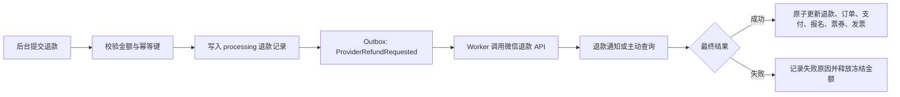

# TokEMS 报名详情统一运营工作台最终方案

> 状态：最终确认稿｜版本：v2.0｜复核日期：2026-08-04
>
> 目标页面：`/admin/events/:eventId/registrations/:registrationId`｜示例记录：大会 101，报名 `2a6104bd-f882-4d34-b73c-398f883d72ab`
>
> 实施状态：本轮核心能力已完成代码实施与自动化复核，待随 PR #16 发布

### 当前交付边界

本轮已经交付统一报名运营详情、按权限裁剪的聚合接口、报名资料维护、内部备注、订单与退款事实、发票状态与文件操作、票券与签到记录，以及统一处理时间线。发票 API 已收敛到明确的大会路径，读写操作同时校验组织和大会范围。

微信支付退款仍遵循现有安全边界：页面展示不可用原因，服务端拒绝提交无法闭环的退款请求。微信退款通知、主动查询和异步状态收敛作为独立后续迭代，不进入本轮发布范围。其他已配置且支持退款的支付渠道继续使用现有退款流程。

## 1. 最终结论

推荐把现有报名详情升级为“以单条报名为核心的统一运营工作台”。运营、客服和财务进入一条报名后，在当前页面完成身份核对、报名维护、票券与签到查看、订单与支付排查、退款、发票处理、文件上传与交付、通知追踪和内部协作。

最终布局采用：

- 顶部五项状态轨道：报名、订单、金额、退款、发票。
- 页面内锚点导航：参会与履约、订单与退款、发票、报名资料、处理记录。
- 桌面端主内容区加右侧运营栏，右侧集中放当前待办、联系方式、内部备注和快捷动作。
- 所有单记录常规动作在原区域就地展开，操作后刷新受影响的整条记录。
- 列表页继续承担搜索、筛选、批量处理和导出。

三个案例中，选择 **Shopify Admin Order Detail** 作为主对标。它最接近 TokEMS 的核心场景：围绕一笔交易集中组织客户、付款、退款、联系、内部备注和 Timeline。Stripe 用于补充发票状态机与条件动作，HubSpot 用于补充记录页信息架构和活动组织。

### 1.1 本轮复核后的关键修正

1. 发票采用“业务阶段 + 处理子状态 + 交付状态”三层表达，避免把开票和发送混为一个状态。
2. 增加支付尝试、可信到账时间、票券和签到记录，形成从报名到履约的完整事实链。
3. 明确微信退款当前不可用，并把微信退款异步闭环列为退款功能完整交付的前置工作。
4. 增加单条报名内部备注，使未关联用户账号的报名也能沉淀客服和运营记录。
5. 报名资料、用户档案和发票购买方资料保持三个独立数据源，编辑时明确影响范围。
6. 新增专用聚合读取接口，旧报名详情契约继续保留，降低兼容和回滚风险。
7. 按报名、订单、发票、通知四个权限域裁剪服务端响应，首屏也不泄露受限金额或税务资料。
8. 增加分区加载、并发冲突、失败恢复、性能目标、观测指标和灰度回滚方案。

## 2. 六维复核结果

| 复核维度   | 原草案中的风险或遗漏                                                   | 最终修正                                                                              |
| ---------- | ---------------------------------------------------------------------- | ------------------------------------------------------------------------------------- |
| 业务闭环   | 订单和发票较完整，支付事实、票券、签到、内部协作不足                   | 增加支付尝试、票券与签到、单报名备注，形成报名到履约再到财务售后的闭环                |
| 状态模型   | 发票主状态与发送状态容易混淆，退款只有成功结果                         | 发票拆成三层状态，退款增加处理中、成功、失败并计算冻结中的退款金额                    |
| 权限安全   | 原详情接口只要求报名查看权限，却可能携带订单，敏感页面缓存策略未定义   | 使用按域裁剪的聚合响应，受限区明确显示无权限，返回 `Cache-Control: private, no-store` |
| 单页体验   | 信息较长，锚点、异常优先级和移动端动作层级不足                         | 增加吸顶页内导航、首要待办、渐进展开、分区错误与移动端单列动作流                      |
| 技术可靠性 | 当前页面读取全大会退款，微信退款被服务端拒绝，支付成功时间缺少可信字段 | 改为订单精确查询，设计异步微信退款闭环，增加 `payments.succeededAt` 及可靠回填规则    |
| 交付治理   | 缺少灰度指标、异常演练和数据迁移回滚细节                               | 拆为四个可独立发布阶段，补充状态、权限、并发、外部依赖、性能、视觉和回滚验收          |

### 2.1 优先级判断

#### P0，必须完成

- 顶部发票状态可见。
- 发票资料、文件、发送状态和现有单发票操作进入报名详情。
- 退款按当前订单精确读取，不再读取全大会退款。
- 订单、发票和通知按权限裁剪。
- 状态派生逻辑有完整自动化测试。
- 微信订单的退款入口真实反映能力，完整发布前接通微信退款闭环。

#### P1，应随统一工作台完成

- 支付尝试、票券与签到信息。
- 报名资料就地编辑。
- 统一处理记录。
- 单报名内部备注。
- 分区加载、错误重试和乐观并发处理。

#### P2，可后续增强

- 工单负责人、服务等级和跨团队指派。
- 自定义内部标签体系。
- 自定义自由文本消息。
- 团体订单、一单多票和多张发票。
- 全局活动流搜索和跨记录关联分析。

## 3. 目标与范围

### 3.1 目标

运营人员打开一条报名后，应在 10 秒内回答：

1. 这个人是谁，报名了什么，票是否有效，是否已经签到？
2. 订单是否支付，钱从哪里来，实际到账多少，是否退款？
3. 用户是否申请发票，资料是否提交，是否已经开具和发送？
4. 当前有什么异常或待办，自己能执行哪些动作？
5. 之前有哪些人做过哪些操作，通知是否送达？

### 3.2 本页面包含

- 参会人和报名快照查看与维护。
- 已关联用户档案摘要与有权限的维护。
- 票券状态、票码、签发时间和签到记录。
- 订单、支付尝试、退款摘要和退款记录。
- 全额或部分退款，以及退款对票券、报名和发票的影响预览。
- 发票申请、购买方资料、状态、文件、上传、登记、作废、下载和发送。
- 发票填写入口重新发送。
- 报名、订单、退款、发票、通知和内部备注的统一处理记录。

### 3.3 专用页面继续承担

- 批量审核、批量开票、批量发送和批量导出。
- 跨报名搜索、跨大会用户历史和全局财务对账。
- 用户账号封禁、关闭、合并、删除和数据导出。
- 通知模板、支付渠道、对象存储和组织权限配置。
- 自定义自由文本群发。

## 4. 真实现状与关键约束

### 4.1 示例记录

- 报名状态：已签到。
- 订单状态：已支付。
- 订单金额：399 元。
- 支付方式：微信支付。
- 已退款：0 元。
- 报名时选择需要发票。
- 发票申请状态：`issued`。
- 发票交付状态：`sent`。
- 存在 1 份有效 PDF 电子发票。
- 已有完整发票状态记录。

当前报名详情只展示“是否需要发票：是”，运营人员看不到已经开票、已经发送和已有文件。

### 4.2 已有基础

- 一条报名最多关联一个订单，一个订单最多关联一个发票申请。
- 已有部分退款、全额退款、幂等和订单状态日志。
- 已有发票审核、驳回、开具失败、重试、上传、登记、作废、下载和发送。
- 已有 PDF/OFD、20 MB、SHA-256 和对象归属校验。
- 已有 Outbox、通知投递记录和订单访问令牌。
- 已有票券和签到记录表。
- 已有报名、订单、发票、通知和用户权限。

### 4.3 必须补齐的缺口

1. 当前报名详情响应可能携带订单，但接口只要求 `event.registration.read`，权限边界需要收紧。
2. 当前页面为显示一条订单的退款，会读取全大会退款并在前端筛选。
3. 微信退款通道当前明确返回“尚未接入”，示例记录无法完成真实退款。
4. 支付表没有专门的可信支付成功时间字段。
5. 未关联用户账号的报名没有内部备注载体。
6. 通知投递表缺少按报名和时间读取的复合索引。
7. 发票动作逻辑集中在较大的发票列表页组件中，复用成本高。

## 5. 对标案例与采用结论

### 5.1 主对标：Shopify Admin Order Detail

[Shopify 官方订单详情文档](https://help.shopify.com/en/manual/fulfillment/managing-orders/managing-order-details)将订单、客户、付款、退款、联系、内部备注和 Timeline 放在同一条订单记录中。

采用：单条报名作为运营上下文，资金动作、客户信息和历史记录保持同页，内部备注进入时间线，报名、票价和条款快照保留历史语义。

### 5.2 专项对标：Stripe Invoice Detail

[Stripe 官方发票管理文档](https://docs.stripe.com/invoicing/dashboard/manage-invoices)强调状态驱动的详情动作，当前状态决定可执行的编辑、发送、下载和后续处理。

采用：顶部业务阶段便于扫描，详情保留完整原始状态和原因，发票动作由权限与状态共同决定，文件和交付保留可审计链路。

### 5.3 结构对标：HubSpot Record Page

[HubSpot 官方记录页文档](https://knowledge.hubspot.com/records/work-with-records)以身份与动作、主要信息与活动、关联记录来组织一条业务记录。

采用：右侧运营栏持续显示身份和待办，主区域按任务组织订单、发票、资料和活动，关联对象先显示摘要再展开历史。

### 5.4 选择结果

产品骨架以 Shopify 为主，发票状态与动作遵循 Stripe 的方法，页面信息层级借鉴 HubSpot。TokEMS 继续沿用现有深蓝编辑式视觉、宋体标题、低饱和状态色、细分隔线和紧凑数据密度。

## 6. 页面信息架构

### 6.1 页面骨架

```text
返回报名管理

持久化测试-30e04a3a的报名详情                     [刷新]
TOK-R-WOP-Z3EM · 提交于 2026/08/04 09:28 · 数据更新于 09:35

[概览] [参会与履约] [订单与退款] [发票] [报名资料] [处理记录]

┌──────────┬──────────┬──────────┬──────────┬──────────────┐
│ 报名状态   │ 订单状态   │ 订单金额   │ 已退款     │ 发票状态       │
│ 已签到     │ 已支付     │ ¥399.00  │ ¥0.00    │ 已开票         │
│ 两日通票   │ 微信已到账 │ 实付一致   │ 可退 ¥399 │ 已发送 · 发票号 │
└──────────┴──────────┴──────────┴──────────┴──────────────┘

┌──────────────────────────────────────┬──────────────────┐
│ 当前待处理提示                        │ 参会人运营栏      │
│                                      │ 姓名、公司、职位  │
│ 订单与退款                            │ 手机、邮箱、复制  │
│ 发票与交付                            │ 账号关系          │
│ 参会与履约                            │ 当前待办          │
│ 报名资料与授权                        │ 内部备注          │
│ 统一处理记录                          │ 快捷操作          │
└──────────────────────────────────────┴──────────────────┘
```

### 6.2 页面顺序

1. 面包屑、记录标题、报名码、提交时间和最近刷新时间。
2. 吸顶页内导航。
3. 五项状态轨道。
4. 最高优先级异常或待办提示。
5. 订单与退款。
6. 发票与交付。
7. 参会与履约。
8. 报名资料与授权。
9. 统一处理记录。
10. 桌面端右侧运营栏。

### 6.3 页面内导航

- 页面滚动超过标题后，页内导航吸顶在后台主导航下方。
- 点击状态单元或锚点定位，并将焦点移到对应区域标题。
- 当前区域用文字和下划线共同表达。
- URL 保存锚点，例如 `#invoice`、`#finance`，刷新和浏览器返回后仍能恢复位置。
- 主内容不使用隐藏大量状态的 Tab。

### 6.4 信息密度

- 核心事实始终展开：状态、金额、票券、发票主资料、当前文件和当前待办。
- 历史支付尝试、作废文件、授权快照和完整技术编号默认折叠。
- 每个区域最多保留一个主动作和一个次动作，其他动作放入“更多操作”。
- 状态轨道使用共享外框与分隔线，减少五张独立卡片的视觉噪声。

## 7. 顶部五项状态轨道

| 单元     | 主信息                             | 次信息                       | 点击目标   |
| -------- | ---------------------------------- | ---------------------------- | ---------- |
| 报名状态 | 待审核、已确认、已签到、已取消等   | 票种名称                     | 参会与履约 |
| 订单状态 | 待支付、已支付、部分退款、已退款等 | 支付渠道和到账事实           | 订单与退款 |
| 订单金额 | 订单金额                           | 实付一致、金额异常或无支付   | 订单与退款 |
| 已退款   | 成功退款金额                       | 处理中金额和当前可退金额     | 订单与退款 |
| 发票状态 | 未申请、待开票、已开票、已终止     | 处理子状态、交付状态、发票号 | 发票与交付 |

示例记录：

```text
发票状态
[已开票]
已发送 · INV-30e04a3a
```

空状态和权限状态：

- 无订单时显示“无订单”，不使用 0 元代替。
- 无发票申请且报名未选择发票时显示“未申请 · 报名时未选择”。
- 发票受限时显示“无查看权限 · 需要发票查看权限”。
- 订单受限时，金额和退款显示无查看权限，服务端不返回具体金额。
- 数据组合不符合约束时显示“数据异常”，提供刷新和复制追踪编号。

## 8. 发票状态模型

### 8.1 三层状态

1. **业务阶段**：未申请、待开票、已开票、已终止、数据异常。
2. **处理子状态**：待支付、待提交资料、资料待审核、开票中、开票失败、资料已驳回、退款待调整、已作废、已取消。
3. **交付状态**：未发送、发送中、已发送、发送失败。

顶部以业务阶段为主，处理子状态和交付状态作为次信息。发票区域保留原始状态、原因、时间和历史。

### 8.2 派生规则

| 原始条件                        | 业务阶段 | 处理子状态       | 交付状态         | 主要动作           |
| ------------------------------- | -------- | ---------------- | ---------------- | ------------------ |
| 无申请，`invoiceRequired=false` | 未申请   | 报名时未选择     | 无               | 无                 |
| 无申请，选择发票，订单待支付    | 待开票   | 待支付           | 无               | 查看订单           |
| 无申请，选择发票，订单已支付    | 数据异常 | 申请记录缺失     | 无               | 刷新、排查         |
| `awaiting_details`              | 待开票   | 待提交资料       | 最近入口投递状态 | 重发填写入口       |
| `pending_review`                | 待开票   | 资料待审核       | 无               | 审核、驳回         |
| `issuing`                       | 待开票   | 开票中           | 无               | 登记发票、标记失败 |
| `issue_failed`                  | 待开票   | 开票失败         | 无               | 重试、取消         |
| `issued` + `not_sent`           | 已开票   | 已开具           | 未发送           | 发送发票           |
| `issued` + `queued`             | 已开票   | 已开具           | 发送中           | 等待结果           |
| `issued` + `sent`               | 已开票   | 已开具           | 已发送           | 下载、重新发送     |
| `issued` + `failed`             | 已开票   | 已开具           | 发送失败         | 重新发送           |
| `rejected`                      | 待开票   | 资料已驳回       | 最近入口投递状态 | 重发填写入口、取消 |
| `adjustment_required`           | 已开票   | 退款待调整       | 最近交付结果     | 作废或登记调整文件 |
| `voided`                        | 已终止   | 已作废           | 无               | 重新开具           |
| `cancelled`                     | 已终止   | 已取消           | 无               | 查看历史           |
| 发票申请存在但报名未选择        | 数据异常 | 意向与申请不一致 | 原交付状态       | 排查数据           |

### 8.3 待办优先级

1. 资金或数据一致性异常。
2. 退款处理中或退款失败。
3. 发票退款待调整、开具失败或发送失败。
4. 报名待审核、发票资料待审核。
5. 支付临近过期、发票资料待提交。
6. 已完成状态。

### 8.4 共享派生逻辑

新增纯函数 `deriveAdminInvoicePresentation()`，输出 `stage`、`substate`、`delivery`、`tone`、`summary`、`attentionLevel` 和 `primaryActionCode`。报名详情和发票列表共同使用，并覆盖全部状态组合测试。

## 9. 各区域详细设计

### 9.1 右侧参会人运营栏

持续显示姓名、公司、职位、城市、手机号、邮箱、报名码和用户账号关系，同时提供：

- 当前最高优先级待办。
- 最近一条内部备注和新增备注入口。
- 联系方式复制按钮。
- 当前状态允许的快捷操作。

动作分为：

- 常规：刷新、复制、编辑资料、下载发票、重新发送。
- 流程：审核报名、审核发票、登记开票、发送填写入口。
- 高影响：退款、驳回、取消申请、作废文件。

高影响动作在当前区域展开确认块，明确显示大会、参会人、订单、金额、当前状态和操作结果。完成或取消后，焦点回到触发按钮或新的状态提示。

### 9.2 订单、支付与退款

#### 订单摘要

- 订单号、状态、票种、订单金额和币种。
- 创建时间、支付截止时间和最近更新时间。
- 定价快照摘要。

#### 支付摘要

- 成功支付渠道、支付方式、支付金额和币种。
- 商户订单号、渠道交易号，默认部分隐藏并支持复制。
- 可信支付成功时间。
- 成功支付不存在、金额不一致或有未知状态时显示数据异常。

#### 支付尝试

默认折叠，按时间倒序显示最近 10 次：渠道、方式、状态、金额、商户订单号、渠道交易号、发起时间、更新时间、关闭时间和查询时间。接口不返回 `payload`、支付凭证和密钥相关信息。

#### 退款摘要

- 成功退款金额。
- 处理中退款金额。
- 当前可发起退款金额。
- 每笔退款的编号、状态、原因、发起人和时间。

计算规则：

```text
成功退款 = sum(status = succeeded)
冻结中退款 = sum(status = processing)
可退金额 = 实际成功支付金额 - 成功退款 - 冻结中退款
```

退款失败后释放冻结金额。金额计算全部使用整数分。

#### 退款表单

- 金额默认填入可退余额。
- 原因必填，2 到 240 字。
- 显示退款后的订单、报名、票券和发票状态预览。
- 生成一次性幂等键并防止重复提交。
- 提交成功后显示“处理中”或“已成功”，由支付通道真实结果决定。

部分退款预览示例：

```text
退款 ¥199.00 后
订单：已支付 -> 部分退款
报名与票券：保持有效
发票：已开票 -> 退款待调整
可退余额：¥200.00
```

全额退款预览应额外说明报名和票券会被取消。已签到记录保持历史事实。

### 9.3 微信退款闭环

当前服务明确拒绝微信退款。示例记录使用微信支付，因此完整退款体验需要先完成以下能力：



实现约束：

- 外部微信 API 调用不放在数据库事务内。
- 本地退款记录先进入 `processing`，同一幂等键只能对应相同请求。
- 同一订单的处理中金额计入冻结，防止并发超退。
- 成功通知和主动查询收敛到同一幂等完成函数。
- 只有渠道确认成功后，才更新订单、支付、报名、票券和发票。
- 超时显示“处理中”，后台继续查询；未知结果不显示退款成功。
- 失败保留渠道错误码和安全摘要，页面提供人工重试或复制追踪编号。

上线前未接通微信退款时，按钮显示“微信退款通道未配置”，不提交一个必然失败的请求。

### 9.4 发票与交付

#### 状态摘要

- 发票申请编号、业务阶段和原始状态。
- 开票金额、订单净支付金额和币种。
- 申请、提交、审核、开具和最近发送时间。
- 当前处理原因和推荐下一步。

#### 购买方资料

- 个人或企业、发票抬头、统一社会信用代码、开票内容。
- 接收邮箱和联系手机号。

税号、邮箱和手机号只向拥有 `org.invoice.read` 的成员返回。复制按钮有明确标签和完成提示。

#### 电子发票文件

每份文件显示发票号码和代码、原始或调整或重开关系、PDF/OFD、文件大小、开具时间、外部流水号、有效或作废状态，以及下载和当前允许的作废动作。历史作废文件默认折叠，保留处理原因、操作者和时间。

#### 状态驱动动作

- 待提交资料：重新发送填写入口。
- 资料待审核：审核通过、驳回。
- 开票中：上传并登记发票、标记开具失败。
- 开票失败：重新开具、取消。
- 已开票：下载、发送或重新发送。
- 退款待调整：作废原文件、登记调整或重开文件。
- 已作废：重新开具。

文件上传保持现有 PDF/OFD、20 MB、SHA-256 和对象归属校验。上传完成只代表文件进入对象存储，登记接口成功后才改变业务状态。

### 9.5 发票填写入口

`awaiting_details` 和 `rejected` 状态提供“重新发送填写入口”。

- 生成只含 `invoice:read` 和 `invoice:write` 的订单访问令牌。
- 默认有效期 24 小时，服务端只保存摘要。
- 新入口生效时撤销同订单旧的未过期填写令牌。
- 通过现有 Outbox 和通知模板排队。
- 同一发票 10 分钟内禁止重复发送。
- 页面显示排队、发送成功、发送失败和最近发送时间。
- 后台页面、日志、时间线和错误信息都不展示原始令牌。

### 9.6 参会与履约

展示票种、票券状态、票券代码、签发时间、报名当前状态，以及最近签到结果、签到时间、签到名单、设备名称和操作员。多签到名单存在时按时间展示完整记录。

规则：

- 全额退款会取消报名和票券。
- 历史签到记录保留。
- 票券代码可复制，二维码默认不在后台首屏展示。
- 票券重发、人工签到和撤销签到本期保持现有入口；新增写操作需要单独状态与权限评审。

### 9.7 三类资料的来源边界

| 数据来源       | 作用                     | 默认编辑影响                     |
| -------------- | ------------------------ | -------------------------------- |
| 本次报名资料   | 本次参会和历史报名事实   | 只更新当前报名及对应核心表单答案 |
| 用户账号档案   | 跨大会复用的用户资料     | 只更新用户账号资料               |
| 发票购买方资料 | 当前订单的税务与交付信息 | 只通过发票流程更新               |

报名资料可编辑姓名、手机、邮箱、公司、职位、城市和仍可解释的额外表单字段。保存使用 `expectedUpdatedAt`，手机和邮箱沿用报名流程校验，保存前提示对当前报名和票券身份展示的影响，保存后写入审计摘要。

已关联用户且拥有 `customer.read` 与 `customer.manage` 时，可编辑常用姓名、邮箱、公司、职位、城市、标签和用户内部备注，并用 `profileVersion` 处理并发冲突。

页面不自动同步三类资料。运营人员可在报名保存时主动勾选“同时更新用户档案”，默认不勾选，并再次校验用户管理权限。发票购买方资料不参与该同步。

### 9.8 单报名内部备注

新增与报名直接关联的内部备注，解决未关联用户无法记录支持信息的问题。

- `event.registration.read` 可查看。
- `event.registration.manage` 可新增。
- 单条最多 2000 字，纯文本存储与转义展示。
- 第一版采用追加式记录，不直接覆盖历史内容。
- 每条记录包含作者和时间，并进入统一处理记录。
- 客户账号内部备注用于跨大会长期信息，单报名备注只服务当前大会和当前报名。

### 9.9 统一处理记录

合并报名创建、审核和资料修改，订单与支付，退款，发票与交付，通知投递，报名备注，票券签发与取消和签到。

每条记录包含业务类型、标题、一行摘要、操作者或系统来源、发生时间、语义状态和可安全展示的关联编号。默认加载最近 30 条，继续加载使用游标。时间线不返回访问令牌、支付载荷、完整通知正文、对象存储路径和未脱敏敏感字段。

## 10. 操作权限与安全矩阵

| 能力                 | 读取权限                          | 操作权限                    | 状态约束                   | 安全约束                       |
| -------------------- | --------------------------------- | --------------------------- | -------------------------- | ------------------------------ |
| 查看报名与履约       | `event.registration.read`         | 无                          | 记录属于当前组织和大会     | 组织、大会、报名三层校验       |
| 编辑报名资料         | `event.registration.read`         | `event.registration.manage` | 报名存在                   | 字段校验、并发版本、审计       |
| 查看订单、支付和退款 | `event.order.read`                | 无                          | 订单存在                   | 不返回支付载荷和密钥信息       |
| 发起退款             | `event.order.read`                | `event.order.refund`        | 已支付或部分退款且有可退额 | 幂等、冻结金额、二次确认、审计 |
| 查看发票             | `event.read` + `org.invoice.read` | 无                          | 发票上下文存在             | 税号和交付信息按权限裁剪       |
| 审核与开票           | 同上                              | `org.invoice.manage`        | 由发票状态机决定           | 并发版本、文件校验、审计       |
| 发送填写入口         | 同上                              | `org.invoice.manage`        | 待资料或已驳回             | 短期令牌、撤销旧令牌、冷却     |
| 下载文件             | `event.read` + `org.invoice.read` | 无                          | 有有效文件                 | 短期下载地址、下载审计         |
| 查看通知记录         | `event.notification.read`         | 无                          | 关联当前报名               | 不返回完整正文和敏感载荷       |
| 新增报名备注         | `event.registration.read`         | `event.registration.manage` | 报名存在                   | 长度限制、转义、审计           |
| 编辑用户档案         | `customer.read`                   | `customer.manage`           | 已关联账号                 | 版本校验、组织隔离、审计       |

服务端裁剪原则：

- 缺少 `event.order.read` 时，响应只表达订单区受限，不返回金额、支付或退款字段。
- 缺少 `org.invoice.read` 时，不返回发票申请、税号、邮箱、手机和文件。
- 缺少 `event.notification.read` 时，时间线不返回通知事件。
- 前端隐藏或禁用只负责体验，所有写接口继续独立校验权限和状态。
- 页面响应设置 `Cache-Control: private, no-store`。
- 错误信息返回安全追踪编号，不回显第三方原始载荷和内部存储路径。

## 11. 状态驱动的操作矩阵

| 操作           | 显示条件                           | 权限                        | 成功后的刷新范围                           |
| -------------- | ---------------------------------- | --------------------------- | ------------------------------------------ |
| 审核报名       | `pending_review`                   | `event.registration.manage` | 报名、待办、时间线                         |
| 编辑报名资料   | 报名存在                           | `event.registration.manage` | 报名、票券摘要、时间线                     |
| 发起退款       | 订单已支付或部分退款，可退额大于 0 | `event.order.refund`        | 订单、退款、报名、票券、发票、待办、时间线 |
| 重发填写入口   | `awaiting_details` 或 `rejected`   | `org.invoice.manage`        | 发票交付、通知、时间线                     |
| 审核通过       | `pending_review`                   | `org.invoice.manage`        | 发票、待办、时间线                         |
| 驳回资料       | `pending_review`                   | `org.invoice.manage`        | 发票、待办、时间线                         |
| 登记发票       | `issuing`                          | `org.invoice.manage`        | 发票、文件、交付、时间线                   |
| 标记开具失败   | `issuing`                          | `org.invoice.manage`        | 发票、待办、时间线                         |
| 重新开具       | `issue_failed` 或 `voided`         | `org.invoice.manage`        | 发票、待办、时间线                         |
| 取消申请       | 待资料、待审核、已驳回或开具失败   | `org.invoice.manage`        | 发票、待办、时间线                         |
| 作废文件       | 有效文件且为已开票或退款待调整     | `org.invoice.manage`        | 发票、文件、待办、时间线                   |
| 下载发票       | 有有效文件                         | `org.invoice.read`          | 追加下载审计，不刷新业务状态               |
| 发送或重新发送 | 已开票且有有效文件和邮箱           | `org.invoice.manage`        | 发票交付、通知、时间线                     |
| 新增报名备注   | 报名存在                           | `event.registration.manage` | 备注、时间线                               |
| 编辑用户档案   | 已关联账号                         | `customer.manage`           | 用户摘要、时间线                           |

服务端额外返回 `capabilities`。每个能力包含 `allowed` 和可选 `reasonCode`，前端据此选择主动作和受限说明。写接口仍以服务端权限与状态机为最终准入条件。

## 12. 数据与接口方案

### 12.1 推荐接口策略

保留现有报名详情接口，新增专用运营聚合接口：

```text
GET /admin/events/:eventId/registrations/:registrationId/operations-detail
```

新接口保持旧 `AdminRegistrationDetailSchema` 和现有调用方兼容，同时可以按报名、订单、发票和通知划分权限域，统一表达 `snapshotAt`、数据版本和可用操作。回滚新页面时无需回退旧详情接口。

### 12.2 聚合响应草案

```ts
type RestrictedContext = { access: 'restricted' };

type RegistrationOperationsDetail = {
  snapshotAt: string;
  traceId: string;
  registration: RegistrationOperationsSummary;
  customer:
    | { access: 'unlinked' }
    | RestrictedContext
    | { access: 'included'; customer: AdminRegistrationCustomer };
  fulfillment: {
    ticket: TicketOperationsSummary | null;
    checkins: CheckinOperationsSummary[];
  };
  commerce:
    | RestrictedContext
    | {
        access: 'included';
        order: Order | null;
        successfulPayment: PaymentOperationsSummary | null;
        paymentAttempts: PaymentOperationsSummary[];
        refunds: RefundOperationsSummary[];
        totals: {
          paidAmount: number;
          succeededRefundAmount: number;
          processingRefundAmount: number;
          refundableAmount: number;
        };
      };
  invoice:
    | RestrictedContext
    | {
        access: 'included';
        request: InvoiceRequestWithDocumentsAndLogs | null;
      };
  notes: RegistrationNote[];
  capabilities: Record<OperationCode, Capability>;
};
```

约束：

- `paymentAttempts` 最多 10 条。
- 发票状态日志最多 50 条，更多历史通过时间线加载。
- 发票文档最多返回 20 条，超过时返回 `hasMoreDocuments`。
- 聚合响应不包含完整通知列表，通知进入独立时间线。
- `snapshotAt` 表达数据读取时间，写操作继续使用各资源版本字段。

### 12.3 新增和调整接口

```text
GET   /admin/events/:eventId/registrations/:registrationId/operations-detail
PATCH /admin/events/:eventId/registrations/:registrationId/attendee
GET   /admin/events/:eventId/registrations/:registrationId/activity?cursor=&limit=30
GET   /admin/events/:eventId/registrations/:registrationId/notes
POST  /admin/events/:eventId/registrations/:registrationId/notes
POST  /admin/events/:eventId/invoices/:invoiceId/request-details
```

继续复用并增强：

```text
POST /admin/orders/:orderId/refunds
现有发票审核、上传、登记、作废、下载和发送接口
现有用户档案更新接口
```

`PATCH attendee`：

```ts
{
  expectedUpdatedAt: string;
  attendee: {
    name: string;
    mobile: string;
    email: string;
    company: string;
    title: string;
    city: string;
  };
  updateLinkedCustomerProfile?: boolean;
  expectedCustomerProfileVersion?: number;
}
```

当 `updateLinkedCustomerProfile=true` 时，服务端同时校验用户读取和管理权限。报名更新与用户档案更新使用同一事务，任何一项失败则整次操作失败。

活动接口返回游标分页条目，类型覆盖 `registration`、`ticket`、`checkin`、`order`、`payment`、`refund`、`invoice`、`delivery`、`notification` 和 `note`。每条只含标题、安全摘要、语义、操作者、时间和可选关联编号。

### 12.4 聚合服务

新增 `AdminRegistrationOperationsService`，负责：

1. 校验组织、大会和报名范围。
2. 根据权限确定需要读取的域。
3. 按报名和订单主键精确读取票券、签到、支付、退款和发票。
4. 计算金额摘要和服务端能力。
5. 输出嵌套的权限联合类型。

```text
RegistrationDetailView
├── RegistrationSummaryRail
├── RegistrationFinanceSection
├── RegistrationInvoiceSection
├── RegistrationFulfillmentSection
├── RegistrationProfilePanel
└── RegistrationActivityTimeline
             │
             ▼
useRegistrationOperations
             │
             ├── GET operations-detail
             ├── GET activity, 首屏后加载
             └── 各资源现有写接口
                         │
                         ▼
AdminRegistrationOperationsService
├── ConferenceRepository
├── CommerceOperationsService
├── InvoiceOperationsService
└── EngagementOperationsService
```

## 13. 数据库调整

最终版需要小规模增量迁移。所有迁移先加字段或表，再切换读取，不删除现有字段。

### 13.1 支付成功时间

在 `payments` 增加 `succeeded_at timestamptz nullable`。新支付在渠道确认成功时写入渠道发生时间，历史数据只使用可信渠道通知或订单状态日志回填。无可靠来源的记录保持空值，页面显示“暂无可信支付时间”。`updatedAt` 不直接作为支付成功时间。

### 13.2 退款状态与渠道字段

退款状态收敛为 `processing`、`succeeded`、`failed`、`cancelled`，并增加：

- `provider_refund_id nullable`
- `failure_code nullable`
- `failure_reason nullable`
- `completed_at nullable`

历史记录当前默认为 `succeeded`，迁移前先验证不存在其他自由文本状态。

### 13.3 单报名内部备注

新增 `registration_notes`：

```text
id
organization_id
event_id
registration_id
author_id
body
created_at
```

外键同时约束组织、大会和报名归属，增加 `(registration_id, created_at desc, id desc)` 索引，第一版只追加写入。

### 13.4 查询索引

- `notification_deliveries(registration_id, created_at desc, id desc)`。
- `audit_logs(organization_id, resource_type, resource_id, created_at desc)`。
- 支付、退款、发票和签到已有主关联索引继续复用。

## 14. 前端组件与视觉规范

### 14.1 组件拆分

- `RegistrationSummaryRail.vue`
- `RegistrationSectionNav.vue`
- `RegistrationProfilePanel.vue`
- `RegistrationFinanceSection.vue`
- `PaymentAttemptsDisclosure.vue`
- `RefundActionPanel.vue`
- `RegistrationInvoiceSection.vue`
- `InvoiceActionPanel.vue`
- `RegistrationFulfillmentSection.vue`
- `RegistrationFormSection.vue`
- `RegistrationNotes.vue`
- `RegistrationActivityTimeline.vue`
- `useRegistrationOperations.ts`
- `useInvoiceActions.ts`
- `invoice-presentation.ts`

`InvoicesView.vue` 与报名详情共用发票展示派生和动作调用逻辑。页面容器负责布局、锚点和整条记录刷新，业务组件负责各自区域。

### 14.2 视觉方向

- 主题：深蓝编辑式运营记录台，紧凑、克制、可信。
- CSS：继续使用 Vue SFC scoped CSS 和现有语义令牌。
- 层级：画布、主区域和运营栏使用轻微明度差；业务区使用分隔线和标题层级。
- 浮层：只用于文件选择等需要焦点锁定的任务；退款和审核优先就地展开。
- 金额、数量、订单号和时间使用等宽数字或 `font-variant-numeric: tabular-nums`。
- 状态同时使用文字、图标和颜色。
- 绿色表示完成，琥珀色表示待处理，蓝色表示处理中，红色表示失败或高风险，灰色表示未申请、终止和受限。

### 14.3 响应式与可访问性

- `>= 1180px`：主内容区和 340px 右侧运营栏并排，运营栏在页面容器内吸顶。
- `760px 至 1179px`：单列布局，运营栏移到状态轨道下方。
- `< 760px`：状态轨道两列，发票状态占满最后一行。
- `< 520px`：字段和表单单列，动作区保持主动作优先。
- 375px 和 320px 无页面级横向滚动。
- 触控按钮最小高度 40px，图标按钮提供至少 40px 可点击区域。
- 触屏不依赖悬停信息，桌面悬停提示同时支持键盘焦点。
- 状态有文字标签，复制成功有可见文本和读屏反馈。
- 使用 `prefers-reduced-motion`，不使用 `transition: all`。

### 14.4 加载与交互

- 分区异步加载时保留标题和骨架，不让整个页面闪空。
- 时间线加载失败只影响时间线，核心详情继续可用。
- 写操作只锁定当前动作区，其他只读区域保持可浏览。
- 发生 409 时保留用户输入，提示数据已被更新，允许刷新比较后重新提交。
- 有未保存表单时，页面刷新先提示确认。

## 15. 失败、并发与一致性策略

### 15.1 读取失败

- 核心聚合详情失败：显示记录级错误、追踪编号和重试。
- 时间线失败：显示分区错误和重试，核心详情保持。
- 下载地址生成失败：文件信息仍显示，下载动作提示重试。
- 权限变化：刷新后对应区域转为无查看权限，清空前端敏感缓存。

### 15.2 写入失败

- 状态冲突：返回 409，展示服务端最新状态和刷新入口。
- 文件上传成功、登记失败：保留上传结果摘要并提供重新登记，后台定时清理未登记对象。
- 通知排队失败：业务状态不显示为已发送，保留失败记录并允许冷却后重试。
- 微信退款超时：保持 `processing`，通过通知或查询收敛最终状态。
- 微信退款失败：记录失败原因，释放冻结退款金额，不修改订单和发票状态。

### 15.3 刷新策略

- 报名审核刷新报名、待办和时间线。
- 发票动作刷新发票、交付、待办和时间线。
- 退款刷新整条聚合详情，因为订单、支付、报名、票券和发票都可能变化。
- 用户档案刷新用户摘要和时间线。
- 所有刷新响应更新页面的 `snapshotAt`。

## 16. 分阶段实施计划

方案预计涉及 25 到 32 个文件，跨数据库迁移、契约、API、服务、Worker、后台组件、测试和文档。四个阶段可以独立合并、灰度和回滚。

### 阶段 1：可信状态与只读工作台

目标：在同一页面完整看清报名、履约、资金和发票状态。

实施内容：

1. 新增 `AdminRegistrationOperationsDetailSchema` 和专用聚合接口。
2. 按权限返回报名、履约、订单和发票上下文。
3. 按订单精确读取退款，移除全大会退款读取。
4. 增加支付尝试、票券、签到和发票只读信息。
5. 增加发票三层状态派生与完整测试。
6. 完成五项状态轨道、页内导航、主内容区和右侧运营栏。
7. 接入发票文件下载。
8. 增加 `no-store`、分区错误和刷新时间。

完成标准：示例记录首屏显示“已开票、已发送”，下方可查看购买方资料、有效 PDF、微信支付和签到事实。

回滚：切回旧报名详情数据和旧页面组件；新接口保持未调用状态。

### 阶段 2：发票就地处理

目标：在报名详情完成现有单发票操作。

实施内容：

1. 从发票列表页抽取共享派生函数和动作调用逻辑。
2. 接入审核、驳回、重试、标记失败和取消。
3. 接入 PDF/OFD 上传、登记、作废和下载。
4. 接入发送与重新发送。
5. 新增“重新发送填写入口”。
6. 增加权限、并发、上传失败、对象存储和通知失败测试。

完成标准：所有现有单发票操作都可在报名详情完成，发票列表的批量与搜索能力继续可用。

回滚：隐藏报名详情中的发票写操作，保留只读区和发票列表入口；已完成状态继续有效。

### 阶段 3：退款闭环与资金一致性

目标：让微信和已有同步通道都提供真实、可追踪的退款体验。

实施内容：

1. 增加退款状态和渠道字段迁移。
2. 增加微信退款 Outbox、Worker、通知验签和主动查询。
3. 成功后原子联动订单、支付、报名、票券和发票。
4. 计算成功、处理中和可退金额，防止并发超退。
5. 优化退款表单和影响预览。
6. 增加超时、重复通知、查询补偿、失败释放和部分退款测试。

完成标准：示例微信订单能进入处理中并收敛到成功或失败；页面金额和关联状态与渠道最终结果一致。

回滚：关闭微信退款能力开关，保留退款记录查询和已有同步通道；处理中任务继续由 Worker 收敛，避免中途丢失。

### 阶段 4：资料维护、备注与统一记录

目标：在当前记录完成日常资料修正、支持协作和历史排查。

实施内容：

1. 增加可信支付时间和报名备注迁移。
2. 新增报名资料编辑及可选用户档案同步。
3. 新增报名备注读取与追加。
4. 新增游标活动接口，合并报名、票券、签到、资金、发票、通知和备注。
5. 完成右侧当前待办和最近备注。
6. 补齐并发、敏感字段、跨权限组合和长时间线测试。

完成标准：常见资料修正、内部协作和历史排查在当前页面完成，未关联账号的报名也可记录备注。

回滚：关闭资料编辑、备注和时间线开关；增量表和字段保留，不执行破坏性回滚。

## 17. 预计文件范围

### 数据库与迁移

- `packages/database/src/schema.ts`
- 新增支付、退款、备注和索引迁移
- `packages/database/src/seed.ts`

### 契约

- `packages/contracts/src/index.ts`
- `packages/contracts/src/admin-registration.test.ts`
- 新增 `packages/contracts/src/admin-registration-operations.test.ts`

### API、服务与 Worker

- `apps/api/src/modules/admin.module.ts`
- `apps/api/src/modules/template-invoice.module.ts`
- 新增 `apps/api/src/common/admin-registration-operations.service.ts`
- `apps/api/src/common/conference.repository.ts`
- `apps/api/src/common/commerce-operations.service.ts`
- `apps/api/src/common/invoice-operations.service.ts`
- `apps/api/src/common/engagement-operations.service.ts`
- `apps/api/src/common/wechat-pay.service.ts`
- `apps/worker/src/main.ts`
- 新增或扩展相关服务与集成测试

### 后台前端

- `apps/admin/src/lib/api.ts`
- `apps/admin/src/views/RegistrationDetailView.vue`
- `apps/admin/src/views/InvoicesView.vue`
- 新增 `apps/admin/src/components/registration/*`
- 新增 `apps/admin/src/composables/useRegistrationOperations.ts`
- 新增 `apps/admin/src/composables/useInvoiceActions.ts`
- 新增 `apps/admin/src/lib/invoice-presentation.ts`
- 新增状态派生和页面交互测试

### 文档与验收

- `docs/api.md`
- `tooling/visual-smoke.mjs`
- 新增或扩展报名详情端到端验收脚本

## 18. 测试与验收矩阵

### 18.1 业务状态

- 无订单、待支付、已支付、部分退款、已退款、已关闭。
- 无成功支付、多个支付尝试、金额不一致、未知支付状态。
- 无退款、退款处理中、退款成功、退款失败、多次部分退款、全额退款。
- 无发票申请、待资料、待审核、开具中、开具失败、已开具、驳回、退款待调整、作废、取消。
- `issued` 与四种交付状态组合。
- 一份有效文件、多份历史文件、全部文件已作废。
- 有票无签到、已签到、多签到名单、票已取消。
- 已关联用户、未关联用户、用户权限受限。

### 18.2 微信退款

- 幂等重复请求只产生一条退款。
- 并发退款不会超过可退金额。
- API 超时后保持处理中。
- 通知先到、查询先到和重复通知都得到同一结果。
- 成功后订单、支付、报名、票券和发票在同一事务更新。
- 失败后释放冻结金额，关联业务状态不改变。
- 全额退款后历史签到记录保留。

### 18.3 权限与隔离

- 只有报名查看权限时，订单和发票上下文均为受限。
- 订单查看权限不授予退款操作。
- 发票查看权限不授予发票写操作。
- 通知权限不足时，时间线不出现通知事件。
- 用户未关联或用户权限不足时，不返回用户档案。
- 组织、大会和报名三层越权全部拒绝。
- 受限响应不包含税号、邮箱、手机、金额、支付载荷和存储路径。

### 18.4 并发与失败恢复

- 报名和用户档案版本冲突返回 409。
- 发票状态冲突保留用户输入并提示刷新。
- 文件上传后登记失败可以安全重试。
- 通知队列失败显示真实失败状态。
- 聚合详情失败与时间线失败分别恢复。
- 页面存在未保存表单时刷新有确认提示。

### 18.5 页面交互与可访问性

- 状态轨道和页内导航正确定位并移动焦点。
- 只显示当前状态和权限允许的动作。
- 高影响操作明确展示对象、金额和结果。
- 操作成功后相关状态与时间线同步。
- 键盘可访问所有按钮、表单、折叠区和文件操作。
- 状态含文字，不依赖颜色。
- 复制操作有可见和读屏反馈。
- 触控目标至少 40px。

### 18.6 视觉验收

- 1440px：五项状态在一行，右侧运营栏稳定吸顶。
- 1280px：主内容和运营栏无挤压，长中文正常换行。
- 768px：单列切换自然，页内导航可横向滚动且页面本身不溢出。
- 375px：状态两列，发票占满一行，无页面级横向滚动。
- 320px：金额、订单号、长状态和动作不溢出。
- 深色与浅色焦点状态均清晰可见。

### 18.7 验证命令

```bash
pnpm --filter @conference/contracts test
pnpm --filter @conference/api test
pnpm --filter @conference/admin test
pnpm lint
pnpm typecheck
pnpm build
ADMIN_USERNAME=admin ADMIN_PASSWORD=admin pnpm test:visual
```

## 19. 性能、观测与发布门槛

### 19.1 性能目标

- 聚合详情只按当前报名、订单和发票主键查询，禁止全大会扫描。
- 首屏聚合接口在测试数据规模下 p95 小于 800 ms。
- 页面核心信息在常规办公网络下 2 秒内可操作。
- 聚合 JSON 建议控制在 200 KB 内，时间线与通知历史独立分页。
- 聚合查询不出现按支付、退款、文件或日志逐条查询的 N+1。

性能门槛应在预发布环境使用接近真实的数据量测量；若现有基础线更优，以现有基础线加 20% 作为回归上限。

### 19.2 观测指标

- 聚合接口 p50、p95、错误率和响应大小。
- 各操作成功率、409 冲突率和平均完成时间。
- 发票填写入口和发票文件的通知排队、成功与失败率。
- 退款从 `processing` 到最终状态的时长。
- 微信退款通知验证失败、主动查询次数和超时数量。
- 页面关键操作后刷新失败率。

### 19.3 灰度方式

- 使用大会或组织级功能开关启用新工作台。
- 先向内部管理员和一个测试大会开放。
- 核对示例记录、待开票、退款待调整和权限受限四类记录。
- 再向财务和运营角色开放写操作。
- 保留旧页面入口一个发布周期，出现严重问题可快速切回。

## 20. 风险与应对

| 风险                   | 影响                     | 应对                                                     |
| ---------------------- | ------------------------ | -------------------------------------------------------- |
| 页面信息过多           | 扫描速度下降             | 状态轨道、页内导航、右栏待办、渐进展开和游标时间线       |
| 三类资料被误同步       | 历史和税务资料混乱       | 明确来源标签，默认分开编辑，跨域同步需主动勾选和权限校验 |
| 发票状态与发送状态混淆 | 运营判断错误             | 业务阶段、处理子状态和交付状态三层表达                   |
| 微信退款未知结果       | 超退或错误展示成功       | processing 冻结、通知加查询、幂等完成函数、成功后再联动  |
| 退款触发发票调整       | 页面显示旧状态           | 操作前影响预览，完成后刷新整条聚合详情                   |
| 发票列表与详情逻辑分叉 | 动作与状态不一致         | 共用派生函数和动作调用层                                 |
| 通知 Worker 延迟       | 用户未及时收到入口或发票 | 展示排队和失败，冷却后重试，保留投递记录                 |
| 多人同时处理           | 后写覆盖前写             | 资源版本、409、保留输入和刷新比较                        |
| 敏感信息泄露           | 税号、联系信息或金额越权 | 服务端按域裁剪、no-store、时间线白名单、下载审计         |
| 增量迁移回滚           | 新旧代码版本不兼容       | 先加后用、字段可空、功能开关、保留旧接口和旧页面         |

## 21. 最脆弱假设与未来扩展

### 21.1 最脆弱假设

本方案依赖“一条报名对应一个订单，一个订单最多对应一个发票申请”。当前数据库唯一索引保证该关系。

未来支持团体订单、一单多票或多张发票时：

- 顶部订单和发票单元改为集合摘要。
- 主内容区按订单或发票分组。
- 页面路由继续以报名为上下文，也可新增订单工作台。
- 当前状态派生函数升级为集合聚合函数。

### 21.2 明确延后

- 运营负责人和 SLA。
- 自定义备注标签和提及。
- 通知正文编辑与自由文本消息。
- 跨大会客户旅程。
- 红字信息表等更深的税务自动化。

这些能力需要新的组织流程、权限或合规设计，可在统一工作台稳定后单独评审。

## 22. 最终产品验收场景

### 场景 A：示例已开票报名

运营打开示例记录，首屏看到已签到、微信已支付、399 元、未退款、已开票和已发送。进入发票区可查看购买方资料、有效 PDF、发票号、发送时间和完整处理记录，可下载或重新发送。

### 场景 B：资料未提交

运营看到“待开票 · 待提交资料”，在当前页面重发填写入口。页面显示通知排队结果和最近发送时间，10 分钟内阻止重复发送。

### 场景 C：微信部分退款

财务输入退款金额和原因，确认块展示订单、票券和发票影响。提交后显示处理中。微信确认成功后，订单变为部分退款，发票变为退款待调整，金额和时间线同步更新。

### 场景 D：资料修正

客服修改当前报名的公司和职位。默认只更新本次报名；有权限且主动勾选后可以同步用户档案。发票抬头不受影响，时间线记录本次修改。

### 场景 E：权限受限

只有报名查看权限的工作人员可以看参会与履约信息。订单金额、退款和发票区域显示无查看权限，接口响应不包含相应敏感字段。

### 场景 F：未关联账号的支持记录

客服可在报名上追加内部备注。备注带作者和时间，并进入统一处理记录，不依赖用户账号关系。

## 23. 实施收口与发布结论

### 23.1 已完成

1. 采用顶部状态总览、页内锚点、主内容区和右侧运营栏的统一详情布局。
2. 发票使用业务阶段、处理子状态和交付状态三层展示，并复用统一派生函数。
3. 新增大会范围内的运营聚合接口；报名、用户、订单和发票内容按权限裁剪，敏感响应使用 `private, no-store`。
4. 报名资料维护和追加式内部备注已落地，操作人、原因、前后值和追踪编号进入审计记录。
5. 退款按当前订单精确计算已退、处理中和可退金额；不支持的微信渠道在提交前给出明确原因。
6. 发票列表、详情、导出、文件、发送和资料提醒统一携带大会编号，服务端同时验证组织与大会范围。
7. 发票文件上传校验扩展名、媒体类型、文件签名、大小和 SHA-256 摘要；重新上传与删除保留审计记录。
8. 契约、权限受限响应、状态派生、日期趋势和后台入口均补充自动化测试。

### 23.2 本轮 review 自动修复

- 报名手机号更新的查重与写入使用同一个事务级手机号锁，两个管理员并发修改时稳定返回业务冲突。
- 运营冒烟创建的大会短地址改用受限长度运行标识，持续满足 24 位短地址契约。
- 前端新增页面完成统一格式修复，消除质量门禁中的模板缩进与闭合告警。
- 生成清单已刷新到 42 个迁移、188 个 API 操作和 63 个测试文件。

### 23.3 延后项

- 微信退款 Outbox、Worker、通知验签、主动查询和最终状态收敛。
- 通知时间线分页、统一负责人、SLA 和跨团队指派。
- 团体订单、一单多票、多张发票和更深的税务自动化。
- 接近生产数据量的 p95、响应体积和慢查询观测，需要在预发布环境完成。

### 23.4 发布门槛

本轮代码可以进入统一发布流程，仍需满足仓库完整门禁、依赖安全审计、顺序迁移验证和远端 CI。生产启用前继续核对对象存储、通知通道和实际退款渠道配置；微信退款入口保持禁用，直到独立闭环通过专项验收。
