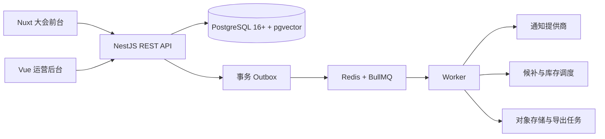
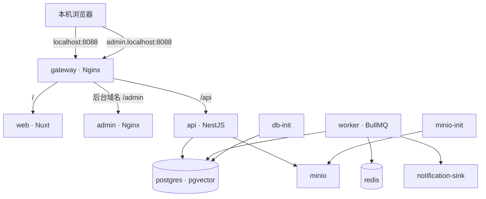
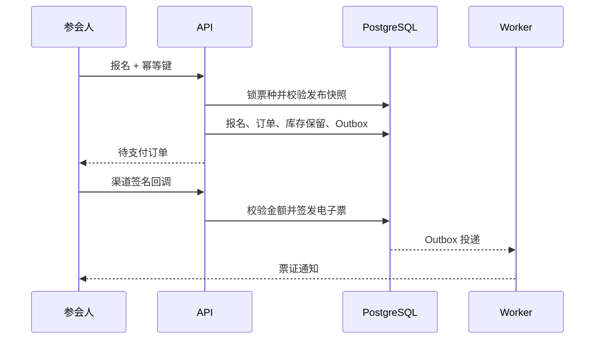

# 系统架构与设计决策

## 目标与形态

系统围绕大会配置、官网发布、报名交易、现场履约和数据复盘建立可追溯闭环。工程采用模块化单体 API 与独立 Worker，领域服务、契约和数据表均保留清晰边界。



## 本地容器拓扑

本地部署使用单一 Compose 项目 `tokems`。外部端口仅绑定到 `127.0.0.1`，应用容器通过内部 DNS 服务名访问 PostgreSQL、Redis、MinIO 和通知接收器。



`db-init` 和 `minio-init` 是可重复执行的一次性任务。API 仅在迁移与种子初始化成功后启动，Web 与 Admin 仅在 API 健康后启动。数据库、Redis 与 MinIO 使用具名数据卷，重建应用镜像不会删除业务数据。

## 上下文边界

| 上下文         | 责任                                       | 关键实体                                                                                          |
| -------------- | ------------------------------------------ | ------------------------------------------------------------------------------------------------- |
| Organization   | 组织、用户、成员、角色与授权               | organizations, users, memberships                                                                 |
| Event Planning | 大会、蓝图、内容草稿与生命周期             | events, event_blueprints, speakers, sessions                                                      |
| Experience     | 共享模板、草稿、版本、资产、大会绑定与覆盖 | conference_templates, conference_template_versions, template_assets, event_template_bindings      |
| Release        | 渲染器、不可变快照、变更记录与回滚指针     | template_packages, event_releases                                                                 |
| Registration   | 版本化表单、条款同意和参会人               | registration_forms, registrations                                                                 |
| Commerce       | 票种、库存保留、订单、支付、退款和状态日志 | ticket_types, inventory_reservations, orders, payments, refunds                                   |
| Invoice        | 发票申请、文件、状态、访问凭证与导出任务   | invoice_requests, invoice_documents, invoice_state_logs, order_access_tokens, invoice_export_jobs |
| Waitlist       | 售罄排队、顺序邀约、占位和一次性领取       | waitlist_entries                                                                                  |
| Fulfillment    | 电子票、签到列表、设备和核销记录           | tickets, checkin_lists, checkin_devices, checkin_records                                          |
| Engagement     | AI 草稿、审批、通知模板和投递              | ai_runs, notification_templates, notification_deliveries                                          |
| Platform       | 幂等、事件投递和审计                       | idempotency_keys, outbox_events, audit_logs                                                       |

## 发布快照

运营后台在大会上线前保存草稿。大会进入预发布或报名开放状态时，系统生成首个公开版本；此后每次有效保存都以当前生效快照为基线，只合并本次修改所在模块，把体验配置、大会字段、票种价格与文案、嘉宾、议程、报名表和服务条款固化为不可变 JSON 快照，并原子更新 `currentReleaseId`。相同内容重复保存不会新增版本。官网读取该指针对应的快照并重新校验；库存保留、已售和候补占位继续实时计算。回滚会立即切换公开指针，后续每次保存继续以回滚后的生效快照为基线，其他模块保持回滚版内容。

该模型让内容变更、价格变更和条款变更在保存成功后立即生效，同时保留完整的变更记录与回滚能力。报名创建时再次锁定票种并核对当前生效版本，避免旧页面提交到新版本。

## 报名、支付与候补



可售数公式：

```text
capacity - sold - active reservations - active waitlist offers
```

票种行锁保护库存计算。事务级顾问锁串行化相同幂等键、报名联系方式和候补邀约。订单保留十五分钟。支付回调验证原始正文 HMAC、五分钟时间窗、金额、币种和渠道外部流水唯一性。

售罄后可进入候补队列。库存因保留过期或全额退款释放时，Worker 按位置邀请第一位等待者，并创建两小时占位。原始邀请令牌只进入通知正文，数据库保存 SHA-256 哈希和末四位。成功报名会把邀请标记为已领取，重放请求会被拒绝。

## 现场核销

在线核销通过 `ticket_id + checkin_list_id` 唯一约束防止重复成功。离线设备首次登记时获得一次性明文令牌，数据库仅保存令牌哈希。每个同步批次绑定组织、大会、设备、批次键和正文哈希；同键同参返回缓存结果，同键异参返回冲突。100 台设备并发验收覆盖报名、支付、发票、同步和重试全过程。

## 一致性与异步处理

- PostgreSQL 保存业务事实，Redis 承载 BullMQ 队列。
- 金额使用整数最小货币单位，订单保存价格快照。
- 业务事实和 Outbox 在同一事务提交。
- Worker 使用 Outbox ID 作为 Job ID，成功投递后回写发布时间。
- 达到阈值的发票导出进入 Worker，结果写入对象存储并通过短期签名链接下载。
- 模板资产删除先验证全部草稿、版本、大会覆盖和发布快照引用，再由 Worker 执行对象删除。
- 退款、订单、报名和电子票均保留状态日志或审计证据。
- 过期库存和候补邀请由 Worker 周期扫描，重复执行保持幂等。

## 多组织与安全

- JWT 只承载身份和组织声明；AuthGuard 在每个后台请求中重新读取成员关系和授权。
- 服务层所有运营查询都带 `organization_id` 范围，跨组织读写返回 404。
- 授权支持精确权限和 `event.*` 通配权限。
- 成员授权受委派上限约束，成员管理员不能修改自己的角色或授予超出自身范围的权限。
- 在线和离线核销同时校验登录成员、设备、大会和电子票的组织范围。
- 密码使用 bcrypt；生产环境强制至少 32 字符的 `JWT_SECRET`。
- Helmet、域名白名单 CORS、2 MiB 正文限制、受信代理范围、请求 ID 清洗和分层限流位于 API 入口。
- 支付回调、设备令牌和候补令牌均采用时间窗、哈希或防重放控制。
- 订单、参会人发票入口和发票文件使用带范围与有效期的随机访问凭证，数据库只保存 SHA-256 摘要。
- 500 错误不会把堆栈、SQL 或内部异常文本返回客户端。
- AI 输出先进入草稿，只有人工审批后的内容才能排队发送。

单实例限流使用 NestJS 内存存储。公开报名限制为每 IP 每分钟 60 次。多实例生产环境需要在 API 网关或共享 Redis 限流存储中执行同等策略；大型公开活动建议额外启用验证码或联系方式验证。

## 视觉系统

前台保留原型的中性白底、蓝色主张、编辑感留白、高密度数据块和强转化路径。后台保留深蓝侧栏、宋体页面标题、表格化信息密度和可折叠移动导航。响应式断点延续原型的 1100px、820px 和 560px 规则。

## 外部适配边界

- 支付渠道通过签名 Webhook 适配，渠道密钥按 `PAYMENT_WEBHOOK_SECRET_<PROVIDER>` 配置。
- 通知渠道通过带幂等键的 HTTP Webhook 适配，可接短信、邮件、企业微信或统一消息中心。
- MinIO/S3 保存模板图片、电子发票文件和异步导出文件；上传注册前校验对象大小、媒体类型和 SHA-256。
- `AI_API_URL`、`AI_API_KEY` 和 `AI_MODEL` 接入兼容的内容生成服务。
- OpenTelemetry、Prometheus 和集中日志可在 API/Worker 入口接入。
