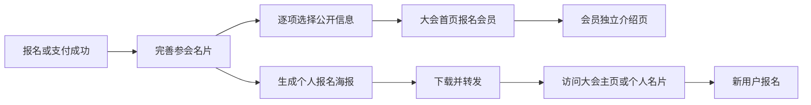
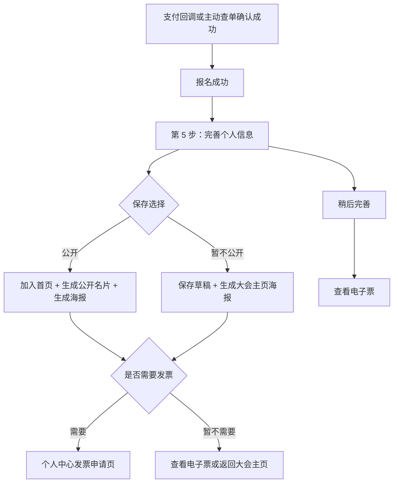

🥷 **推荐结论：把本次升级定义为一套“参会名片 + 报名会员展示 + 个人海报”的大会级增长闭环。公开资料按每场大会独立保存，用户逐项授权，支付成功后进入可跳过的第 5 步，首页按报名成功顺序展示，个人中心可持续维护，后台具备查看与下架能力。**

# TokEMS 报名会员展示与个人海报升级方案

> 状态：核心链路已实现，待联调与灰度验收
> 版本：v1.0
> 方案日期：2026-08-15
> 目标大会：第二届中国 GEO & AI 营销大会
> 依据：当前 TokEMS 仓库、现有报名/支付/个人中心/用户后台架构，以及支付页现状截图
> 实现进度：参会名片、会员目录、公开详情页、个人海报、头像处理与后台管理已进入验收阶段。

## 1. 方案目标

本次升级在现有“官网 → 报名 → 支付 → 电子票 → 个人中心”链路中增加一个自愿参与的公开名片环节。已完成报名的用户可以维护头像、姓名、公司、职位、行业、业务介绍、业务网址和联系方式，逐项决定是否公开，并生成可下载的专属报名海报。

公开后的资料进入大会首页“报名会员”模块。访客可以点击会员卡片，在新标签页打开该会员的独立介绍页。系统按报名成功顺序排序；公开人数超过 100 人后自动启用行业分类；每页最多展示 40 人。

本轮形成以下闭环：



## 2. 对当前系统的理解

### 2.1 已有能力

| 现有能力     | 当前实现                                                   | 本次复用方式                               |
| ------------ | ---------------------------------------------------------- | ------------------------------------------ |
| 用户身份     | 组织 + 中国大陆手机号唯一，前台报名要求有效用户会话        | 继续作为名片编辑权限依据                   |
| 报名关系     | 同一用户在同一大会只有一条报名主记录                       | 每条大会报名对应一份参会名片               |
| 支付事实     | 订单、支付记录、`payments.succeededAt`、免费订单和电子票   | 判断公开资格与报名顺序                     |
| 常用资料     | `customer_profiles` 已有昵称、姓名、邮箱、公司、职位、城市 | 首次打开名片时用于预填                     |
| 个人中心     | 已有大会记录、电子票、报名详情、发票中心和常用资料         | 增加“参会名片”模块和维护入口               |
| 发票         | 已支付订单可进入个人中心发票页申请                         | 名片完成页只提供跳转，不重复建设发票表单   |
| 大会首页     | Nuxt 结构化模板，已有嘉宾、议程、门票和报名模块            | 在嘉宾模块后加入 `home.members`            |
| 发布系统     | 页面结构和文案进入不可变发布快照，库存读取实时数据         | 会员模块结构进入快照，会员资料保持实时读取 |
| 后台用户详情 | 已能查看和编辑账号资料、报名历史、发票记录                 | 增加各大会参会名片与公开状态               |
| 对象存储     | 已有 MinIO、上传预留、摘要和文件类型校验模式               | 用于头像原图与标准化头像                   |

### 2.2 当前缺口

1. 现有报名流程只有 4 步，支付成功后直接进入电子票或个人中心。
2. `customer_profiles` 是组织级常用资料，缺少大会级业务介绍、网址、行业和公开授权。
3. 大会公开事件响应只有嘉宾、议程、票种和 FAQ，缺少报名会员数据。
4. 首页模板类型没有 `members` 区块，HTML 模板变量也没有会员集合。
5. 用户头像上传、裁剪和标准化链路尚未建立。
6. 用户没有独立的公开参会名片页。
7. 用户没有大会个人报名海报及下载能力。
8. 后台用户详情看不到用户为某场大会填写的公开名片和授权状态。

### 2.3 核心领域边界

本方案明确区分三类资料：

| 资料类型     | 作用域               | 来源                              | 修改影响                       |
| ------------ | -------------------- | --------------------------------- | ------------------------------ |
| 账号常用资料 | 当前组织内的用户账号 | `customer_profiles`               | 用于后续报名预填               |
| 报名资料快照 | 单场大会、单条报名   | `registrations.attendee`          | 保留报名和履约事实             |
| 参会名片     | 单场大会、单条报名   | 新增 `attendee_showcase_profiles` | 只影响当前大会的公开展示和海报 |

用户首次进入参会名片页时，系统使用账号常用资料和报名快照预填。保存后的参会名片拥有独立版本，后续修改不会改写其他大会的公开页面。账号常用资料继续由个人中心“常用资料”区域维护。

技术命名采用 `attendee_showcase`。现有数据库已经使用 `memberships` 和 `member_profiles` 表示后台组织成员，继续使用“member”作为数据库实体会造成领域混淆。

## 3. 需求范围

### 3.1 本次包含

- 支付成功或免费报名确认后的第 5 步“完善个人信息”。
- 大会级参会名片编辑、完成度、逐项公开授权和总公开开关。
- 头像上传、裁剪、标准化和姓名首字头像兜底。
- 行业选择、业务介绍、业务网址、联系电话、联系邮箱和微信号。
- 个人中心“参会名片”模块和后续修改入口。
- 大会首页“报名会员”模块。
- 40 人分页与超过 100 人后的行业分类。
- 报名会员独立介绍页，新标签页打开。
- 个人报名海报预览、自动更新和 PNG 下载。
- 发票申请跳转。
- 后台用户详情中的参会名片展示和运营下架。
- 隐私、内容安全、审计、退款联动和账号删除联动。

### 3.2 本次不包含

- 会员私信、站内聊天、交换名片、好友关系和群组。
- 会员搜索、关注、点赞、评论和排行榜。
- AI 自动判断行业或改写业务介绍。
- 主办方人工逐条审核后才发布的前置流程。
- 微信一键分享接口和小程序卡片。
- 服务端长期保存每次生成的海报文件。
- 将联系方式自动同步到 CRM 或第三方营销系统。
- 为导入型 HTML 首页提供完整实时会员组件；当前大会使用的结构化首页进入本轮交付。

## 4. 关键产品决策

### 4.1 公开采用“总开关 + 字段开关”

编辑页提供一个总开关：

> 在大会首页和我的公开名片页展示我

总开关关闭时，首页、公开接口和独立名片页都不返回该用户。字段开关保留用户对每项内容的控制权。联系方式默认关闭；其他字段可以预先选中，只有总开关开启并保存后才生效。

推荐默认值：

| 字段     | 是否预填                   | 公开开关默认值             |
| -------- | -------------------------- | -------------------------- |
| 头像     | 无，用户上传               | 开启；无头像时使用兜底头像 |
| 姓名     | 报名姓名或账号真实姓名     | 开启                       |
| 公司     | 报名公司或账号公司         | 开启                       |
| 职位     | 报名职位或账号职位         | 开启                       |
| 行业     | 用户选择                   | 开启                       |
| 业务介绍 | 空                         | 开启                       |
| 业务网址 | 空                         | 开启                       |
| 联系电话 | 空，禁止自动带出登录手机号 | 关闭                       |
| 联系邮箱 | 账号邮箱或报名邮箱         | 关闭                       |
| 微信号   | 空                         | 关闭                       |

姓名也允许关闭公开。头像兜底规则如下：

1. 头像已上传且头像允许公开：显示头像。
2. 头像未上传或头像未公开，姓名允许公开：显示姓名前 1～2 个字符生成的头像。
3. 姓名也未公开：显示通用“会员”图形和“报名会员 #序号”。

### 4.2 公开资格以报名成功事实为准

满足以下条件时，用户可以公开参会名片：

- 付费订单状态为 `paid` 或 `partially_refunded`，并存在可信支付成功记录。
- 免费订单已经确认并处于 `paid`。
- 报名状态为 `confirmed`、`checked_in` 或 `completed`。
- 用户账号状态为 `active`。
- 用户总公开开关已开启。
- 后台没有执行下架。

联动规则：

| 状态变化       | 首页与公开名片                                       |
| -------------- | ---------------------------------------------------- |
| 部分退款       | 保持展示，电子票仍有效                               |
| 全额退款       | 自动隐藏                                             |
| 报名取消       | 自动隐藏                                             |
| 电子票取消     | 自动隐藏                                             |
| 用户关闭总开关 | 立即隐藏                                             |
| 管理员下架     | 立即隐藏，保留用户填写内容                           |
| 用户账号删除   | 删除头像资产和公开名片，报名交易事实继续按原规则保留 |

### 4.3 排序采用报名成功时间

首页排序键采用：

```text
qualifiedAt ASC, registrationId ASC
```

`qualifiedAt` 取首笔可信支付成功时间；免费订单取订单确认时间。资料完成时间只用于显示“最近更新”，不会改变报名顺序。

用户较晚才完善资料时，公开后会进入其原始报名顺序对应的位置。这个口径符合“按报名顺序依次增加”的需求，也可以在海报中稳定表达“第 N 位报名会员”。

### 4.4 行业由用户选择，系统自动分组

用户选择 1 个主行业，用于首页自动分类。首版采用固定代码和中文标签，避免自由文本造成同义词分裂：

1. AI / 大模型 / Agent
2. 品牌 / 市场 / GEO
3. 互联网 / 软件 / IT
4. 电商 / 零售 / 消费品牌
5. 企业服务 / 咨询
6. 广告 / 媒体 / 内容
7. 教育 / 培训
8. 金融 / 投资
9. 医疗 / 健康
10. 制造 / 供应链
11. 房地产 / 建筑
12. 政府 / 协会 / 公共服务
13. 其他

公开名片要求主行业有值，“其他”可以覆盖未命中分类的用户。行业标签使用稳定代码保存，中文标签由契约统一输出，后续国际化时可以直接映射翻译。

### 4.5 首页采用分页网格

自动轮播会降低浏览控制和无障碍体验，首页采用静态网格与明确分页：

| 公开会员数 | 展示方式                                          |
| ---------- | ------------------------------------------------- |
| 0          | 整个模块隐藏                                      |
| 1～40      | 展示全部，不显示分页                              |
| 41～100    | 只显示“全部会员”，每页 40 人                      |
| 101 及以上 | 显示“全部 + 有数据的行业”分类，每个分类每页 40 人 |

分类采用标签式切换，页面只渲染当前分类和当前页。切换分类后回到第 1 页。分类顺序使用上面的固定行业顺序，空分类不显示。

分页使用页码和上一页/下一页。用户切页后滚动回模块标题，焦点进入更新后的会员结果区域。头像使用懒加载，公开接口每次只返回当前页所需字段。

## 5. 用户流程设计

### 5.1 支付成功后的第 5 步

现有截图中的步骤为：

1. 选择票种
2. 填写资料
3. 确认并支付
4. 报名成功

本次在第 4 步后增加：

5. 完善个人信息



推荐交互：服务端确认支付成功后自动进入第 5 步。页面顶部持续显示“报名成功，电子票已签发”，用户可以选择“稍后完善，先看电子票”。免费报名确认后也进入同一页面。待审核报名在审核和支付完成前不进入公开名片步骤。

### 5.2 第 5 步页面结构

页面路由建议：

```text
/account/registrations/:registrationId/showcase
```

页面结构：

1. 报名成功状态与 5 步进度条。
2. 说明文案。
3. 左侧信息编辑；移动端改为单列。
4. 右侧实时会员卡片与海报预览；移动端移到表单下方。
5. 总公开开关。
6. 每个字段右侧的“在大会主页展示”开关。
7. 保存状态、资料完成度与公开预览。
8. 海报下载、查看我的公开名片、查看电子票。
9. 发票入口。

推荐说明文案：

> 你已完成报名。完善参会名片后，可以选择将头像、姓名、公司、职位、行业、业务介绍、网址和联系方式展示在大会首页及个人名片页，方便同行认识你，也方便你转发大会。公开展示完全自愿，每项信息都可以单独控制，你可以随时修改或关闭。首页按报名成功顺序展示，保存后还会生成可下载的专属报名海报。

表单字段和限制：

| 字段      | 类型与限制                                  | 备注                     |
| --------- | ------------------------------------------- | ------------------------ |
| 头像      | JPG/PNG/WebP，原文件不超过 5 MB，裁剪为 1:1 | 输出 512×512 WebP        |
| 姓名      | 1～120 字符                                 | 预填报名姓名             |
| 公司/组织 | 最多 160 字符                               | 可隐藏                   |
| 职位      | 最多 100 字符                               | 可隐藏                   |
| 主行业    | 单选固定行业                                | 公开时必填               |
| 业务介绍  | 最多 500 字符，纯文本                       | 支持自然换行             |
| 业务网址  | 最多 500 字符，只允许 HTTPS/HTTP            | 详情页新标签打开         |
| 联系电话  | 最多 32 字符                                | 与登录手机号独立，默认空 |
| 联系邮箱  | 合法邮箱                                    | 默认不公开               |
| 微信号    | 最多 80 字符                                | 默认不公开               |

### 5.3 保存后的结果页

保存完成后留在当前页并切换到结果状态：

- 显示“参会名片已保存”。
- 公开开启时显示“已加入大会首页报名会员”。
- 公开关闭时显示“资料已保存，当前仅自己可见”。
- 海报立即使用最新数据重新渲染。
- 提供“下载专属海报”“查看我的名片”“查看电子票”“返回大会主页”。
- 付费且具备开票资格时显示“需要发票”选择；确认后跳转现有 `/account/invoices/:orderId`。
- 已提交发票时显示现有状态并提供“查看发票”。

### 5.4 个人中心

个人中心导航建议调整为：

1. 总览
2. 我的大会
3. 参会名片
4. 发票中心
5. 常用资料
6. 账户安全

“个人资料”改名为“常用资料”，减少与大会级参会名片的歧义。

“参会名片”模块按大会显示：

| 信息     | 示例                                                    |
| -------- | ------------------------------------------------------- |
| 大会     | 第二届中国 GEO & AI 营销大会                            |
| 完成度   | 80%                                                     |
| 公开状态 | 已公开 / 仅自己可见 / 已被主办方下架 / 当前报名不可公开 |
| 行业     | 品牌 / 市场 / GEO                                       |
| 首页顺序 | 第 26 位报名会员                                        |
| 更新时间 | 2026-08-15 14:20                                        |
| 操作     | 完善或编辑、查看公开名片、下载海报                      |

报名列表和报名详情也增加“参会名片”快捷入口。用户关闭支付页、换设备或稍后登录时，仍然可以继续完善和修改。

## 6. 大会首页“报名会员”模块

### 6.1 模块位置

新增模板节点：

```text
home.members
```

默认位置固定在 `home.speakers` 后、`home.organizer` 前，符合“嘉宾模块下方增加报名会员”的要求。导航可以增加“会员”锚点，会员数为 0 时导航项和模块一起隐藏。

建议文案：

- Kicker：`ATTENDEE NETWORK`
- 标题：`报名会员`
- 副标题：`认识这一届大会的同行者`
- 说明：`以下信息由报名会员自愿公开，按报名成功顺序展示。`
- 数量：`已有 86 位报名会员公开了参会名片`

### 6.2 会员卡片

首页卡片保持与嘉宾卡片一致的视觉语言，信息密度更轻：

- 头像或兜底头像。
- 姓名；隐藏时显示“报名会员 #序号”。
- 公司与职位；只显示已授权字段。
- 行业标签。
- “查看名片 ↗”提示。

业务介绍、网址和联系方式只进入详情页，避免首页卡片过高。卡片整体可点击，使用新标签页打开，并提供 `rel="noopener noreferrer"`。

响应式建议：

| 视口         | 列数 |
| ------------ | ---- |
| ≥ 1280 px    | 5 列 |
| 960～1279 px | 4 列 |
| 640～959 px  | 3 列 |
| 390～639 px  | 2 列 |
| < 390 px     | 1 列 |

### 6.3 公开接口只返回已授权字段

首页不能先拿到完整对象再由前端隐藏。服务端根据字段授权生成公共响应，未授权字段不会进入 JSON、SSR 数据、页面 DOM、结构化数据或埋点。

公开列表响应中的单个会员只包含：

```text
publicSlug
sequence
avatarUrl（可选）
displayName（可选）
company（可选）
title（可选）
industry（可选）
```

## 7. 报名会员独立介绍页

### 7.1 路由与打开方式

建议公开路由：

```text
/members/:publicSlug?event=:eventSlug
```

首页会员卡片在新标签页打开该路由。`publicSlug` 使用不可预测的随机字符串，内部 UUID、用户数字 ID、报名 ID 和手机号都不进入公开地址。

### 7.2 页面结构

1. 大会品牌、日期和会场信息。
2. “返回大会主页”主导航。
3. 会员头像、姓名、公司、职位和行业。
4. 业务介绍。
5. 业务/公司/项目网址。
6. 用户已授权的联系方式。
7. “我也要参加”报名按钮。
8. 大会信息与报名入口。

无值或未授权字段不显示标题和空占位。网址添加 `rel="noopener noreferrer nofollow ugc"`。业务介绍作为纯文本输出，禁止用户 HTML。

个人页默认使用 `noindex,nofollow`，允许用户通过首页和海报链接访问，降低搜索引擎长期收录个人联系方式的风险。页面使用大会现有分享图作为 Open Graph 图片，首版不把联系方式写入分享元数据。

总公开开关关闭、全额退款、报名取消或管理员下架后，公开 API 返回 404。页面提供“该参会名片当前不可访问”和返回大会主页的安全空状态。

## 8. 专属报名海报

### 8.1 海报内容

首版采用 1080×1440 的 3:4 竖版 PNG，适合手机保存和微信传播。版式沿用大会首页的白底、品牌蓝和编辑式排版。

海报信息：

- 大会品牌和届次。
- 大会名称。
- 日期、城市和会场。
- 用户头像或兜底头像。
- 姓名、公司、职位；仅使用允许公开的字段。
- “我是第 N 位报名会员”。
- 一句业务介绍；长度超过 48 个中文字符时截断。
- 二维码。
- 行动文案：“扫码查看我的参会名片与大会详情”。

联系方式不进入海报，降低转发后的隐私扩散风险。

### 8.2 二维码目标

| 状态           | 二维码链接     |
| -------------- | -------------- |
| 总公开开关开启 | 会员独立介绍页 |
| 总公开开关关闭 | 大会主页       |
| 公开资格失效   | 大会主页       |

链接可以附加匿名归因参数：

```text
utm_source=member_poster&utm_medium=share&utm_campaign=:eventSlug
```

首版只记录活动级归因，不在公开查询参数中携带手机号、用户 ID 或报名 ID。

### 8.3 生成方式

推荐使用浏览器原生 Canvas 按当前已保存数据即时渲染：

- 编辑预览随表单变化即时更新。
- 每次点击下载都重新生成当前版本 PNG。
- 用户重新打开页面时，从服务端读取最新名片并重新生成。
- 文件名为 `大会短名-姓名-报名海报.png`；姓名未公开时使用 `报名会员-序号`。
- 海报文件不写入数据库和对象存储，避免陈旧文件与清理任务。

头像通过同源受控地址读取，二维码在 Canvas 中绘制。字体加载失败时使用系统中文字体并保持布局边界。下载失败时保留重试和“打开原图”操作。

## 9. 数据模型

### 9.1 新增 `attendee_showcase_profiles`

| 字段                      | 类型               | 说明                                     |
| ------------------------- | ------------------ | ---------------------------------------- |
| `id`                      | UUID PK            | 内部名片 ID                              |
| `organization_id`         | UUID FK            | 组织隔离                                 |
| `event_id`                | INT FK             | 所属大会                                 |
| `registration_id`         | UUID FK UNIQUE     | 每条报名最多一份名片                     |
| `customer_user_id`        | UUID FK            | 仅报名所属用户可编辑，用户删除时级联删除 |
| `public_slug`             | VARCHAR(32) UNIQUE | 公开地址标识                             |
| `qualified_at`            | TIMESTAMPTZ        | 报名成功排序时间                         |
| `display_name`            | VARCHAR(120)       | 大会级显示姓名                           |
| `company`                 | VARCHAR(160)       | 公司/组织                                |
| `title`                   | VARCHAR(100)       | 职位                                     |
| `industry_code`           | VARCHAR(60)        | 主行业稳定代码                           |
| `business_intro`          | TEXT               | 最多 500 字符                            |
| `business_url`            | VARCHAR(500)       | HTTP/HTTPS 网址                          |
| `contact_phone`           | VARCHAR(32)        | 独立公开联系电话                         |
| `contact_email`           | VARCHAR(255)       | 联系邮箱                                 |
| `wechat_id`               | VARCHAR(80)        | 微信号                                   |
| `avatar_asset_id`         | UUID FK NULL       | 标准化头像资产                           |
| `is_public`               | BOOLEAN            | 用户总公开开关，默认 false               |
| `visible_fields`          | JSONB              | 固定字段可见性映射                       |
| `consent_version`         | VARCHAR(40) NULL   | 公开授权文案版本                         |
| `consented_at`            | TIMESTAMPTZ NULL   | 最近一次开启公开时间                     |
| `admin_hidden_at`         | TIMESTAMPTZ NULL   | 后台下架时间                             |
| `admin_hidden_reason`     | VARCHAR(500) NULL  | 下架原因                                 |
| `version`                 | INT                | 乐观并发版本                             |
| `created_at / updated_at` | TIMESTAMPTZ        | 审计时间                                 |

约束与索引：

- 复合外键保证组织、大会、报名归属一致。
- `registration_id` 唯一。
- `public_slug` 全局唯一。
- 列表索引：`event_id, is_public, admin_hidden_at, qualified_at, id`。
- 行业分页索引：`event_id, industry_code, is_public, qualified_at, id`。
- `visible_fields` 只接受契约定义的字段键和布尔值。

### 9.2 新增 `customer_media_assets`

| 字段                                       | 说明                          |
| ------------------------------------------ | ----------------------------- |
| `id`                                       | 头像资产 UUID                 |
| `organization_id` / `customer_user_id`     | 归属与删除范围                |
| `kind`                                     | 首版固定为 `avatar`           |
| `source_storage_key`                       | 原图短期存储键                |
| `output_storage_key`                       | 标准化 WebP 存储键            |
| `media_type` / `size` / `width` / `height` | 文件事实                      |
| `content_digest`                           | SHA-256                       |
| `status`                                   | `processing / ready / failed` |
| `failure_reason`                           | 处理失败原因                  |
| `created_at / updated_at`                  | 时间                          |

头像上传沿用现有“准备上传 → 对象存储直传 → 服务端确认 → 校验摘要和文件头”的模式。处理任务生成 512×512 WebP、移除 EXIF，并删除过期原图。处理期间使用姓名头像兜底。

### 9.3 不新增海报表

海报由当前事件数据、参会名片、公开字段和模板版本确定，浏览器按需渲染即可满足“自动更新 + 下载”。数据库只保留名片事实，减少存储、缓存失效和后台清理成本。

### 9.4 存量数据迁移

- 数据库迁移只新增表、枚举、约束和索引。
- 现有已支付报名不会自动公开，也不会批量创建公开名片。
- 用户首次进入名片页面时创建私有草稿，并从报名资料和常用资料预填。
- `qualified_at` 从首笔 `payments.succeededAt` 读取；免费订单使用确认时间。
- 缺少可信成功时间的存量记录保持不可公开，并在后台显示数据原因。
- 回滚应用时保留新表和用户授权数据，旧应用不会读取这些表。

## 10. API 与契约设计

### 10.1 用户侧接口

```text
GET   /customer/registrations/:registrationId/showcase
PATCH /customer/registrations/:registrationId/showcase
POST  /customer/registrations/:registrationId/showcase/avatar-upload
POST  /customer/registrations/:registrationId/showcase/avatar-confirm
DELETE /customer/registrations/:registrationId/showcase/avatar
```

读取接口返回：报名资格、名片草稿、字段可见性、完成度、公开状态、公开地址、首页序号、发票入口状态和海报所需大会信息。

更新接口要求：

- 有效用户会话和 CSRF。
- 报名属于当前组织和当前用户。
- `version` 乐观并发校验。
- 开启公开时校验姓名、行业和公开授权版本。
- 审计日志只记录发生变化的字段名、公开开关和可见性键，不记录联系方式正文。

### 10.2 公开接口

```text
GET /events/:eventSlug/members?page=1&industry=:industryCode
GET /events/:eventSlug/members/:publicSlug
```

列表响应：

```text
items
total
page
pageSize = 40
totalPages
groupingMode = all | industry
industryCounts[]
```

公开详情响应只包含当前允许公开的字段和大会基础信息。两个接口均重新校验报名、订单、票券、用户公开开关和后台下架状态。

缓存策略采用 `Cache-Control: no-cache, must-revalidate`。用户关闭公开或管理员下架后，下一次请求立即生效。

### 10.3 后台接口

用户详情契约增加：

```text
showcases[]
```

每项包含大会、报名编号、完成度、行业、用户公开状态、后台下架状态、可见字段清单、更新时间和公开预览地址。

新增后台动作：

```text
PATCH /admin/events/:eventId/member-showcases/:showcaseId/moderation
```

操作使用现有 `customer.manage` 权限，支持下架、填写原因和恢复。下架与恢复都写入审计日志。

### 10.4 模板契约

`TemplateHomeBlockSchema.type` 增加 `members`。当前大会的新发布版本显式加入：

```text
nodeKey: home.members
type: members
enabled: true
```

`TemplateFlowStepSchema.type` 增加 `member-profile`，当前大会报名流显式加入第 5 步。

老发布快照缺少这两个节点时保持原页面和原 4 步流程。新默认模板可以包含这两个节点，新建大会直接获得完整能力。这个规则避免代码升级后让所有历史大会自动出现未配置模块。

会员运行数据不会写入发布快照。区块顺序、标题和说明进入发布快照；会员列表、公开状态和头像从实时接口读取。

## 11. 后台设计

### 11.1 用户列表

现有“用户管理”列表增加一个轻量状态：

- `参会名片 2/3`：3 场有效报名中有 2 场已完善。
- 状态点：公开、私有、下架。

本轮不增加独立的会员管理一级菜单。用户列表和用户详情已经是跨大会用户运营入口，继续在该页面承载可以减少重复目录。

### 11.2 用户详情

在“用户资料”和“报名历史”之间增加“参会名片”区域：

| 展示项     | 内容                                               |
| ---------- | -------------------------------------------------- |
| 大会与报名 | 大会名称、报名编号、报名成功时间                   |
| 名片资料   | 头像、姓名、公司、职位、行业、介绍、网址、联系方式 |
| 授权状态   | 总公开开关、逐项可见性、授权时间和文案版本         |
| 当前状态   | 已公开、私有、资格失效、后台下架                   |
| 公开预览   | 新标签页打开名片                                   |
| 运营动作   | 下架、填写原因、恢复                               |

后台查看完整名片需要 `customer.read`。后台修改账号常用资料继续走现有资料编辑；名片内容由用户维护，后台首版只提供下架与恢复，减少主办方无提示改写用户公开内容的风险。

## 12. 安全、隐私与内容治理

1. 登录手机号不会自动进入公开联系电话。
2. 联系邮箱即使被预填，公开开关仍然默认关闭。
3. 未授权字段在服务端响应阶段移除。
4. 公开授权保存文案版本和时间，关闭公开不需要说明原因。
5. 业务介绍只允许纯文本，所有输出统一转义。
6. 网址只允许 HTTP/HTTPS，拒绝 `javascript:`、`data:` 和凭据型 URL。
7. 外部链接使用 `nofollow ugc noopener noreferrer`。
8. 头像校验声明类型、文件头、大小、摘要和尺寸；标准化过程移除 EXIF。
9. 公开详情页默认 `noindex,nofollow`。
10. 头像资源地址不包含手机号、姓名、报名 ID 或用户公开数字 ID。
11. 管理员下架原因和操作人进入审计日志，公开页面不展示内部原因。
12. 用户关闭公开、全额退款或账号删除后，公开接口立即停止返回资料。
13. 公共列表和详情接口增加 IP 频率限制，防止高频抓取。

## 13. 失败与边界处理

### 13.1 依赖与凭据

- 继续复用现有 PostgreSQL、MinIO、Redis、BullMQ 和同源公开 API。
- Worker 新增 `sharp` 依赖，用于头像裁剪、缩放、WebP 转换和 EXIF 清理；Docker 构建需要验证对应平台二进制。
- 海报使用浏览器 Canvas 和项目已有二维码能力，不调用第三方制图服务。
- 本次不新增 API Key、第三方账号、环境变量或独立服务。

### 13.2 异常场景

| 场景               | 处理方式                                               |
| ------------------ | ------------------------------------------------------ |
| 支付渠道短暂不可用 | 保持现有支付重试；公开名片入口只在服务端确认成功后开放 |
| 头像上传失败       | 保留表单内容，使用姓名头像，支持单独重试               |
| 头像处理中         | 显示本地预览；公共页面暂时使用兜底头像                 |
| 海报生成失败       | 保留名片保存结果，提供重新生成和打开原图               |
| 两个页面同时编辑   | `version` 冲突返回 409，提示刷新后合并                 |
| 用户隐藏所有字段   | 首页显示通用会员卡和报名序号，详情页只显示大会信息     |
| 行业为空           | 私有草稿可保存；开启公开时要求选择                     |
| 会员刚公开         | 按原报名成功顺序插入，分页总数同步更新                 |
| 公开网址失效       | 页面仍显示文字链接，外部访问结果由目标网站负责         |
| 全额退款           | 自动从首页和公开详情移除，海报二维码回到大会主页       |
| 管理员下架         | 用户仍可编辑并看到下架状态，公开端不返回资料           |

## 14. 实施分期

本次预计涉及 20 个以上文件、2 个新数据表、1 个数据库迁移、Web/Admin/API/Contracts/Database/Worker 六个工作区，属于完整跨端升级。

### 阶段一：参会名片与海报闭环

独立可发布结果：已报名用户可以在第 5 步和个人中心完成参会名片、逐项授权、头像上传、公开个人页、海报下载和发票跳转；后台可以查看和下架。

实施内容：

- 新增数据表、索引、契约和迁移。
- 新增用户名片接口、头像处理和公开详情接口。
- 新增第 5 步页面、公开名片页和 Canvas 海报。
- 支付成功、免费报名、电子票和个人中心接入入口。
- 后台用户详情增加参会名片。
- 完成隐私、状态联动和审计测试。

阶段一上线后，即使首页会员模块尚未发布，用户也可以通过海报分享个人名片与大会。

### 阶段二：首页报名会员与规模化展示

独立可发布结果：当前结构化大会首页加入报名会员模块，支持 40 人分页和超过 100 人的行业分类。

实施内容：

- 模板契约增加 `home.members`。
- 当前大会模板版本加入会员区块并发布新快照。
- 新增公开会员列表接口、统计和行业计数。
- 首页增加会员网格、分页、分类、加载状态和空状态。
- 完成 0、1、40、41、100、101、500、5000 人数据量验收。
- 完成桌面和移动端视觉验收。

### 阶段三：运营加固与发布收尾

独立可发布结果：具备生产监控、异常清理、数据导出边界和完整上线说明。

实施内容：

- 增加头像处理失败重试和过期原图清理。
- 增加公开接口限流、慢查询指标和下架审计查询。
- 更新 API、架构、用户系统和运营文档。
- 更新演示数据与视觉验收脚本。
- 完成迁移备份、灰度、回滚和隐私复核。

## 15. 预计文件范围

核心文件目标如下，实施时以当前工作区未提交修改为基线逐个合并：

| 工作区       | 预计文件                                                                                          |
| ------------ | ------------------------------------------------------------------------------------------------- |
| Contracts    | `packages/contracts/src/index.ts` 及对应契约测试                                                  |
| Database     | `packages/database/src/schema.ts`、下一号 Drizzle 迁移、种子数据                                  |
| API          | 新增 `attendee-showcase.service.ts`；调整 `public.module.ts`、`customer.module.ts` 和相关模块测试 |
| Worker       | `apps/worker/src/main.ts`、`apps/worker/package.json`、`pnpm-lock.yaml`、头像标准化任务及测试     |
| Web API      | `useConferenceApi.ts`、`useCustomerSession.ts`                                                    |
| Web 页面     | `order/[id].vue`、`ticket/[id].vue`、`account/index.vue`、`account/registrations/[id].vue`        |
| Web 新页面   | `account/registrations/[id]/showcase.vue`、`members/[publicSlug].vue`                             |
| Web 样式     | `main.css`、`conference.css` 和页面局部样式                                                       |
| Admin        | `CustomerUsersView.vue`、`lib/api.ts` 和相关样式/测试                                             |
| Docs/Tooling | `docs/api.md`、`docs/user-system.md`、架构文档、视觉与持久化验收脚本                              |

当前工作区已有大量未提交修改。实施时需要保留这些用户改动，避免覆盖同文件中的在建报名、支付、发票和后台升级内容。

## 16. 验收标准

### 16.1 主链路

1. 付费报名确认成功后进入第 5 步，免费报名行为一致。
2. 用户可以跳过第 5 步，电子票与报名结果不受影响。
3. 用户保存公开名片后，在首页按报名成功时间出现。
4. 首页卡片新标签打开正确的独立名片页。
5. 独立名片页只显示允许公开的字段。
6. 用户修改信息后，首页、独立页和新下载海报使用最新内容。
7. 用户关闭公开后，首页移除卡片，公开地址返回不可访问状态。
8. 用户可以从名片页跳转到现有发票申请或发票详情。
9. 用户可以在个人中心重新进入、修改和下载海报。
10. 后台点击用户后可以看到该用户各场大会的名片和授权状态。

### 16.2 隐私与安全

1. 登录手机号从未自动出现在公共响应和海报。
2. 隐藏字段不出现在 JSON、SSR 数据、DOM、OG 元数据和下载海报中。
3. 非本人无法读取或修改私有名片接口。
4. 跨组织、跨大会和跨报名访问全部拒绝。
5. 恶意 HTML、脚本 URL、伪造图片类型和超限文件被拒绝。
6. 公开接口无法通过 UUID 或数字用户 ID 枚举用户。
7. 总公开开关、字段授权、后台下架和恢复都有审计记录。

### 16.3 状态与边界

1. 部分退款保持展示；全额退款自动隐藏。
2. 报名取消、票券取消、账号封禁和账号删除都会停止公开。
3. 头像缺失、头像隐藏、姓名隐藏和全部字段隐藏均有完整兜底。
4. 版本冲突不会静默覆盖后保存的数据。
5. 会员数为 40、41、100、101 时，分页与分类边界准确。
6. 5000 名公开会员时无 N+1 查询，分页查询命中复合索引。

### 16.4 体验与性能

1. 1440、1024、768、390 和 320 px 宽度无横向溢出。
2. 会员卡、分类和分页支持键盘操作、清晰焦点与读屏提示。
3. 新标签页操作在可访问名称中说明“在新标签页打开”。
4. 40 人列表响应不携带业务介绍和联系方式，JSON 目标小于 100 KB。
5. 5000 名数据下，公开列表数据库查询 P95 目标小于 200 ms，接口 P95 目标小于 500 ms。
6. 会员模块位于首屏以下并懒加载头像，不增加首页主视觉 LCP 资源。
7. 海报生成不会阻塞名片保存，失败可以单独重试。

### 16.5 验证命令

```bash
pnpm lint
pnpm typecheck
pnpm test
pnpm build
pnpm docs:check
pnpm test:persistent
pnpm test:operations
pnpm test:visual
```

## 17. 发布与回滚

推荐发布顺序：

1. 备份 PostgreSQL 和对象存储。
2. 执行新增表和索引迁移。
3. 发布 API 与 Worker，使新接口和头像任务先可用。
4. 发布 Web 与 Admin。
5. 升级当前大会模板定义，加入第 5 步和 `home.members`。
6. 发布当前大会的新快照。
7. 使用内部测试报名验证私有、公开、字段隐藏、海报和发票跳转。
8. 小范围邀请已报名用户完善资料。
9. 观察公开接口错误率、头像任务失败率、名片公开率和海报下载率。

回滚策略：

- 首页模块通过当前发布快照控制，可以回滚到上一版本立即隐藏。
- 第 5 步入口可以随 Web 版本回滚，报名、支付和电子票保持原链路。
- API 回滚后保留新表和对象，不删除用户已填写资料和授权记录。
- 头像任务停止时使用姓名头像兜底。
- 数据库迁移保持向前兼容，回滚期间不执行删表。

## 18. 成功指标

上线两周建议观察：

| 指标         | 定义                        | 首版参考目标 |
| ------------ | --------------------------- | ------------ |
| 名片开始率   | 进入第 5 步 / 报名成功用户  | ≥ 60%        |
| 名片完成率   | 保存名片 / 进入第 5 步      | ≥ 55%        |
| 公开选择率   | 开启公开 / 已保存名片       | ≥ 35%        |
| 海报下载率   | 下载海报 / 已保存名片       | ≥ 30%        |
| 海报访问率   | 海报归因访问 / 海报下载     | 建立基线     |
| 海报报名转化 | 海报归因报名 / 海报归因访问 | 建立基线     |
| 隐私关闭率   | 关闭公开 / 曾公开用户       | 监控异常上升 |
| 后台下架率   | 后台下架 / 公开名片         | < 2%         |

## 19. 关键假设与风险

### 19.1 最脆弱假设

本方案假设线上目标大会继续使用仓库默认的 `structured` 结构化首页。仓库种子和当前页面代码均符合该模式。如果线上生效版本使用导入型 HTML 首页，`home.members` 无法直接挂载，需要增加受控实时组件挂载点和 HTML 编译器能力，实施范围会扩展到 `packages/html-template`、HTML 模板编辑器、发布验证和 CSP。

上线前由大会运营负责人在后台确认当前发布版本的 `presentation.kind`。确认结果为 `html` 时，应先补充 HTML 实时会员组件设计，再进入首页实施。

### 19.2 其他风险

| 风险               | 处理                                                               |
| ------------------ | ------------------------------------------------------------------ |
| 用户误公开联系方式 | 总开关默认关闭，联系方式字段默认关闭，发布前显示公开预览           |
| 用户内容不当       | 纯文本与 URL 校验，后台即时下架，保留审计                          |
| 大量头像拖慢首页   | 512×512 WebP、懒加载、当前页 40 人、尺寸占位                       |
| 公开人数快速增长   | 服务端分页、复合索引、超过 100 人自动按行业分类                    |
| 编辑后旧数据残留   | 公共接口实时校验，no-cache，海报每次重新生成                       |
| 退款后仍被传播     | 公开页停止返回，海报旧图片无法远程撤回，二维码目标页面显示大会主页 |

## 20. 待产品确认的 6 项决策

以下均给出推荐值，确认后可以直接进入实施：

1. **公开排序**：采用报名成功时间，资料完成时间不影响顺序。推荐确认。
2. **隐私默认值**：总公开开关默认关闭；头像、姓名、公司、职位、行业、介绍和网址预选公开；电话、邮箱、微信默认关闭。推荐确认。
3. **分类阈值**：公开会员达到 101 人时出现行业分类；每页 40 人。推荐确认。
4. **退款联动**：部分退款保持公开；全额退款、报名取消和票券取消自动隐藏。推荐确认。
5. **海报二维码**：公开时进入个人名片，私有时进入大会主页；海报永远不放联系方式。推荐确认。
6. **渲染器范围**：当前结构化大会首页完整支持；导入型 HTML 首页实时会员组件进入后续专项。推荐确认。

## 21. 确认后的实施口径

产品确认本方案后，实施以本文件为唯一业务口径。工程开始前先复核当前工作区未提交修改和线上生效模板类型；完成后运行全量检查与视觉验收，再进入数据库备份、灰度发布和大会快照更新。
