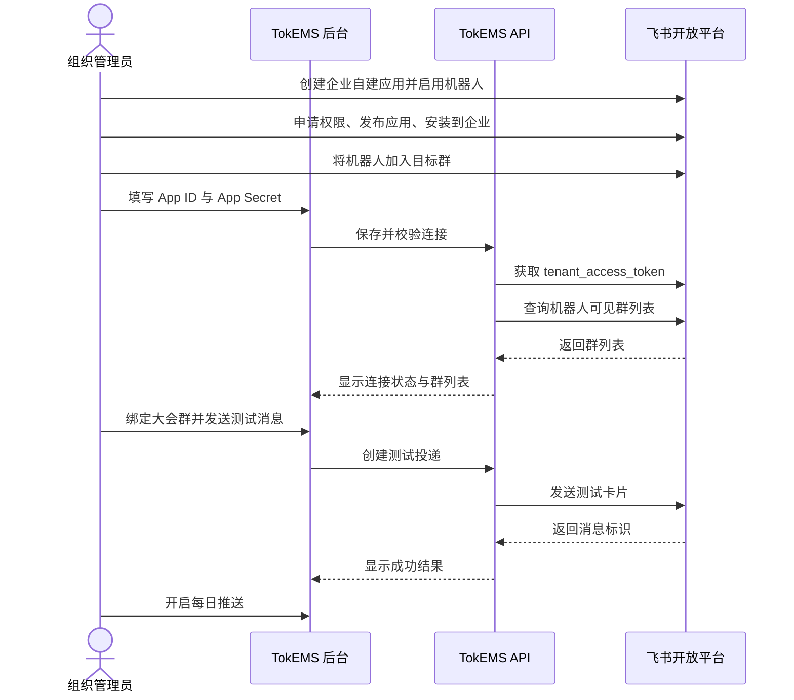
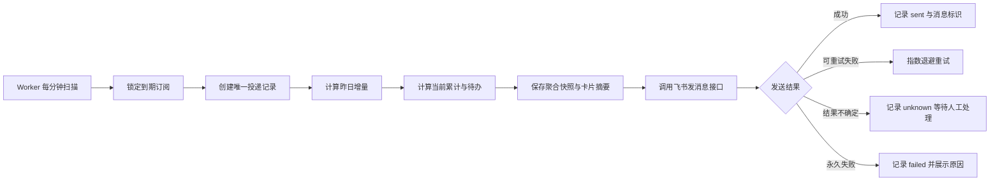
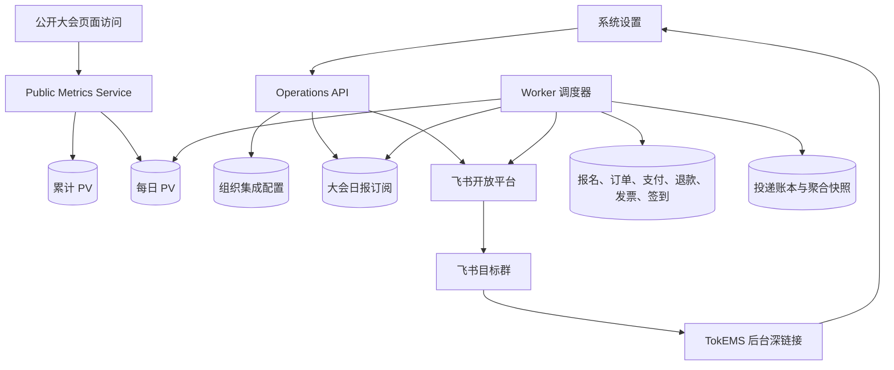
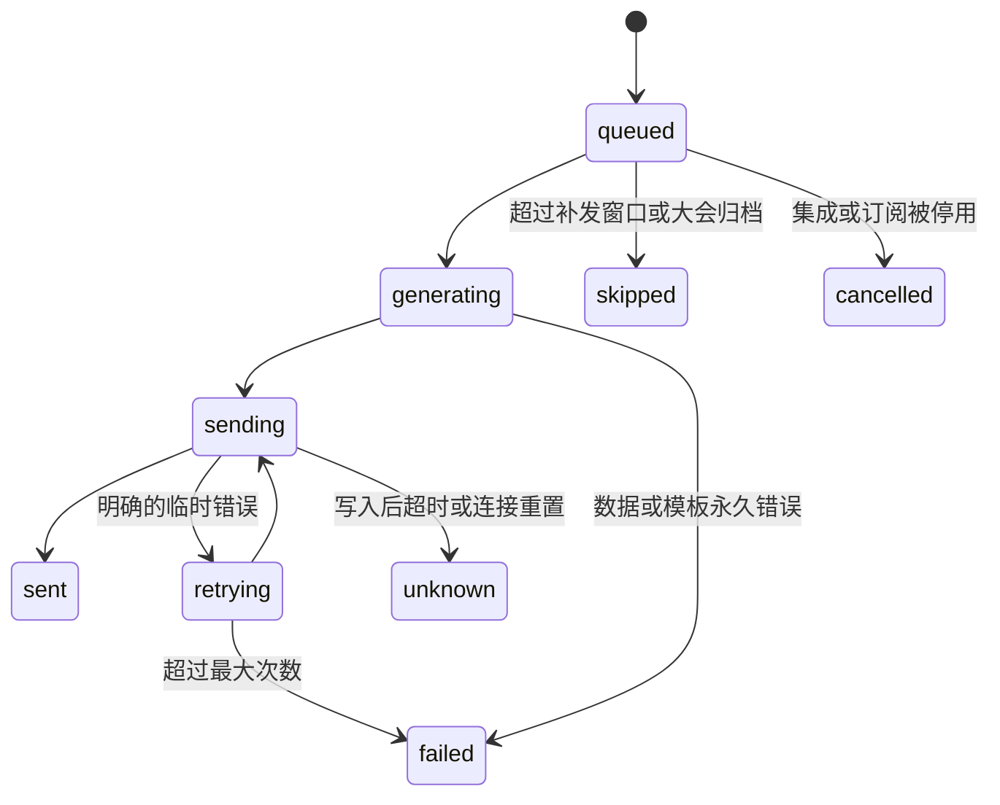

# TokEMS 飞书运营日报与待办推送方案

> 版本：v1.1
>
> 状态：后端已实现，待数据库迁移、飞书应用联调与后台界面接入
>
> 评审日期：2026-08-19
> 适用范围：TokEMS 组织后台、大会运营、财务协同与飞书群通知

## 1. 方案结论

TokEMS 增加“飞书机器人”集成，由组织管理员填写飞书企业自建应用的 App ID 和 App Secret，系统完成凭据校验、机器人可用群查询、目标群绑定和测试消息发送。每场大会可独立开启日报，在大会时区的固定时间，将前一完整自然日的增量数据、截至发送时的累计数据和当前待处理事项推送到指定飞书群。

首期采用“企业自建应用机器人 + 静态 Card 2.0 + TokEMS 后台深链接”的组合。机器人负责主动推送聚合数据，运营人员点击卡片按钮进入 TokEMS 完成审核、开票、退款处理等操作。该边界可以保持现有权限、审计和业务规则完整，也能避免飞书用户身份与 TokEMS 账号尚未映射时产生越权风险。

方案需要新增三类能力：按大会本地日期累计访问量、飞书日报订阅配置、消息投递账本。定时任务沿用现有 Worker、PostgreSQL 和事务 Outbox，不增加服务容器、语言运行时或消息中间件。

本轮已完成后端接口、数据库模型、每日访问量双写、指标聚合、飞书客户端、定时调度、投递状态机和自动化测试。后台界面与真实飞书企业应用联调列入上线前工作。

## 2. 本次评审补齐的关键设计

原始需求中的方向完整，评审后补充以下决策，作为开发与验收依据：

1. 明确选择飞书企业自建应用机器人，暂不采用群自定义 Webhook。
2. 明确授权边界：TokEMS 校验 App ID 和 App Secret；飞书管理员仍需在开放平台完成应用发布、企业安装、权限审批，并将机器人加入目标群。
3. 固定日报统计窗口、时区、指标口径和退款口径，避免后台与群消息数据不一致。
4. 增加每日访问量存储。现有累计访问量无法还原历史每日访问量，历史数据不做推算回填。
5. 将“昨日增量”和“当前待办”分开计算，并在卡片中显示数据日期与生成时间。
6. 增加数据库级调度抢占、唯一去重键、投递账本、重试策略和不确定状态，覆盖多 Worker、重启与网络超时场景。
7. 明确群消息仅包含聚合数据，敏感明细通过受 TokEMS 权限保护的后台页面查看。
8. 将飞书设置放入“系统设置”第七个页签；一套组织凭据可服务多场大会，每场大会首期绑定一个目标群。
9. 将飞书卡片回调、群内直接审批、原生飞书任务等能力列入后续范围，首期无需事件订阅或长连接。

## 3. 当前系统基线

### 3.1 已有可复用能力

- NestJS API、PostgreSQL、Redis、BullMQ Worker 和事务 Outbox 已具备异步投递基础。
- `organization_integrations` 已支持集成状态、JSON 配置、加密凭据、密钥版本、最近校验时间和错误信息。
- 集成凭据已有加解密能力，可直接用于保存 App Secret。
- 运营后台已有短信、支付等系统设置模式，可复用连接状态、密钥掩码、保存和测试交互。
- 大会仪表盘已有报名、已支付订单、已售席位、参会人、购票人、净收入、签到和待审核等指标。
- `resolveDeploymentOrigins()` 已能解析 `adminOrigin`，可用于生成飞书卡片中的后台链接。
- 公开页面访问已具备机器人 User-Agent 排除和 10 分钟 `pageViewId` 去重。

### 3.2 当前缺口

- `event_public_metrics` 只保存大会累计访问量和统计起始时间，无法生成可靠的每日访问量。
- 目前没有飞书集成配置页、群列表查询、消息预览、投递历史和定时发送能力。
- 现有业务状态中没有“用户提交退款申请”的独立队列，因此“退单”首期按成功退款笔数与金额统计。
- 部分运营列表页还未完整消费 URL 筛选参数，飞书卡片深链接需要同步补齐。

### 3.3 大会现状快照

以下数据仅用于评审时校准方案，采集于 2026-08-19，开发与上线前需要重新核验：

| 项目           | 当前值                       |
| -------------- | ---------------------------- |
| 大会           | 第二届中国 GEO & AI 营销大会 |
| 大会标识       | `tokems26`                   |
| 当前状态       | `registration_open`          |
| 举办时间       | 2026-11-21 至 2026-11-22     |
| 大会时区       | `Asia/Shanghai`              |
| 已确认参会人数 | 3                            |
| 票种剩余库存   | 497                          |
| 标准票价       | 399 CNY                      |
| 访问统计       | 累计值为 0，尚无统计起始时间 |

当前阶段属于报名售票期，日报应优先呈现访问、报名、支付、库存、发票和退款信息。大会进行中提高签到指标优先级；大会结束后提高财务结算和遗留待办优先级。

## 4. 产品目标与范围

### 4.1 产品目标

- 让运营团队每天在固定群聊获得统一、可信且可追溯的数据快照。
- 让异常与待处理事项在同一张卡片中被看见，并可一键进入后台筛选结果。
- 让组织管理员通过后台完成连接、群选择、试发、启停和投递排障。
- 保证多大会、多组织、Worker 重启和网络抖动下的数据隔离与投递稳定性。

### 4.2 首期范围

- 飞书企业自建应用机器人连接和校验。
- 查询机器人已加入的群并绑定大会目标群。
- 日报预览、测试发送、启停、发送时间配置。
- 昨日增量、累计经营数据、当前待办和监控项。
- 静态 Card 2.0 消息与 TokEMS 后台深链接。
- 数据库安全调度、投递记录、失败重试和后台历史查询。
- 每日访问量统计表和既有指标聚合。

### 4.3 首期范围外

- 飞书用户与 TokEMS 用户身份映射。
- 在飞书群内直接审核报名、开票、退款或修改订单。
- 飞书卡片回调、事件订阅和 WebSocket 长连接。
- 创建或同步飞书原生任务。
- 一场大会同时推送多个群。
- `@所有人`、自定义卡片模板和自由配置指标公式。
- 历史每日访问量推算或回填。
- 用户退款申请队列。

## 5. 角色与核心流程

### 5.1 角色

| 角色         | 主要权限                                             |
| ------------ | ---------------------------------------------------- |
| 组织管理员   | 配置应用凭据、校验连接、选择群、测试发送、启停日报   |
| 大会运营人员 | 查看配置状态、预览日报、查看投递历史和进入业务列表   |
| 飞书群成员   | 查看聚合日报，通过链接进入有权限的 TokEMS 页面       |
| Worker       | 生成统计快照、创建投递、调用飞书接口、记录结果和重试 |

### 5.2 首次连接流程



### 5.3 每日发送流程



### 5.4 管理员拉群与指定群绑定流程

目标群由飞书组织管理员或群管理员在飞书客户端内完成授权，TokEMS 只允许绑定机器人已经加入的群。完整流程如下：

1. 飞书管理员完成企业自建应用发布、企业安装和机器人能力启用。
2. 飞书组织管理员或目标群管理员打开群设置，进入“群机器人”，选择“添加机器人”。
3. 管理员搜索并添加当前企业自建应用机器人。这里添加的是应用机器人，群自定义 Webhook 机器人不进入本方案。
4. 管理员返回 TokEMS“系统设置 > 飞书机器人”，点击“刷新群列表”。
5. TokEMS 使用应用身份调用“获取用户或机器人所在的群列表”，只展示该机器人已经加入的有效群。
6. 管理员为某场大会选择目标群。系统保存稳定的 `chat_id` 和群名快照，群名只用于后台展示。
7. 管理员确认目标群成员可以查看聚合经营数据，并向该群发送带有“测试”标记的日报卡片。飞书返回消息标识后，系统记录 `test_verified_at` 和 `test_verified_chat_id`。
8. 当前选择群与测试通过群一致时，管理员可以开启自动推送。Worker 后续使用 `receive_id_type=chat_id` 将日报定向发送到该群。

系统不提供手工录入 `chat_id` 的入口。保存目标群和测试发送前，后端都会重新确认该群仍在机器人可见群列表中，避免将经营数据发送到未经确认的会话。

群关系发生变化时按以下规则处理：

- 机器人被移出群：下一次发送会被飞书拒绝，投递记录进入失败状态，后台提示重新添加机器人并测试。
- 群被解散：刷新群列表后不再展示该群，已保存配置保留群名快照并停止自动发送。
- 群名称变化：刷新并重新选择后更新群名快照，实际投递仍以稳定的 `chat_id` 为准。
- 更换目标群：立即清除原群测试标记，完成新群测试后才能重新开启自动推送。
- 机器人加入多个群：后台按群名列出全部可见群，每场大会首期只允许选择一个目标群。
- 更换 App ID：立即停用该组织下的日报并清除目标群测试标记，使用新机器人重新刷新群列表和试发。

首期通过管理员主动刷新群列表完成发现，无需订阅“机器人进群”事件。后续如需机器人进群后实时出现在后台，可增加 `im.chat.member.bot.added_v1` 事件订阅，并继续保留刷新按钮作为恢复入口。

## 6. 时间与统计规则

### 6.1 报告时间

- 默认发送时间：每天 09:00。
- 时区来源：大会时区，并在订阅中保存时区快照。
- 夏令时切换导致所选本地时刻不存在时，当天顺延到该时区第一个有效分钟；重复时刻每天只执行一次。
- 报告日期：发送时间对应的前一个完整自然日。
- 增量窗口：大会本地时间 `[报告日 00:00, 次日 00:00)`，转换为 UTC 后查询。
- 累计和待办时点：卡片实际生成时间。
- 卡片必须显示报告日期、大会时区和生成时间。

例如，大会时区为 `Asia/Shanghai`，2026-08-20 09:00 发送的日报，增量窗口为北京时间 2026-08-19 00:00 至 2026-08-20 00:00。

### 6.2 指标分层

| 分层     | 含义                               | 计算时点     |
| -------- | ---------------------------------- | ------------ |
| 昨日增量 | 报告自然日内新发生的业务量         | 固定统计窗口 |
| 当前累计 | 从大会业务开始至生成时的累计结果   | 卡片生成时   |
| 当前待办 | 生成时仍需人工处理的事项           | 卡片生成时   |
| 监控项   | 暂不需要立即处理，但值得关注的状态 | 卡片生成时   |

## 7. 指标体系与精确口径

### 7.1 昨日核心指标

| 指标         | 展示       | 计算口径                                                                        |
| ------------ | ---------- | ------------------------------------------------------------------------------- |
| 页面访问     | PV         | `event_public_metric_days.local_date = 报告日` 的 `page_views`                  |
| 新增报名     | 人数       | 报名 `createdAt` 落入窗口，且 `supersededAt IS NULL`                            |
| 支付成功订单 | 订单数     | 支付 `succeededAt` 落入窗口，状态为 `succeeded` 或后续已 `refunded`，按订单去重 |
| 支付成功金额 | 金额       | 窗口内成功支付金额求和，包含后续发生退款的原支付                                |
| 成功退款     | 笔数与金额 | 退款 `createdAt` 落入窗口，且退款状态为 `succeeded`                             |
| 当日净现金   | 金额       | 当日支付成功金额减当日成功退款金额                                              |
| 发票申请     | 请求数     | 发票 `requestedAt` 落入窗口                                                     |
| 有效签到     | 人次       | 被系统接受的签到记录发生在窗口内                                                |

补充规则：

- 金额统一使用数据库中的最小货币单位计算，在展示层按币种格式化，避免浮点误差。
- 同一订单多次支付尝试只统计成功支付；订单数按订单主键去重，金额按实际成功支付记录汇总。
- 支付成功后跨日退款时，支付发生日保留原支付金额，退款发生日计入退款金额。
- “退单”在首期卡片中命名为“成功退款”，避免与尚不存在的退款申请流程混淆。
- 页面访问沿用现有机器人流量排除和 10 分钟 `pageViewId` 去重规则。

### 7.2 当前累计指标

| 指标         | 计算口径                                             |
| ------------ | ---------------------------------------------------- |
| 累计访问     | 当前大会累计 `pageViews`                             |
| 有效报名     | 当前未被替代的报名记录数                             |
| 已支付订单   | 当前符合已支付业务口径的去重订单数                   |
| 已售席位     | 当前有效已支付席位数，扣除已完成退款释放的席位       |
| 已确认参会   | 当前确认状态的参会人数                               |
| 累计净收入   | 累计成功支付金额减累计成功退款金额                   |
| 剩余库存     | 各在售票种可售库存合计，同时保留分票种详情供后台查看 |
| 累计有效签到 | 被系统接受的签到记录总数                             |

累计指标优先复用现有大会 Dashboard Repository 的业务口径。新增聚合查询需要与 Dashboard 做同数据集对账，避免同一指标在不同页面出现两个定义。

### 7.3 当前待办

| 待办           | 纳入状态                                                       | 深链接目标               |
| -------------- | -------------------------------------------------------------- | ------------------------ |
| 报名待审核     | 现有报名审核待处理状态                                         | 报名列表的待审核筛选     |
| 发票待处理     | `pending_review`、`issue_failed`、`adjustment_required`        | 发票列表的对应状态筛选   |
| 支付异常       | `query_pending`、`close_pending`、`unknown` 且持续超过 10 分钟 | 订单或支付异常筛选       |
| 合作咨询待处理 | `new`                                                          | 合作咨询列表的新请求筛选 |
| 低库存票种     | 剩余量不高于 20，或剩余比例不高于 10%                          | 票种和库存管理页         |

待办区域只展示数量大于 0 的条目。阈值首期固定，后续可根据运营反馈配置化。

### 7.4 监控项

以下状态进入“监控”区域，不计入人工待办总数：

- 发票 `awaiting_details`：等待申请人补充信息。
- 发票 `issuing`：开票流程正在执行。
- 普通待支付订单：仍处于合理支付窗口内。

### 7.5 按大会阶段调整优先级

| 大会状态                            | 优先指标                               |
| ----------------------------------- | -------------------------------------- |
| `draft`、`configuring`              | 配置完整度、测试消息，仅允许手动试发   |
| `prepublished`、`registration_open` | 访问、报名、支付、库存、发票、退款     |
| `in_progress`                       | 签到、现场异常、订单与发票待办         |
| `ended`                             | 净收入、退款、发票、遗留待办和结算监控 |
| `archived`                          | 停止自动发送并将订阅置为停用           |

## 8. 飞书卡片设计

### 8.1 卡片结构

首期卡片控制在 2 至 5 个内容区块，保证群内快速浏览：

1. 标题：大会名称、日报日期和大会时区。
2. 昨日核心：访问、报名、支付订单、支付金额、退款、净现金、发票申请。
3. 当前累计：已确认参会、累计净收入、剩余库存；大会进行中增加签到。
4. 待办与监控：只展示非零待办，监控项单独分组。
5. 底部信息：时区、生成时间、数据口径入口和后台按钮。

### 8.2 卡片示例

```text
第二届中国 GEO & AI 营销大会｜运营日报
数据日期：2026-08-19（Asia/Shanghai）

昨日核心
访问 1,286｜新增报名 43｜支付订单 31
支付 ¥12,369｜退款 2 笔 / ¥798｜净现金 ¥11,571
发票申请 8

当前累计
已确认参会 368｜累计净收入 ¥142,680｜剩余库存 132

待处理 12
报名待审核 4｜发票待处理 5｜支付异常 1｜合作咨询 2

[查看大会仪表盘] [处理待办]
生成时间：2026-08-20 09:00:08
```

示例数值仅用于展示样式，不代表当前生产数据。

### 8.3 内容安全

飞书群消息仅允许出现聚合数字、公开大会名称和后台入口，不包含以下数据：

- 姓名、手机号、邮箱、证件信息。
- 订单号、支付流水号、票码。
- 发票抬头、税号、开户地址和账号。
- App Secret、访问令牌、数据库标识或内部错误堆栈。

目标群会接收收入、退款等聚合经营数据。管理员保存或更换群时，界面需要明确提示数据可见范围，并要求确认后发送测试消息。

## 9. 后台功能设计

### 9.1 信息架构

在“系统设置”增加第七个页签“飞书机器人”，同一页面分为三个区域：

1. 组织连接：应用凭据、连接状态、权限检查、最近校验结果。
2. 大会日报：大会、目标群、发送时间、时区、开关和最近投递状态。
3. 投递记录：测试与正式消息的状态、发送时间、失败原因和人工重发入口。

首期不增加大会工作台一级导航，减少管理入口分散。

### 9.2 组织连接区

字段与操作：

| 字段或操作 | 说明                                               |
| ---------- | -------------------------------------------------- |
| App ID     | 明文保存于集成配置，可完整显示                     |
| App Secret | 加密保存；读取时只显示掩码，留空表示不修改         |
| 连接状态   | 未配置、待校验、已连接、权限不足、凭据失效、已停用 |
| 校验连接   | 获取租户令牌并校验所需权限与机器人能力             |
| 刷新群列表 | 查询机器人已加入且当前可见的群                     |
| 停用连接   | 停止创建新的投递，保留历史记录和配置               |

界面附带飞书侧准备清单：

- 创建企业自建应用并启用机器人能力。
- 申请机器人发消息权限，例如 `im:message:send_as_bot`。
- 申请读取群基本信息所需权限，例如 `im:chat:read`，最终权限名称以上线时飞书控制台为准。
- 发布应用并安装到企业。
- 将机器人手动加入需要接收日报的群。

### 9.3 大会日报区

| 字段     | 规则                                                |
| -------- | --------------------------------------------------- |
| 大会     | 组织内大会，按当前状态和时间排序                    |
| 目标群   | 从机器人可见群列表中选择，保存 `chat_id` 与群名快照 |
| 发送时间 | 默认 09:00，按大会时区解释                          |
| 时区     | 默认继承大会时区，首期只读                          |
| 自动发送 | 仅在连接有效、目标群测试通过且大会状态允许时开启    |
| 预览     | 使用当前数据模拟卡片，不产生正式消息                |
| 发送测试 | 向已选群发送显著标记为“测试”的卡片                  |
| 最近结果 | 显示成功、失败、不确定或跳过，以及发生时间          |

目标群变化后，需要重新确认并测试发送。测试成功时保存 `test_verified_at` 和 `test_verified_chat_id`，只有当前群与已验证群一致时才允许开启自动发送。

### 9.4 投递记录区

支持按大会、消息类型、状态和日期筛选。每条记录展示：

- 报告日期、消息类型、目标群名快照。
- 计划时间、实际生成时间、最终状态和尝试次数。
- 飞书消息标识、耗时和安全化错误摘要。
- 查看聚合快照、复制诊断编号、人工重新发送。

`unknown` 状态的人工重发需要二次确认，因为飞书可能已经收到原消息。

## 10. 飞书接入方式

### 10.1 连接模型

采用飞书企业自建应用机器人。TokEMS 使用 App ID 和 App Secret 获取 `tenant_access_token`，再通过飞书开放接口查询群和发送消息。

连接动作的责任边界：

| 环节                             | 执行方       |
| -------------------------------- | ------------ |
| 创建应用、启用机器人             | 飞书管理员   |
| 权限申请、应用发布、企业安装     | 飞书管理员   |
| 将机器人加入目标群               | 飞书群管理员 |
| 凭据保存和校验                   | TokEMS       |
| 群列表查询、目标群绑定、测试发送 | TokEMS       |
| 日报生成、定时推送和记录         | TokEMS       |

主动群消息无需用户 OAuth。首期没有交互回调，因此无需配置事件订阅、Encrypt Key 或 Verification Token。

### 10.2 固定网络边界

- 飞书 API 主机固定为 `https://open.feishu.cn`，后台不提供自定义 API 地址。
- 使用 Node.js 内置 `fetch`，不引入新的运行时依赖。
- 请求设置明确超时，响应体限制大小，错误信息经过安全化后再记录。
- `tenant_access_token` 仅缓存在进程内存中，并在过期前刷新。
- 令牌不写入数据库、日志、审计记录或投递快照。

### 10.3 官方资料

- [飞书机器人常见问题](https://open.feishu.cn/document/develop-an-echo-bot/faq)
- [服务端 API 常见问题](https://open.feishu.cn/document/server-docs/docs/faq)
- [交互卡片机器人开发步骤](https://open.feishu.cn/document/develop-a-card-interactive-bot/development-steps)
- [事件订阅加密配置说明](https://open.feishu.cn/document/server-docs/event-subscription-guide/event-subscription-configure-/encrypt-key-encryption-configuration-case?lang=en-US)

飞书权限名称、接口版本和 Card 2.0 字段可能随平台更新，开发实施时需要依据官方文档再次确认。

## 11. 系统架构

### 11.1 组件职责

| 组件                   | 职责                                               |
| ---------------------- | -------------------------------------------------- |
| Admin Web              | 配置、群选择、预览、试发、历史查询和状态展示       |
| Operations API         | 权限校验、配置保存、飞书校验、指标聚合和投递查询   |
| Public Metrics Service | 同步累计 PV 与大会本地日期 PV                      |
| Worker                 | 扫描到期订阅、抢占任务、生成快照、投递和重试       |
| PostgreSQL             | 配置、每日 PV、调度状态、投递快照和审计事实源      |
| Redis                  | 访问去重、短期令牌或辅助缓存；不作为调度唯一事实源 |
| Feishu API             | 租户令牌、群列表和机器人消息发送                   |

### 11.2 数据流



## 12. 数据模型

### 12.1 复用 `organization_integrations`

新增 provider：`feishu-bot`。

建议配置结构：

```json
{
  "enabled": true,
  "appId": "cli_xxx",
  "appName": "TokEMS 运营机器人",
  "botOpenId": "ou_xxx"
}
```

加密凭据保存：

```json
{
  "appId": "cli_xxx",
  "appSecret": "encrypted-by-existing-integration-key"
}
```

状态字段沿用现有结构：`status`、`lastVerifiedAt`、`lastError`、`keyVersion`。`config` 中不保存访问令牌。

### 12.2 新增 `event_public_metric_days`

用于按大会本地日期原子累计页面访问量。

| 字段                | 类型或约束     | 说明             |
| ------------------- | -------------- | ---------------- |
| `organization_id`   | FK，非空       | 组织隔离         |
| `event_id`          | FK，非空       | 大会             |
| `local_date`        | date，非空     | 大会时区下的日期 |
| `page_views`        | bigint，默认 0 | 当日去重后 PV    |
| `timezone_snapshot` | varchar，非空  | 写入时大会时区   |
| `created_at`        | timestamptz    | 创建时间         |
| `updated_at`        | timestamptz    | 更新时间         |

现有 `event_public_metrics` 同时增加可空字段 `daily_tracking_started_at`，记录可靠的按日统计开始时间。日报仅在该时间早于报告窗口起点时展示当日 PV；旧的累计 PV 不用于推算历史日数据。

复合主键：`(organization_id, event_id, local_date)`。

写入方式：现有累计 PV 成功计数时，在同一业务动作内对当日行执行原子 upsert 加一。日期由大会时区转换得到。发布日之前缺失的每日数据保持缺失，卡片显示“尚无可靠历史数据”，不将累计值拆分到历史日期。

### 12.3 新增 `event_feishu_digest_subscriptions`

| 字段                       | 类型或约束                    | 说明                     |
| -------------------------- | ----------------------------- | ------------------------ |
| `id`                       | UUID，PK                      | 订阅标识                 |
| `organization_id`          | FK，非空                      | 组织隔离                 |
| `event_id`                 | FK，非空                      | 大会                     |
| `digest_type`              | enum，默认 `daily_operations` | 为后续周报保留扩展点     |
| `enabled`                  | boolean                       | 自动发送开关             |
| `chat_id`                  | varchar                       | 飞书目标群标识           |
| `chat_name_snapshot`       | varchar                       | 最近选择时群名           |
| `send_local_time`          | time                          | 默认 09:00               |
| `timezone_snapshot`        | varchar                       | 大会时区快照             |
| `next_run_at`              | timestamptz                   | 下次到期时间，调度事实源 |
| `last_successful_at`       | timestamptz，可空             | 最近成功发送时间         |
| `test_verified_at`         | timestamptz，可空             | 当前群最近测试成功时间   |
| `test_verified_chat_id`    | varchar，可空                 | 已测试群标识             |
| `created_at`、`updated_at` | timestamptz                   | 审计时间                 |

唯一约束：`(organization_id, event_id, digest_type)`。首期每场大会只有一个运营日报订阅。

### 12.4 新增 `feishu_digest_deliveries`

| 字段                         | 类型或约束        | 说明                                        |
| ---------------------------- | ----------------- | ------------------------------------------- |
| `id`                         | UUID，PK          | 投递标识                                    |
| `subscription_id`            | FK，可空          | 测试投递也可关联订阅                        |
| `source_delivery_id`         | 自关联 FK，可空   | 人工补发所关联的原投递                      |
| `organization_id`            | FK，非空          | 组织隔离                                    |
| `event_id`                   | FK，非空          | 大会                                        |
| `kind`                       | enum              | `scheduled`、`manual_test`、`manual_resend` |
| `report_date`                | date              | 报告日                                      |
| `window_start`、`window_end` | timestamptz       | 增量统计窗口                                |
| `generated_at`               | timestamptz，可空 | 快照生成时间                                |
| `aggregate_snapshot`         | jsonb             | 仅保存聚合指标和口径版本                    |
| `card_digest`                | varchar           | 卡片内容哈希，用于诊断和对账                |
| `status`                     | enum              | 投递状态                                    |
| `provider_message_id`        | varchar，可空     | 飞书消息标识                                |
| `attempts`                   | integer           | 尝试次数                                    |
| `last_error_code`            | varchar，可空     | 归一化错误码                                |
| `last_error`                 | text，可空        | 安全化错误摘要                              |
| `dedup_key`                  | varchar，唯一     | 防止同日重复正式发送                        |
| `scheduled_at`、`sent_at`    | timestamptz，可空 | 调度与成功时间                              |
| `created_at`、`updated_at`   | timestamptz       | 审计时间                                    |

正式日报的去重键建议为：

```text
feishu-digest:{organizationId}:{eventId}:daily_operations:{reportDate}
```

手动测试和人工重发使用新的唯一键，人工重发通过 `source_delivery_id` 关联原投递。`aggregate_snapshot` 只保存聚合数字、时区、时间窗口和指标版本，不保存业务明细或个人信息。

### 12.5 迁移规则

后端实现使用 Drizzle 生成迁移 `0054_bright_amphibian.sql` 和 `0055_thankful_sharon_carter.sql`。`0054` 包含三张新表、`daily_tracking_started_at` 字段、订阅修订号、外键、检查约束和索引；`0055` 为组织集成补充修订号，用于连接校验的并发保护。迁移序列建立在当前工作区已有 `0053` 的基础上；合并前如编号变化，需要重新生成并核对快照。

## 13. 后端接口

所有接口位于现有管理员 API 范围内，继续使用组织上下文和现有认证。

### 13.1 组织集成接口

| 方法与路径                                          | 权限                  | 作用                               |
| --------------------------------------------------- | --------------------- | ---------------------------------- |
| `GET /admin/integrations/feishu-bot`                | `org.settings.read`   | 查询脱敏配置和连接状态             |
| `PATCH /admin/integrations/feishu-bot`              | `org.settings.manage` | 保存 App ID、App Secret 或启停集成 |
| `POST /admin/integrations/feishu-bot/verify`        | `org.settings.manage` | 校验凭据、机器人能力和权限         |
| `GET /admin/integrations/feishu-bot/chats`          | `org.settings.manage` | 只读查询机器人可见群列表           |
| `POST /admin/integrations/feishu-bot/chats/refresh` | `org.settings.manage` | 刷新群并停用目标已失效的订阅       |

### 13.2 大会日报接口

| 方法与路径                                                                | 权限                                           | 作用                   |
| ------------------------------------------------------------------------- | ---------------------------------------------- | ---------------------- |
| `GET /admin/events/:eventId/feishu-digest`                                | `org.settings.read`                            | 查询大会日报配置       |
| `PATCH /admin/events/:eventId/feishu-digest`                              | `org.settings.manage` + `event.dashboard.read` | 保存群、时间和开关     |
| `GET /admin/events/:eventId/feishu-digest/preview`                        | `org.settings.read` + `event.dashboard.read`   | 预览当前卡片数据       |
| `POST /admin/events/:eventId/feishu-digest/send-test`                     | `org.settings.manage` + `event.dashboard.read` | 向当前群发送测试卡片   |
| `GET /admin/events/:eventId/feishu-digest/deliveries`                     | `org.settings.read`                            | 查询投递历史           |
| `POST /admin/events/:eventId/feishu-digest/deliveries/:deliveryId/resend` | `org.settings.manage` + `event.dashboard.read` | 人工重新发送一份新投递 |

所有写接口继续校验 `organization_id + event_id` 归属关系。发送类 POST 接受 `Idempotency-Key`，防止浏览器重复提交。API 响应不返回 App Secret、租户令牌或完整飞书错误响应。

## 14. 深链接与页面筛选

卡片链接使用已有 `ADMIN_ORIGIN` 生成，链接只指向允许的 TokEMS 后台路径。进入页面后仍需完成 TokEMS 登录、组织校验和权限校验。

建议补齐以下 URL 参数消费：

| 页面           | 示例筛选参数                                                        |
| -------------- | ------------------------------------------------------------------- |
| 报名列表       | `eventId`、`reviewStatus=pending`                                   |
| 发票列表       | `eventId`、`status=pending_review,issue_failed,adjustment_required` |
| 订单列表       | `eventId`、`paymentException=true`                                  |
| 合作咨询       | `eventId`、`status=new`                                             |
| 通知或任务中心 | `eventId`、`source=feishu-digest`                                   |

页面需要忽略未知参数，对无权限或已失效大会展示明确提示。任何数据筛选条件都需要在后端重复执行权限与组织隔离检查。

## 15. 调度、并发与投递状态

### 15.1 调度机制

Worker 每分钟扫描 `enabled = true AND next_run_at <= now()` 的订阅：

1. 开启数据库事务。
2. 使用 `FOR UPDATE SKIP LOCKED` 抢占一批到期订阅。
3. 计算报告日期和统计窗口。
4. 根据唯一 `dedup_key` 创建投递记录；发生唯一键冲突时视为已创建。
5. 写入现有事务 Outbox，并推进订阅的 `next_run_at`。
6. 提交事务后由 Worker 生成快照并发送。

数据库中的 `next_run_at` 和唯一投递记录是调度事实源。Redis 或进程定时器只负责唤醒扫描。

### 15.2 重启与迟到策略

- Worker 恢复后，计划时间迟到不超过 12 小时的日报继续补发。
- 迟到超过 12 小时的日报记为 `skipped`，原因标记为 `grace_window_expired`，并推进下一次计划时间。
- Worker 在实际发送前再次检查 12 小时窗口，队列长期延迟或多次重试不会发送陈旧日报。
- 该策略防止长时间停机后集中发送多份过期日报。
- 大会时区变化时立即重算 `timezone_snapshot` 和 `next_run_at`。
- 组织飞书集成停用后停止创建新投递，已进入发送过程的记录按当前状态完成或失败。
- 大会归档时自动停用订阅，并记录 `skipped` 或审计事件。

### 15.3 投递状态机



### 15.4 错误分类与重试

- 数据生成、获取令牌阶段的临时失败、服务端 5xx，以及消息接口明确返回的限流：按指数退避重试，最多 5 次。
- 凭据错误、权限不足、机器人不在群、群不存在、卡片结构无效：标记永久失败，等待管理员修复。
- 消息请求发出后遇到服务端 5xx、无效响应、读取超时或 Socket 重置等无法确认结果的情况：标记 `unknown`，停止自动重试，避免同一群收到重复日报。
- 管理员可从 `unknown` 创建一条 `manual_resend`，界面显示重复消息风险并要求确认。

## 16. 权限、安全与审计

### 16.1 权限

- 查看连接状态、订阅配置和投递历史：`org.settings.read`。
- 预览日报聚合数据：同时需要 `org.settings.read` 和 `event.dashboard.read`。
- 修改凭据和刷新群：`org.settings.manage`；选择群、测试发送、启停和人工重发还需要 `event.dashboard.read`。
- 变更目标群时需要显式确认该群将接收聚合财务数据。
- 深链接进入后的页面继续使用各业务模块现有权限，不因消息来源放宽访问。

### 16.2 凭据保护

- App Secret 使用现有集成密钥加密后保存，并记录 `keyVersion`。
- 更新接口中，空 Secret 表示保留旧值；停用连接会停止订阅并保留加密配置，便于后续恢复。
- 日志、接口响应、审计记录和异常监控中统一脱敏。
- `tenant_access_token` 仅存在于进程内存，按飞书有效期提前刷新；同一 Worker 进程按组织复用客户端，并合并并发取令牌请求。
- 不在浏览器侧直接调用飞书 API。

### 16.3 审计事件

建议新增：

- `integration.feishu.update`
- `integration.feishu.verify`
- `integration.feishu.test`
- `digest.feishu.subscription.update`
- `digest.feishu.target_unavailable`
- `digest.feishu.manual_send`
- `digest.feishu.scheduled_send`

审计记录包含操作者、组织、大会、目标群标识的安全摘要、动作结果和时间。审计元数据不包含 Secret、令牌、完整卡片或飞书原始响应。

## 17. 可观测性与运营排障

### 17.1 结构化日志

日志字段建议包含：

- `deliveryId`
- `organizationId`
- `eventId`
- `reportDate`
- `deliveryKind`
- `status`
- `attempt`
- `latencyMs`
- `errorCode`

日志不记录凭据、令牌、群内卡片正文和业务明细。

### 17.2 指标

- 发送成功、失败、`unknown`、跳过和取消数量。
- 从计划时间到开始处理的调度延迟。
- 从发送开始到飞书响应的接口延迟。
- 重试次数与飞书限流次数。
- 连续失败订阅数和连接失效组织数。

### 17.3 后台告警呈现

- 最近一次正式发送失败时，在飞书设置页顶部展示错误摘要和修复建议。
- 同一订阅连续两次失败时显示高优先级警告。
- 连接校验失败时阻止开启新订阅，已有订阅显示“暂停等待修复”。
- 群列表不再包含已绑定群时，保留群名快照并要求重新选择和测试。

## 18. 实施状态与后续工作

### 18.1 本轮已完成的后端能力

- 飞书凭据加密保存、连接校验、顶层 `bot` 响应兼容和机器人所在群分页查询。
- 群列表只读查询与显式刷新命令分离；管理员刷新后自动停用已经离群或解散群对应的订阅，并写入脱敏审计。
- 群刷新、连接校验和测试发送均使用修订号条件更新；并发管理员保存的新配置、目标群和启用状态不会被旧请求覆盖。
- 大会目标群保存、数据可见范围确认、测试消息、自动推送开关、预览、投递历史与人工补发接口。
- Card 2.0 静态卡片、`open_url` 按钮行为、固定飞书 API 主机和安全化错误响应。
- 昨日增量、当前累计、待办、监控和实时可售库存聚合；所有日报指标在只读 `REPEATABLE READ` 事务中读取同一数据库快照，金额聚合支持超过 32 位整数范围并校验 JavaScript 安全整数边界。
- 每日 PV 与累计 PV 事务双写；大会时区变化后重置每日统计起点，时区快照不一致的历史日数据保持不可用。
- 可靠按日 PV 起始时间，迁移前缺失数据保持“暂无完整数据”。
- Worker 每分钟调度、数据库抢占、同日报唯一去重、事务 Outbox、发送前 12 小时窗口复核和最多 5 次明确失败重试；进程在数据生成阶段中断时继续通过队列重试恢复。
- `sent`、`unknown`、`failed`、`skipped`、`cancelled` 投递状态，供应商已接收后的本地落库失败按 `unknown` 处理。
- 组织、大会和目标群变更保护；App ID 切换会停用订阅并清除原机器人测试标记。
- 飞书临时网络或限流错误会保留已验证连接状态并记录本次失败；永久凭据或权限错误会将连接标记为异常。

### 18.2 上线前待完成

- 在 Admin 设置页接入组织连接、大会日报、群选择、数据可见范围确认和投递历史界面。
- 补齐报名、发票和订单页面对日报深链接筛选参数的消费。
- 使用专用飞书测试应用和内部测试群完成真实凭据、权限、群列表和 Card 2.0 联调。
- 在配置 `DATABASE_URL` 的隔离测试库中执行持久化调度、迁移和多 Worker 并发用例。
- 按生产 Runbook 完成数据库备份、迁移预演、灰度启用、三日对账和回滚演练。

## 19. 测试与验收

### 19.1 单元测试

- 大会时区、夏令时和自然日窗口转换。
- 各指标公式、订单去重、跨日退款和金额精度。
- 大会不同阶段的卡片区块与指标优先级。
- 卡片内容长度、零值隐藏、金额和日期格式化。
- 飞书错误分类、指数退避和最大重试次数。
- 深链接只允许 `ADMIN_ORIGIN` 下的后台路径。

### 19.2 持久化集成测试

- 累计 PV 与每日 PV 原子增加，保持组织和大会隔离。
- 多 Worker 并发抢占同一订阅，只产生一个正式投递。
- 同一大会同一报告日的 `dedup_key` 无法重复创建。
- Worker 重启后正确补发 12 小时内日报，并跳过更早日报。
- 大会时区调整后正确重算下一次执行时间。
- 集成停用、大会归档和目标群变更后的状态转移。
- 连接校验、群刷新和测试发送与并发配置更新之间的修订号冲突保护。

### 19.3 API 与权限测试

- `org.settings.read` / `org.settings.manage` 与 `event.dashboard.read` 的组合边界。
- 跨组织访问、跨大会 ID 和无权限访问被拒绝。
- Secret 读取掩码、空值保留、显式清除和日志脱敏。
- 发送接口的 `Idempotency-Key` 防重复提交。
- 飞书限流、权限不足、机器人退群、群解散和超时响应。

### 19.4 前端与浏览器验收

- 首次配置、更新 Secret、校验、刷新群和停用连接。
- 群选择、确认、试发、开启、关闭、预览和历史查询。
- 测试未通过时无法开启自动推送。
- `unknown` 重发风险提示和二次确认。
- 卡片按钮落到正确大会和筛选结果。
- 320 px、375 px 和桌面宽度下设置页可用。

### 19.5 安全验收

- 群消息、投递快照、日志与审计中不出现个人信息和密钥。
- 飞书 API 主机固定，无法通过后台配置发起任意外部请求。
- 管理员深链接失效、退出登录或权限不足时不会泄露数据。
- 卡片内容不包含可复用的敏感标识。

### 19.6 仓库质量门禁

实现完成后执行：

```bash
pnpm lint
pnpm typecheck
pnpm test
pnpm build
pnpm docs:check
```

也可以运行项目聚合检查命令 `pnpm check`。涉及真实飞书环境的测试使用专用测试应用与测试群，凭据只进入安全环境变量或后台加密配置。

## 20. 上线、回滚与数据保留

### 20.1 上线顺序

1. 完成数据库迁移和每日 PV 双写。
2. 上线 API 与后台配置页，保持所有自动发送开关关闭。
3. 使用测试飞书应用完成连接、群查询、预览与测试发送验收。
4. 选择一个内部大会和内部群进行小范围自动发送。
5. 对账三个完整自然日，确认数据、时区和去重结果。
6. 逐场大会开启正式订阅。

正式发布必须遵循 `docs/production-deployment-runbook.md`，代码来自已合并且 CI 通过的 `origin/main`，发布前完成数据库备份、镜像回滚标签和版本记录。

### 20.2 回滚方式

- 第一优先级：关闭组织飞书集成或大会订阅，立即停止创建新投递。
- 第二优先级：按生产 Runbook 回滚应用镜像。
- 新表和聚合投递快照保留，用于审计与后续恢复。
- 回滚时不删除业务数据，也不反向修改订单、报名、退款、发票等业务表。
- 每日 PV 双写失败不得影响公开页面主流程；记录错误并触发监控。

## 21. 风险与前提

| 风险或前提                           | 影响                      | 应对措施                                       |
| ------------------------------------ | ------------------------- | ---------------------------------------------- |
| 飞书管理员未完成权限审批、发布或安装 | TokEMS 无法完成连接       | 后台提供分步骤检查和明确错误建议               |
| 机器人未加入目标群                   | 群不可选或发送失败        | 刷新群列表，并提示群管理员添加机器人           |
| 当前累计 PV 缺少历史日期             | 上线前日期无法生成日报 PV | 从功能上线日起可靠统计，缺失日期明确显示       |
| 飞书接口返回结果不确定               | 自动重试可能造成重复消息  | 进入 `unknown`，由管理员确认后人工重发         |
| 财务聚合数据进入范围过大的群         | 经营信息扩散              | 群变更确认、测试消息、权限限制和群名展示       |
| 大会时区发生变化                     | 下一次执行时间可能偏移    | 保存时区快照并即时重算 `next_run_at`           |
| 业务状态后续扩展                     | 待办口径可能遗漏          | 指标口径版本化，并在新增业务状态时更新映射测试 |
| 飞书开放平台接口或权限变化           | 连接或发消息失败          | 上线前复核官方文档，保留连接校验和错误分类     |

以下前提失效时需要重新评审方案：

- 需要在飞书群内直接完成审核、退款或开票。
- 一场大会需要发送多个群，或不同群接收不同指标。
- 需要按用户权限动态裁剪同一群中的消息内容。
- 需要飞书原生任务与 TokEMS 待办双向同步。
- 需要历史访问量的审计级回填。

## 22. 验收标准

方案完成后应同时满足：

1. 管理员仅需在 TokEMS 填写有效 App ID 和 App Secret，即可完成连接校验、群选择和测试发送；飞书侧前置动作在页面中有清晰指引。
2. 每场已启用大会按自身时区每天产生一条正式日报，报告日和生成时间清楚可见。
3. 昨日增量、累计数据和当前待办符合本方案口径，并与后台同口径页面完成对账。
4. 多 Worker、重复扫描和浏览器重复提交不会造成同一报告日重复正式投递。
5. 网络结果不确定时系统停止自动重试，并向管理员说明重复发送风险。
6. 群消息、日志、审计和投递快照中没有个人敏感信息、密钥或访问令牌。
7. 每个待办按钮都进入正确大会、正确筛选条件，并继续受 TokEMS 权限控制。
8. 单场大会或整个组织可随时关闭推送，关闭后不再创建新的正式投递。
9. 飞书故障不会阻塞报名、订单、支付、发票和公开页面等核心业务流程。
10. 后台可以追踪每次计划、生成、发送、重试、跳过和人工重发的结果。

## 23. 最终建议

建议按两个阶段实施。先完成每日 PV、连接配置、群选择、指标预览和手动试发，建立可对账的数据与卡片基础；随后接入数据库安全调度、完整投递状态和可观测性。首期保持单组织应用、单大会单群、静态卡片和后台深链接，能够覆盖当前大会运营的主要场景，并为后续交互式机器人保留清晰扩展点。
