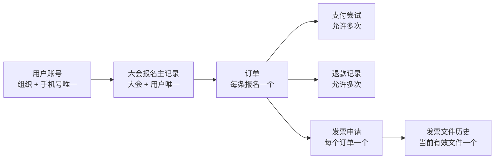
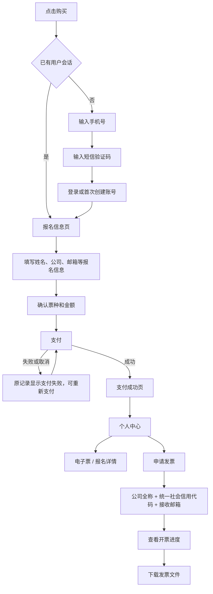

# TokEMS 极简报名、支付与发票闭环排查及迭代方案

> 状态：核心链路已实现，待联调与灰度验收
>
> 版本：v1.0
>
> 排查日期：2026-08-04
>
> 排查范围：普通用户登录、报名、支付、个人中心、发票；大会后台报名管理、退款、发票批处理；大会配置导航收敛
>
> 实现进度：手机号身份、唯一报名、多次购买、退款与发票批处理已进入验收阶段。

## 1. 结论

本轮推荐把 TokEMS 收敛成一条清晰主线：手机号验证码建立唯一用户身份，用户在每场大会始终只有一条报名主记录，支付尝试、退款和发票作为该记录下的业务明细保留。普通用户从购买到付款、申请发票、下载发票都在用户账号内完成；管理员从报名详情进入同一人的资料、支付、退款与发票处理。

当前系统已经具备短信验证码、订单支付、个人中心、支付后开票资格校验、单张发票上传与下载、报名详情资料编辑、退款入口和发票导出等基础能力。主要缺口集中在六处：

1. 系统仍支持游客报名，手机号登录还没有成为唯一报名入口。
2. 登录手机号与报名手机号可以不同，唯一用户和唯一报名的业务口径存在分叉。
3. 数据库只限制“未取消报名”的手机号唯一；支付超时、审核拒绝和全额退款会把报名改成已取消，后续可以生成第二条记录。
4. 报名列表只展示报名状态和订单状态，支付失败、支付处理中、退款和发票状态需要进入详情后才能确认。
5. 发票自助存在两条入口，当前表单包含购买方类型、联系电话和开票内容等额外字段，未达到三个字段完成提交的目标。
6. 发票导出字段不足，批量导入缺失；大会配置中的“官网设置”仍是独立页面。

推荐按四个可独立发布阶段完成升级。第一阶段先锁定唯一身份和单记录原则，第二阶段收敛发票自助，第三阶段补齐发票批量导入导出，第四阶段合并大会官网设置。预计会涉及 20 个以上文件、至少 2 个数据库迁移和一组数据预检脚本，属于跨 Web、Admin、API、Contract、Database、Worker 的完整业务升级。

## 2. 产品目标与边界

### 2.1 本次目标

- 登录和首次注册统一使用中国大陆手机号与短信验证码。
- 点击购买后先完成手机号验证，再进入报名信息页。
- 同一用户在同一大会始终只有一条报名主记录。
- 重复点击、支付失败、支付重试、支付成功、部分退款和全额退款都更新同一条主记录。
- 支付尝试、退款和发票可以有多条业务明细，后台报名列表只展示一条用户主记录。
- 支付成功且净支付金额大于 0 的用户可以提交企业发票资料。
- 发票资料只显示公司全称、统一社会信用代码、接收邮箱三个字段。
- 用户在个人中心查看发票状态并下载管理员上传的 PDF 或 OFD 文件。
- 管理员在报名详情完成资料修改、退款、发票审核、上传和交付。
- 发票管理支持按大会导出开票工作单和批量导入发票文件。
- 大会配置删除“官网设置”页签，保留能力迁入基本信息或模板管理。

### 2.2 本次不扩展

- 团体报名、一单多参会人和一单多票。
- 一个订单拆分多张普通发票。
- 全电发票平台直连、税控接口和自动红字信息表。
- 海外手机号、邮箱登录、账号密码和第三方社交登录。
- 用户自行发起退款。
- 自动识别 PDF 内的发票号码和税务字段。
- 运营负责人、工单 SLA 和跨团队任务指派。

### 2.3 核心成功标准

1. 使用同一手机号重复进入同一大会时，数据库和后台列表都只有一条报名主记录。
2. 支付失败后再次支付复用原报名和原订单，新增支付尝试明细。
3. 报名列表无需打开详情即可识别待支付、支付中、支付失败、已支付、部分退款和已退款。
4. 未支付、已全额退款或净支付金额为 0 的用户无法提交发票资料。
5. 管理员批量导入发票后，匹配成功的用户立即能在个人中心下载文件。
6. `/events/:eventId/settings/site` 完成兼容跳转，后台大会配置不再显示“官网设置”页签。

## 3. 统一业务原则

### 3.1 唯一身份

用户身份以 `organizationId + mobileE164` 确定。手机号验证码验证成功时：

- 已存在账号：直接登录。
- 首次使用：创建账号并登录。
- 前台不出现“登录”和“注册”两套选择。
- 大会报名接口必须存在有效用户会话。
- 报名手机号由已验证手机号带入并设为只读。
- 邮箱用于联系和接收发票，同一邮箱可以由多名参会人使用，不参与报名去重。

现有用户账号表已经具备 `customer_users_org_mobile_unique` 唯一索引，适合作为统一身份基础。

### 3.2 一场大会一条报名主记录

业务唯一键采用：

```text
organization_id + event_id + customer_user_id
```

手机号作为兼容旧数据的第二道校验：

```text
event_id + attendee_mobile_e164
```

报名、订单、支付、退款、发票的关系保持：



“只有一条记录”用于报名主记录和后台列表。支付尝试、退款记录、发票状态日志与历史文件继续保留，用于财务核对和审计。

### 3.3 重复进入与重试规则

| 当前事实 | 用户再次点击购买 | 系统行为 |
| --- | --- | --- |
| 没有报名 | 进入资料页 | 创建报名、订单和库存预留 |
| 待支付，支付窗口有效 | 继续支付 | 返回原报名和原订单 |
| 存在支付中尝试 | 查看支付结果 | 返回原订单并同步渠道状态 |
| 最近支付失败，订单仍有效 | 重新支付 | 原订单新增支付尝试 |
| 支付超时且未成功 | 重新确认票种和价格 | 复用原报名和原订单，重新预留库存 |
| 已支付 | 查看报名 | 进入个人中心或电子票 |
| 部分退款 | 查看报名 | 保持原记录，可处理剩余金额发票 |
| 已全额退款 | 查看退款结果 | 保持原记录，默认不允许自助再次购买 |
| 已取消或审核拒绝 | 查看结果 | 保持原记录，管理员可以重新开放同一条记录 |

支付超时后的重新预留需要重新校验大会开放状态、票种是否仍上架、库存和当前价格。价格发生变化时，用户确认新价格后再继续。

### 3.4 状态来源

底层继续保留报名状态、订单状态、支付状态、退款状态和发票状态。列表新增一个面向运营的派生业务状态，避免把底层枚举直接暴露给普通用户和运营人员。

派生顺序如下：

| 优先级 | 条件 | 业务状态 | 列表说明 |
| --- | --- | --- | --- |
| 1 | 订单 `refunded` 或成功退款等于实付金额 | 已退款 | 全额退款完成 |
| 2 | 订单 `partially_refunded` | 部分退款 | 显示实付、已退和可退金额 |
| 3 | 存在成功支付且订单 `paid` | 已支付 | 显示渠道和支付成功时间 |
| 4 | 存在 active payment attempt | 支付中 | 准备、待支付、查询中或结果待确认 |
| 5 | 最近支付尝试 `failed`，没有成功支付 | 支付失败 | 显示失败时间，可重新支付 |
| 6 | 订单 `closed`，没有成功支付 | 未支付已关闭 | 支付超时或运营关闭 |
| 7 | 订单 `pending_payment`，没有支付尝试 | 待支付 | 等待用户发起支付 |
| 8 | 报名 `pending_review` | 待审核 | 审核完成后进入支付或出票 |
| 9 | 免费订单 `paid` | 已确认 | 免费报名完成 |

发票状态独立显示：不可开票、可申请、待审核、开票中、已开具、待调整、已终止。

## 4. 普通用户视角

### 4.1 推荐主流程



### 4.2 登录与首次注册

用户看到统一文案“手机号登录 / 注册”。第一步只输入手机号，第二步输入六位验证码并确认协议。首次验证成功自动创建账号，后续验证成功直接登录。

验收要求：

- 手机号输入框仅接受中国大陆 11 位号码。
- 验证码错误、过期、频率限制和账号禁用都有明确提示。
- 验证成功后回到点击购买前的目标，不丢失大会和票种上下文。
- 登录手机号自动写入报名联系方式，用户不能在报名页改成另一个手机号。
- 用户无需理解账号是否已经存在。

### 4.3 报名信息页

手机号验证完成后进入报名信息页。页面保留当前可配置报名字段，首轮建议默认字段为：

- 真实姓名：必填。
- 手机号：已验证，只读。
- 邮箱：建议必填，用于支付和发票通知。
- 公司或机构：建议必填。
- 职位、城市：按大会需要配置。
- 票种：有多个票种时必选。

当前页面提示“报名手机号可单独填写，不必与登录号相同”，该规则需要移除。

### 4.4 支付

用户提交报名信息后进入订单页。支付失败、取消、网络异常或切换微信支付通道都保留原报名和原订单。

支付页需要明确显示：

- 大会、票种、参会人和金额。
- 当前支付状态。
- 支付窗口剩余时间。
- 重新尝试支付。
- 返回个人中心。

支付成功页提供三个动作：查看电子票、进入个人中心、申请发票。申请发票始终进入个人中心的订单发票页。

### 4.5 个人中心

个人中心按大会展示一条报名记录，记录中聚合：

- 大会名称和时间。
- 报名业务状态。
- 订单金额、支付状态和退款状态。
- 电子票状态。
- 发票状态。
- 当前允许操作。

操作规则：

| 业务状态 | 用户主操作 |
| --- | --- |
| 待支付、支付失败 | 继续支付 |
| 支付中 | 查询支付结果 |
| 已支付 | 查看电子票、申请发票 |
| 部分退款 | 查看退款和发票 |
| 已退款 | 查看退款结果 |
| 待审核 | 查看审核进度 |
| 已取消 | 查看取消原因 |

### 4.6 发票自助

企业发票表单只显示三个字段：

1. 公司全称，也作为发票抬头。
2. 统一社会信用代码。
3. 接收邮箱。

系统内部固定或自动补充：

- `buyerType = company`
- `content = 会务费`
- `mobile = 当前登录手机号`
- `amount = 实际支付金额 - 成功退款金额`

开票资格同时满足：

- 订单状态为已支付或部分退款。
- 存在可信的成功支付记录。
- 净支付金额大于 0。
- 当前订单还没有另一条发票申请。

用户可以：

- 首次提交开票资料。
- 在待审核或资料驳回状态修改资料。
- 查看开票进度和驳回原因。
- 下载当前有效 PDF 或 OFD。
- 已开具后重新发送到接收邮箱。

用户不能：

- 在未支付、支付失败或支付处理中提交发票。
- 在全额退款后新建发票申请。
- 在开票中和已开具状态直接修改税务资料。
- 下载已作废文件。

## 5. 管理员视角

### 5.1 报名管理列表

列表按“每人每场大会一行”展示，推荐字段：

| 字段 | 内容 |
| --- | --- |
| 用户 | 真实姓名、手机号、公司 |
| 报名 | 票种、报名编号、报名时间 |
| 业务状态 | 待审核、待支付、支付中、支付失败、已支付、部分退款、已退款、已关闭 |
| 金额 | 应付、实付、已退 |
| 发票 | 不可开票、可申请、待处理、已开具、待调整 |
| 最近更新 | 最后一次业务变化时间 |
| 操作 | 查看详情 |

筛选建议：

- 搜索：姓名、手机号、公司、报名编号和订单号。
- 业务状态：上述八类状态。
- 发票状态：未申请、待处理、已开具、待调整。
- 票种。
- 报名时间。

当前报名状态筛选可以保留在“更多筛选”中，日常运营优先使用派生业务状态。

### 5.2 报名详情

现有统一报名运营工作台可以继续作为详情基础，页面保留五个摘要：报名、订单、实付、退款、发票。

管理员在当前页面完成：

- 编辑本次报名资料。
- 查看用户账号关系和常用资料。
- 查看支付尝试和渠道结果。
- 发起支持渠道允许的全额或部分退款。
- 查看退款记录和可退金额。
- 查看、审核和驳回发票资料。
- 上传、替换、作废和下载发票文件。
- 重新发送发票或资料填写提醒。
- 添加内部备注并查看处理记录。

报名资料、用户档案和发票购买方资料继续保持独立来源。管理员编辑报名资料时只影响当前报名；同步用户档案需要独立权限和明确勾选。

### 5.3 退款

退款操作只在存在成功支付且可退金额大于 0 时开放。部分退款后报名和电子票保持有效；全额退款后报名与电子票转为取消，报名主记录继续保留。

当前微信支付退款通道尚未形成完整闭环。第一阶段继续展示不可用原因；需要支持真实微信退款时，应新增 processing、成功、失败的异步收敛流程，并在独立迭代中验收通知验签、主动查询、幂等和防超退。

### 5.4 发票处理

发票管理列表只处理满足以下条件的记录：

- 用户已经提交完整开票资料。
- 存在成功支付事实。
- 净支付金额大于 0。
- 发票申请状态属于待审核、开票中、开票失败、已开具或退款待调整。

“已经支付但尚未申请发票”的用户可以在报名列表中看到“可申请”，不进入财务开票工作单。

### 5.5 批量导出

导出以当前大会和筛选条件为范围。推荐工作单字段：

| 列名 | 说明 |
| --- | --- |
| `request_no` | 发票申请编号，系统唯一匹配键 |
| `registration_code` | 报名编号 |
| `event_name` | 大会名称 |
| `attendee_name` | 真实姓名 |
| `mobile` | 手机号 |
| `company_name` | 公司全称或发票抬头 |
| `tax_id` | 统一社会信用代码 |
| `email` | 接收邮箱 |
| `payment_status` | 已支付或部分退款 |
| `paid_amount` | 成功支付金额，单位分 |
| `refunded_amount` | 成功退款金额，单位分 |
| `invoice_amount` | 本次净开票金额，单位分 |
| `currency` | CNY |
| `invoice_status` | 发票申请状态 |
| `invoice_number` | 财务填写，导入时必填 |
| `invoice_code` | 财务填写，可选 |
| `upload_file` | 系统生成的目标文件名 |

导出默认只包含 `pending_review` 和 `issuing`，管理员可以按筛选条件导出其他状态。CSV 使用 UTF-8 BOM，继续保留公式注入防护和导出审计。

### 5.6 批量导入规范

推荐使用 ZIP 包加清单文件，避免依赖姓名和手机号进行模糊匹配。

```text
invoice-batch-<eventId>-<yyyyMMddHHmm>.zip
├── manifest.csv
└── files/
    ├── <request_no>.pdf
    ├── <request_no>.ofd
    └── ...
```

`manifest.csv` 使用导出的工作单。财务完成以下列：

- `invoice_number`
- `invoice_code`，可选
- `upload_file`，默认 `files/<request_no>.pdf`

示例：

```csv
request_no,invoice_number,invoice_code,upload_file
INV2026ABC001,254012345678,044002500111,files/INV2026ABC001.pdf
```

匹配规则：

1. `request_no` 是唯一业务键。
2. 导入大会必须与申请所属大会一致。
3. 当前申请状态必须允许上传或重开。
4. 文件名必须与 `manifest.csv` 完全一致。
5. 每个申请只能有一个本批次有效文件。
6. PDF 或 OFD，单文件不超过 20 MB。
7. 服务端校验扩展名、媒体类型、文件签名、大小和 SHA-256。
8. 重复批次和重复文件摘要使用幂等键返回原结果。

导入分两步：

1. 预检：上传 ZIP，返回匹配成功、缺少文件、未知申请、重复文件、状态冲突和字段错误。
2. 确认：管理员确认后逐条原子登记。单条失败不影响已经成功的其他记录，最终提供可下载错误报告。

每条成功记录执行：

- 登记发票号码、代码和文件。
- 发票状态更新为已开具。
- 写入状态日志和审计记录。
- 用户个人中心立即可见。
- 按现有通知配置决定是否发送邮件。

## 6. 大会配置收敛

### 6.1 目标信息架构

大会配置页签调整为：

1. 基本信息
2. 报名设置
3. 表单与条款
4. 修改记录

“官网设置”页签删除。

### 6.2 能力迁移

| 现有官网设置能力 | 新位置 | 处理方式 |
| --- | --- | --- |
| 查看官网、预览前台 | 基本信息页头部 | 保留 |
| 首页主按钮、辅助按钮 | 基本信息 > 公开页面展示 | 保留 |
| FAQ 呈现方式、标题、导语、问答 | 基本信息 > 常见问题 | 折叠分区保留 |
| 当前页面模板和版本 | 基本信息 > 页面模板摘要 | 只展示摘要和更换入口 |
| 应用模板升级、更换模板 | 基本信息 > 页面模板摘要 | 保留权限与二次确认 |
| 另存为共享模板 | 模板管理 | 从大会基本信息提供跳转或动作入口 |

基本信息页按分区组织：大会资料、时间地点、公开页面展示、常见问题、页面模板摘要。FAQ 默认折叠，保持首屏简洁。

### 6.3 路由与权限

- `/events/:eventId/settings/site` 兼容跳转到 `/events/:eventId/settings/general#public-page`。
- `event-settings-general` 允许具备 `event.manage` 或 `event.site.read` 的成员进入。
- 大会资料编辑继续要求 `event.manage`。
- 页面模板和公开页面分区分别沿用 `event.site.read`、`event.site.publish`、`event.content.manage` 等现有服务端权限。
- 只读成员看到只读摘要，写操作按权限隐藏或禁用。
- 删除独立路由前先拆分 `PublishingView.vue` 中的业务区块，避免把全部逻辑直接并入一个超大组件。

组织级“公开网站”设置继续保留。它负责站点身份、SEO、页脚与合规，范围与大会级页面展示不同。

## 7. 现状排查结果

### 7.1 需求分类

| 需求 | 分类 | 当前证据 | 结论 |
| --- | --- | --- | --- |
| 手机号验证码登录与首次注册 | 已经具备 | `CustomerAuthDialog.vue`、`customer-auth.service.ts` | 保留，收敛为唯一模式 |
| 首次验证自动创建用户 | 已经具备 | `verifyOtp()` 查询后创建 `customer_users` | 保留 |
| 点击购买后验证手机号 | 已接受改进 | 当前在报名页提交时才强制登录 | 验证时点前移 |
| 每人每大会一条主记录 | 缺陷 | 唯一索引排除 `cancelled`，超时和全退会产生 cancelled | P0 修复 |
| 登录手机号决定报名身份 | 缺陷 | 报名页明确允许填写不同手机号 | P0 修复 |
| 邮箱只作为联系信息 | 缺陷 | 当前报名创建会按手机号或邮箱任一重复返回 409 | 移除邮箱唯一判断 |
| 支付失败、成功、退款在同一行可见 | 已接受改进 | 报名列表只返回 registration + order | 扩展列表聚合契约 |
| 支付重试保留明细 | 已经具备 | `payments` 支持多尝试且限制一个 active attempt | 作为子记录保留 |
| 支付成功后个人中心申请发票 | 已经具备 | 客户发票中心和订单发票上下文已存在 | 收敛入口 |
| 未支付不能申请发票 | 已经具备 | `customerInvoicePaymentEligibility()` 服务端校验 | 保留并补端到端测试 |
| 三字段企业发票资料 | 已接受改进 | 当前显示 5 个输入项和个人/企业选择 | 简化为三个字段 |
| 用户下载发票 | 已经具备 | 用户发票详情按点击生成下载地址 | 保留 |
| 后台编辑报名资料 | 已经具备 | 统一报名详情调用 attendee 更新接口 | 保留 |
| 后台退款管理 | 部分具备 | 非微信通道可用，微信退款被明确禁用 | 单独补微信闭环 |
| 后台单张发票上传 | 已经具备 | PDF/OFD 预签名上传、登记、替换和作废已存在 | 保留 |
| 发票批量导出 | 部分具备 | 当前导出仅 7 列，缺少姓名、手机、税号、邮箱和净额 | 扩展工作单 |
| 发票批量导入 | 功能缺口 | 未发现导入契约、接口、任务和页面 | P1 新增 |
| 删除大会官网设置 | 功能缺口 | 路由、页签、页面和视觉测试仍存在 | 合并后删除入口 |

### 7.2 关键根因

1. 身份根因：系统同时支持 `mobile_otp_required` 和 `guest_allowed`，登录手机号与参会手机号又可独立填写，唯一身份缺少单一口径。
2. 去重根因：报名创建同时按手机号和邮箱查重，同一财务邮箱或公共联系邮箱会误判成同一人。
3. 单记录根因：`registrations_event_mobile_active_unique` 只覆盖非 `cancelled` 记录；超时释放库存、审核拒绝和全额退款都会将报名设为 `cancelled`。
4. 列表状态根因：`AdminRegistrationRowSchema` 只包含报名和订单，列表查询没有聚合支付尝试、退款和发票。
5. 发票表单根因：发票契约面向个人和企业通用场景，强制包含购买方类型、手机和开票内容，前台直接暴露了完整通用模型。
6. 批处理根因：现有导出以 `invoice_requests` 为中心，仅输出七列；系统没有导入任务、清单契约和批次审计表。
7. 配置导航根因：大会页面模板、首页展示和 FAQ 集中在独立 `PublishingView.vue`，其路由、权限和视觉脚本均依赖“官网设置”入口。

### 7.3 已有可靠基础

- 用户账号已按组织和手机号建立唯一索引。
- OTP 验证具备过期、尝试次数、频率、会话、CSRF 和协议版本校验。
- 一条报名最多一个订单，一条订单最多一个发票申请。
- 支付尝试具备渠道流水唯一性和 active attempt 唯一约束。
- 发票资格已经按订单状态和成功退款后的净额校验。
- 报名详情已经聚合支付尝试、退款、发票、票券、签到和备注。
- 发票文件具备 PDF/OFD、20 MB、签名、摘要和对象归属校验。
- 用户发票中心已经支持状态分类、修改、下载和重新发送。
- 发票导出已经具备大结果异步任务、对象存储、过期和审计基础。

## 8. 数据与接口方案

### 8.1 数据库调整

#### 报名唯一性

新增完整唯一约束：

```text
unique(event_id, customer_user_id) where customer_user_id is not null
unique(event_id, attendee_mobile_e164) where attendee_mobile_e164 <> ''
```

第二个索引不再排除 `cancelled`。所有新报名必须关联 `customer_user_id`。

#### 支付可信时间

为 `payments` 增加：

```text
succeeded_at timestamptz null
```

支付通知、主动查询和模拟支付确认都在首次成功时写入。后续幂等回调不覆盖首次可信时间。

#### 发票导入任务

新增 `invoice_import_jobs`：

- 组织、大会、创建人。
- 原始 ZIP 存储键、摘要和大小。
- 状态：uploaded、validated、processing、completed、completed_with_errors、failed、expired。
- 总数、成功数、失败数。
- 幂等键、错误摘要和完成时间。

新增 `invoice_import_items`：

- 导入任务、申请编号、文件名、发票号码、发票代码。
- 匹配的发票申请和最终文件。
- 状态与安全错误码。
- 文件摘要和处理时间。

### 8.2 现有接口调整

#### 报名创建

`POST /registrations`：

- 正式模式要求普通用户会话。
- 服务端忽略客户端传入的报名手机号，使用会话手机号。
- 服务端不再按邮箱判断重复报名。
- 同一 `eventId + customerUserId` 存在记录时返回已有或恢复后的 checkout。
- 已支付、部分退款和已退款记录直接返回当前详情，不创建新订单。
- 未支付已关闭记录完成库存与价格复核后恢复同一订单。

#### 报名列表

`GET /admin/events/:eventId/registrations` 或现有兼容接口新增：

- `businessStatus`
- `latestPaymentStatus`
- `paidAmount`
- `refundedAmount`
- `invoiceSummary`
- `lastBusinessAt`
- `businessStatus` 与 `invoiceStatus` 筛选

列表查询应使用数据库聚合或 lateral 子查询获取最新支付尝试，避免逐行查询。

#### 用户报名详情

`GET /customer/registrations/:registrationId` 新增允许操作：

- `resume_payment`
- `sync_payment`
- `view_ticket`
- `apply_invoice`
- `view_invoice`

新增 `POST /customer/registrations/:registrationId/resume-payment`，只恢复同一报名和订单。

#### 发票

用户发票提交接口对外只接受：

```json
{
  "companyName": "示例科技有限公司",
  "taxId": "91310000XXXXXXXXXX",
  "email": "finance@example.com"
}
```

服务端映射到现有发票字段并补充固定值。旧通用契约保留一个兼容周期，仅供已有链接和旧客户端使用。

### 8.3 新增批量接口

```text
GET  /admin/events/:eventId/invoices/worklist.csv
POST /admin/events/:eventId/invoice-imports
GET  /admin/events/:eventId/invoice-imports/:jobId
POST /admin/events/:eventId/invoice-imports/:jobId/confirm
GET  /admin/events/:eventId/invoice-imports/:jobId/errors.csv
```

创建导入任务返回预签名上传地址。上传后服务端或 Worker 完成解压安全检查、manifest 解析、文件匹配和预检。确认接口采用幂等键。

### 8.4 安全约束

- ZIP 限制总大小、文件数、单文件大小、压缩比和解压后总大小。
- 拒绝绝对路径、`..`、符号链接和重复规范化路径。
- 只接受根目录 `manifest.csv` 与 `files/` 下的 PDF/OFD。
- CSV 设定最大行数和字段长度。
- 税号、手机号、邮箱和文件操作只向具备发票权限的管理员返回。
- 导出和导入响应使用 `private, no-store`。
- 原始 ZIP 和错误报告设置自动过期与对象存储生命周期。
- 每条导入成功、失败、重试和下载都写审计。

## 9. 数据迁移与回滚

### 9.1 上线前数据预检

迁移前检查以下重复组：

```sql
select event_id, customer_user_id, count(*)
from registrations
where customer_user_id is not null
group by event_id, customer_user_id
having count(*) > 1;
```

```sql
select event_id, attendee_mobile_e164, count(*)
from registrations
where attendee_mobile_e164 <> ''
group by event_id, attendee_mobile_e164
having count(*) > 1;
```

处理原则：

- 没有重复：直接建立唯一索引。
- 只有一个含成功支付事实：保留该记录为主记录，其他未支付记录进入人工清理清单。
- 同组存在多条成功支付、退款或发票：停止自动迁移，由财务和运营确认保留策略。
- 任何迁移都不能删除订单、支付、退款、发票和审计历史。

由于当前环境未连接 PostgreSQL，本轮无法确认生产数据是否存在重复。实施阶段必须先执行预检。

### 9.2 发布顺序

1. 上线兼容读取和重复数据观测。
2. 运行数据预检并处理阻塞组。
3. 添加完整唯一索引。
4. 上线 create-or-resume 报名逻辑。
5. 前台移除游客入口和可编辑手机号。
6. 上线列表聚合字段与新筛选。

### 9.3 回滚

- 前端可以回滚到旧入口，服务端继续接受旧字段一个兼容周期。
- 唯一索引保留，防止回滚期间重新产生重复报名。
- 派生业务状态只增加响应字段，旧客户端可以忽略。
- 发票批量导入采用新增表和新增接口，可独立关闭入口。
- 官网旧路由在兼容周期内保持重定向。
- 已导入发票文件不随代码回滚删除，用户下载能力继续有效。

## 10. 分阶段迭代清单

### 阶段 1：唯一用户、唯一报名和支付状态

目标：手机号身份和单记录原则形成完整闭环。

任务：

1. 移除大会和组织设置中的游客报名选项，已有大会迁移到 `mobile_otp_required`。
2. 点击购买时完成 OTP，验证后恢复大会和票种上下文。
3. 报名手机号由会话带入并只读。
4. 增加 `event_id + customer_user_id` 和完整手机号唯一索引。
5. 移除报名创建中的邮箱去重，邮箱继续保留格式校验。
6. `POST /registrations` 改为创建或返回同一条记录。
7. 支付超时后支持恢复同一报名和订单。
8. 报名列表增加业务状态、实付、退款和发票摘要。
9. 增加 `payments.succeeded_at` 及回填策略。
10. 调整个人中心主操作和支付成功页。

验收：

- 同一用户并发提交 10 次，只产生 1 条报名和 1 个订单。
- 两个不同登录手机号使用同一接收邮箱时，各自产生 1 条报名。
- 同一订单连续支付失败 3 次，报名列表仍只有 1 行，详情显示 3 次支付尝试。
- 支付超时后重新支付，报名 ID 和订单 ID 保持不变。
- 成功支付后重复回调不会重复出票或重复创建发票申请。
- 全额退款后列表仍保留原记录并显示已退款。

### 阶段 2：三字段发票自助与个人中心收敛

目标：用户在个人中心完成支付后开票和下载。

任务：

1. 发票表单固定为企业发票三个字段。
2. 手机号和开票内容由服务端补充。
3. 支付成功后的发票入口统一进入 `/account/invoices/:orderId`。
4. 旧 `/invoice/:id` 验证后跳转到个人中心对应订单，保留旧访问令牌兼容期。
5. 个人中心一条大会记录显示报名、支付、退款和发票状态。
6. 强化未支付、全额退款和并发提交测试。

验收：

- 用户只填写三个字段即可提交。
- 未支付用户通过页面和直接 API 都无法提交。
- 管理员上传文件后用户无需重新登录即可在刷新后看到下载入口。
- 作废文件立即失效，替换文件仍沿用同一发票业务记录。

### 阶段 3：发票批量导出与导入

目标：财务可以按大会批量处理并把文件一次性推送到用户中心。

任务：

1. 扩展发票工作单字段并增加默认待处理筛选。
2. 新增导入任务、导入明细、契约和权限。
3. 新增 ZIP 预签名上传、Worker 预检和错误报告。
4. 新增预检结果页和二次确认。
5. 逐条登记文件、更新状态、写审计和通知。
6. 增加重复导入、混大会、缺文件、错文件名、恶意 ZIP 和部分失败测试。

验收：

- 1000 条工作单导出字段完整。
- 1000 个文件导入可以输出准确的成功与失败数量。
- 同一个 ZIP 和幂等键重复确认不会重复登记文件。
- 混入其他大会申请时该行失败，当前大会合法行继续处理。
- 成功导入后每个对应用户都能下载自己的文件。

### 阶段 4：大会配置简化

目标：删除“官网设置”页签并保持现有公开页面能力。

任务：

1. 将页面模板、首页展示和 FAQ 拆成可复用组件。
2. 组件迁入基本信息页对应分区。
3. “另存为共享模板”迁入模板管理。
4. 删除大会配置中的官网设置页签。
5. 旧路由重定向到基本信息锚点。
6. 调整权限、后台入口、视觉脚本和文档。

验收：

- 大会配置只显示四个页签。
- 旧官网设置深链接不会 404。
- 只有页面查看权限的成员仍能看到公开页面摘要。
- 具备对应写权限的成员可以更新首页、FAQ 和模板。
- 前台首页和 FAQ 与调整前保持一致。

## 11. 测试与发布门槛

### 11.1 自动化测试

- Contract：业务状态、三字段发票、导入 manifest、导入结果。
- API 单元：create-or-resume、状态派生、发票资格、文件名匹配。
- PostgreSQL 集成：唯一索引、并发报名、支付重试、恢复订单、混大会导入。
- Web：OTP 后恢复购买、手机号只读、支付失败重试、发票三字段。
- Admin：业务状态筛选、详情操作、导出、导入预检和权限。
- Worker：ZIP 安全、批量校验、部分失败、幂等重试和对象存储过期。
- E2E：普通用户完整主线和管理员完整主线。

### 11.2 核心端到端场景

#### 场景 A：首次用户成功购买

点击购买，手机号验证，填写资料，支付成功，个人中心出现一条报名、电子票和可申请发票状态。

#### 场景 B：支付失败后成功

第一次支付失败，个人中心显示支付失败。用户重新支付成功，报名和订单编号保持不变，详情保留两次支付尝试。

#### 场景 C：未支付申请发票

页面不提供发票提交入口，直接调用 API 返回稳定的 409 业务错误。

#### 场景 D：批量开票

财务导出待处理工作单，按规范准备 ZIP，预检全部通过，确认导入，用户个人中心出现对应文件。

#### 场景 E：部分退款后开票

订单部分退款后只按净支付金额开票，导出和用户页面金额一致。

#### 场景 F：全额退款后保持单记录

全额退款取消票券，报名列表仍只有一行并显示已退款，用户无法创建新发票。

#### 场景 G：旧官网设置地址

访问旧地址后进入基本信息的公开页面分区，权限和大会上下文保持正确。

### 11.3 本轮证据

本轮已运行现有自动化测试：

- Contracts：18 个测试文件，66 个测试通过。
- API：16 个测试文件、72 个测试通过，8 个数据库相关文件、49 个测试因未配置 `DATABASE_URL` 跳过。
- Web：6 个测试文件，40 个测试通过。
- Admin：11 个测试文件，61 个测试通过。

共 239 个现有测试通过。现有测试证明已实现能力没有显性单元回归，同时也确认测试仍接受当前的游客模式、取消记录可重复报名和通用发票字段。实施阶段需要新增本方案列出的回归测试，并在 PostgreSQL 环境运行完整集成测试。

## 12. 风险与处理

| 风险 | 影响 | 处理 |
| --- | --- | --- |
| 历史数据存在同大会重复用户 | 唯一索引迁移被阻塞 | 上线前预检，含多条财务事实的组人工处理 |
| 支付超时恢复时票价已变化 | 用户看到金额变化 | 恢复前重新确认票种、库存和价格 |
| 微信支付结果处于 unknown | 误判失败后重复支付 | 先主动查询或关闭原尝试，再允许新尝试 |
| 批量 ZIP 包含恶意路径或压缩炸弹 | 存储和服务风险 | 限制路径、大小、数量、压缩比和解压总量 |
| 导入一半失败 | 财务需要定位问题 | 每行独立事务，提供错误报告和只重试失败项 |
| 官网设置合并后基本信息过长 | 管理效率下降 | 分区、锚点和 FAQ 折叠，模板动作保持摘要化 |
| 权限依赖旧官网路由 | 部分角色失去入口 | 基本信息路由允许多权限进入，分区内继续授权 |

## 13. 最脆弱假设

本方案假设一张已支付大会订单对应一名参会人、一条报名和一份当前有效普通发票。未来引入团体订单、一单多票或拆分开票时，报名主记录仍可保持唯一，订单与发票关系需要升级为集合模型。

另一个关键假设是中国大陆手机号能够作为稳定用户身份。如果未来需要换绑手机号，应先增加受控换绑流程，并在事务内同步账号手机号、报名身份映射和唯一索引，禁止管理员直接把同一用户拆成两个账号。

## 14. 产品确认项

推荐确认以下四项后进入实施：

1. 所有大会统一要求手机号验证码登录，游客报名入口下线。
2. 报名手机号固定使用登录手机号，前台不可修改。
3. 全额退款后保留原记录，默认不允许用户自助再次购买；管理员可以恢复同一条记录。
4. 用户端只支持企业发票，三个字段为公司全称、统一社会信用代码和接收邮箱。

确认后按“阶段 1 → 阶段 2 → 阶段 3 → 阶段 4”实施，每阶段均可独立发布和回滚。
