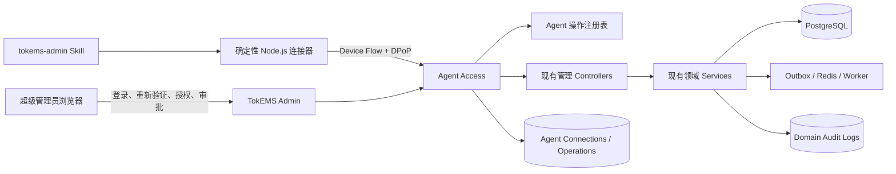
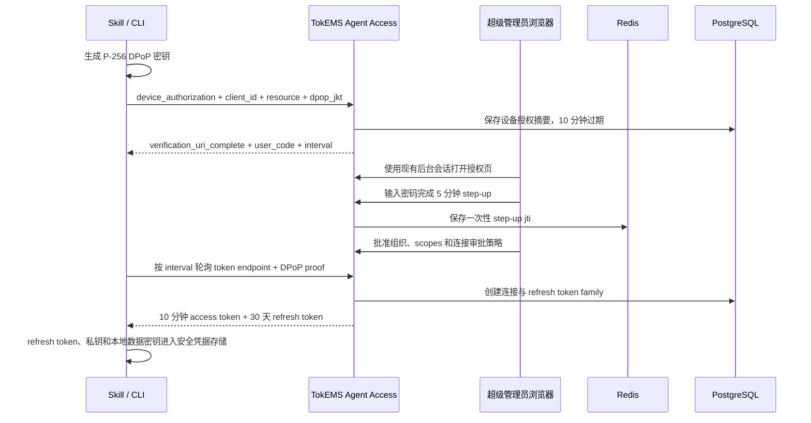
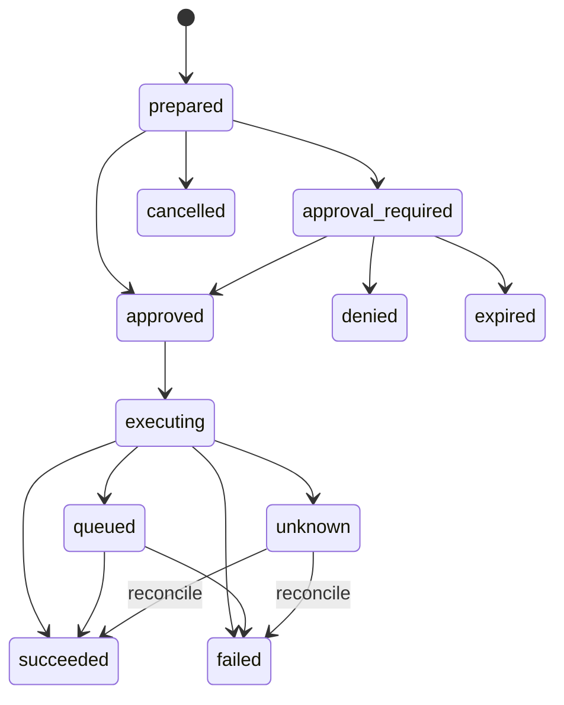

# TokEMS 配套管理 Skill 最终设计与开发方案

> 状态：最终待批准
> 方案版本：v2.0
> 评审日期：2026-08-17
> 目标形态：Governed Agent Skill + TokEMS Agent Access
> 当前阶段：`0.1.1` experimental 已完成安全复审，启用与生产验收见 [TokEMS Admin Skill 实施说明](tokems-admin-skill-implementation.md)

## 方案结论

建设一个名为 `tokems-admin` 的远程运营管理 Skill。超级管理员在 TokEMS 浏览器后台完成授权后，Codex 或兼容的 AI 客户端可在指定实例、指定组织内执行完整的产品级管理任务，包括前台文案、嘉宾和议程、结构化模板、HTML 模板、用户与管理员、报名、订单、退款、发票、通知、现场签到、集成配置和审计查询。

交付物分成三部分：

1. **TokEMS Agent Access**，在现有 NestJS API 中增加设备授权、Agent 身份、连接生命周期、请求方密钥绑定、操作目录、风险审批、幂等与审计能力。
2. **确定性 Node.js 连接器**，只负责认证、签名、调用、凭据保管、文件传输、脱敏和结果验证，不承担开放式业务判断。
3. **`tokems-admin` Skill**，负责触发路由、任务拆解、动作编排、用户确认、领域工作流和最终报告。

这里的超级管理权限是产品级权限。它覆盖 TokEMS 已有产品 API 和领域服务，受组织边界、状态机、审计、幂等及业务规则约束。部署、服务器文件、环境变量、数据库直连、任意改账和源码修改都不在授权范围内。

订单能力按现有合法动作开放，包括查询、参会资料修正、退款和相关状态处理。当前系统没有任意修改订单金额、支付事实或流水的管理接口。若以后需要订单纠错，应增加单独的 `commerce.order.correct` 领域命令，明确会计影响、权限、审计和回退规则。

## 本轮 Review 修正的关键问题

| 原方案缺口                                                 | 最终处理                                                                                                                                          |
| ---------------------------------------------------------- | ------------------------------------------------------------------------------------------------------------------------------------------------- |
| 已登录的后台会话被盗后可能直接批准高权限连接               | 完整授权和关键操作审批增加密码重新验证，签发 5 分钟、单用途、一次性的人类 step-up 凭据                                                            |
| 通用 Interceptor 无法保证业务写入与 Agent 操作记录原子提交 | 操作目录声明 `domain-key`、`transactional-command`、`outbox-job`、`one-time-secret` 四类执行策略，网络结果不确定时进入 `unknown`，禁止盲目重试    |
| DPoP `jti` 防重放缺少多实例共享存储                        | Redis 保存短期重放键和 step-up 单次凭据，Agent Access 启用后 Redis 故障时失败关闭                                                                 |
| `prepare` 不保存正文，后续 `execute` 又无法恢复原请求      | 客户端用连接级本地密钥加密保存待执行正文，服务端只保存哈希和脱敏摘要，终态后自动删除本地正文                                                      |
| 普通读取与含 PII 的读取共用一个等级                        | 增加 `tokems:pii` scope 和 `dataClass`，详情查询最小化返回，PII 导出固定进入关键审批                                                              |
| 从 OpenAPI 自动推断完整操作目录不够稳定                    | TypeScript 操作注册表成为唯一来源，管理 Controller 用元数据标记 Agent surface，CI 要求零未分类路由                                                |
| 完整权限连接缺少默认审批策略                               | 全权限连接默认对 `controlled` 和 `critical` 都使用浏览器审批，超级管理员可经重新验证把连接降为仅关键动作浏览器审批                                |
| 令牌轮换、保留、监控和应急处置没有完整定义                 | 增加当前与上一签名密钥轮换、数据保留、全局撤销、异常指标和事件响应步骤                                                                            |
| Skill 发布只覆盖基础文件                                   | Governed 发布增加 Skill IR、目标编译、触发与输出评测、Skill Atlas、conformance、trust、registry、安装模拟、升级检查、Review Studio 和 waiver 证据 |
| 迁移文件名被提前写死                                       | 实施时由 Drizzle 生成下一条可用迁移，同时提交 snapshot 和 journal，避免与正在进行的迁移工作冲突                                                   |

实施后的安全复审进一步收紧了信任边界：服务端生成审批投影、影响摘要和风险；前态使用短期签名观察 token；设备授权强制核对 `user_code`；自定义报名答案默认掩码；客户端验证仅作为声明；通知由 Worker 按投递终态 reconcile；refresh 轮换与一次性秘密增加响应丢失恢复。领域事务内的原子前态条件、真实领域审计关联和其余异步 action resolver 继续作为生产写开关的退出条件。

## 当前系统基线

### 工程与技术栈

方案评审时的 inventory 识别出 15 个前台页面、34 个后台页面、26 个 API Controller、217 个 API Operation、67 张数据表、53 个迁移和 119 个测试文件。完成实施、安全复审与依赖 PR 合并后，当前 inventory 为 15 个前台页面、37 个后台页面、30 个 API Controller、246 个 API Operation、72 张数据表、53 个迁移文件和 137 个测试文件。Agent 的基础表、恢复字段和组合租户外键统一位于 `0052_hard_rafael_vega.sql`。所有实施均在嘉宾管理、内容、前台、契约、数据库和文档改动之上增量完成。

| 层级     | 当前实现                                                    | 对本方案的影响                                                  |
| -------- | ----------------------------------------------------------- | --------------------------------------------------------------- |
| 前台     | Nuxt 4 + Vue 3                                              | 公开站读取大会内容和发布快照，写后可校验真实页面                |
| 管理后台 | Vue 3 + Vite                                                | 增加设备授权、连接管理和关键操作审批页面                        |
| API      | NestJS 11 + Fastify + Zod                                   | 复用现有 Controller、领域服务、Guard、Swagger 和限流体系        |
| 数据     | PostgreSQL 16 + Drizzle ORM                                 | 保存连接、设备授权、刷新令牌和 Agent 操作记录                   |
| 异步任务 | Redis + BullMQ                                              | 继续处理通知、导出、资产和发票任务，也承载 Agent 防重放短期状态 |
| 安全     | JWT、RBAC、组织隔离、审计、限流、幂等                       | Agent 权限始终与委派管理员的当前权限取交集                      |
| 工程     | Node.js 24、TypeScript、pnpm、Turborepo、Vitest、Playwright | 连接器使用 Node.js 24 内置能力，服务端沿用现有测试门禁          |

### 已有管理能力

| 能力域       | 当前能力                                           | Skill 接入结论                                             |
| ------------ | -------------------------------------------------- | ---------------------------------------------------------- |
| 组织与管理员 | 成员、角色、权限、状态、邀请、组织设置、管理员凭据 | 全量接入，角色、权限、凭据和删除属于关键动作               |
| 大会         | 新建、修改、短地址、首页大会、发布、回滚           | 全量接入，公开影响按运行时状态升级                         |
| 内容         | 嘉宾、议程、报名表、条款、票种、AI 文案            | 全量接入，草稿和公开版本采用不同审批等级                   |
| 结构化模板   | 草稿、修订、版本、复制、归档、资产、绑定、预览     | 全量接入，保留修订号和不可变版本语义                       |
| HTML 模板    | 导入、扫描、净化、变量、预览、替换、提交           | 全量接入，沿用现有扫描和 blocker 门禁                      |
| 普通用户     | 查询、创建、资料、标签、状态、导出、删除           | 全量接入，详情最小化，导出和删除进入关键审批               |
| 报名         | 查询、详情、参会资料、备注、审核、导出             | 全量接入，保持大会和组织范围                               |
| 订单与退款   | 查询、关联详情、全额或部分退款                     | 只接入现有合法动作，退款固定为关键动作                     |
| 发票         | 查询、审核、驳回、重试、取消、文件、发送、导出     | 全量接入，状态和文件动作按财务影响分级                     |
| 通知与 AI    | AI 生成与审批、模板、投递查询、通知排队            | 全量接入，任何发送都需要受控确认，大范围群发升级为关键动作 |
| 现场         | 设备登记、在线核销、离线同步、库存维护             | 全量接入，一次性设备令牌走安全交接                         |
| 审计         | 组织和大会范围的操作日志                           | 每个 Agent 写操作增加代理审计信封并关联领域审计            |

## 目标、成功标准与边界

### 产品目标

- 超级管理员能给一个 AI 客户端授权指定 TokEMS 实例和一个组织。
- AI 客户端能读取远程实例实时发布的能力目录，并只调用目录中的动作。
- 当前管理面中的每条 Agent candidate 路由都被明确允许或附理由排除，未分类路由固定拒绝。
- 草稿修改、公开影响、敏感数据、财务、安全、删除和批量动作使用不同门禁。
- 每次写入都能追溯到连接、委派管理员、请求原因、请求哈希、资源前态、幂等键、审批记录、领域审计和验证结果。
- Skill 按 Agent Skills 开放格式发行，首发通过 Codex 和 generic Agent Skills 安装验收。

### 排除范围

- SSH、Docker、部署、服务器文件、环境变量和数据库直连。
- 原始 SQL、绕过状态机的数据修改、伪造支付回调和手工改账。
- TokEMS 源码、Vue/Nuxt 页面组件及部署目录中的模板文件修改。
- Agent 创建、批准、扩权或延长自己的连接。
- 在聊天、日志、命令参数和普通输出中展示密码、访问令牌、刷新令牌、支付密钥、短信密钥和一次性设备令牌。
- 未经单独授权切换到另一个组织或另一个 TokEMS 实例。
- 缺少命令执行、出站 HTTPS 或安全凭据存储的平台直接运行完整权限连接。

## 推荐架构



架构遵循以下约束：

- 产品 API 是执行入口，Skill 不调用数据库和隐藏内部接口。
- 服务端操作注册表是动作、风险和权限的唯一来源，Skill 包内的目录只用于离线说明和评测。
- Agent 管理面默认拒绝，新路由完成分类并通过覆盖测试后才可访问。
- 每次请求重新校验连接、成员、凭据版本、grants、组织和资源范围。
- 审计只保存脱敏摘要、哈希和必要标识，敏感正文保留在业务表或客户端短期加密状态中。
- 连接器只接受 action ID 和结构化参数，不接受自由 method、自由 path 或任意请求 URL。

## 身份、授权与连接

### 设备授权流程



### 协议决定

- 设备授权遵循 OAuth 2.0 Device Authorization Grant。
- 公共客户端 ID 固定为 `tokems-admin-skill`，不使用客户端 secret，首发不支持动态客户端注册。
- 设备和令牌端点接受 `application/x-www-form-urlencoded`，轮询错误使用 `authorization_pending`、`slow_down`、`expired_token` 和 `access_denied`。
- `resource` 和 access token `aud` 固定为 `${PUBLIC_ORIGIN}/api/v1`，`iss` 使用规范化后的 `PUBLIC_ORIGIN`。
- access token 带 `typ=at+jwt`、`token_use=agent`、连接 ID、组织 ID、委派成员 ID、scopes、凭据版本和 `cnf.jkt`。
- access token 使用独立的 256 位随机 secret 和 HS256，10 分钟有效。签名头的 `kid` 由 secret 指纹派生，验证端同时接受当前和上一 secret，轮换后上一 secret 至少保留 15 分钟。
- refresh token 为 256 位随机不透明值，数据库只保存 SHA-256 摘要，30 天有效，每次使用后旋转。已使用 token 再次出现时撤销整个 family。
- Agent 连接默认 90 天绝对有效，管理员可随时撤销。延长连接需要重新进行设备授权和 step-up。
- DPoP 使用 P-256 和 ES256。资源请求 proof 校验 `htu`、`htm`、`iat`、`jti`、`ath` 和 `cnf.jkt`，令牌端点校验同一 DPoP key。
- token endpoint 返回 `token_type=DPoP`。资源请求使用 `Authorization: DPoP <access-token>` 和独立的 `DPoP` proof header。
- `htu` 使用 `PUBLIC_ORIGIN` 与规范化请求路径重建，不信任可被客户端改变的 Host header，反向代理部署仍按外部 URL 验证。
- Redis 使用 `SET NX EX` 保存已验签的 `jti`，保留 11 分钟。Agent Access 开启后，Redis 不可用时所有 Agent 鉴权请求失败关闭。
- 设备码使用高熵随机值并以 SHA-256 摘要入库。低熵 user code 使用服务端 HMAC 入库，避免数据库泄露后被离线枚举。
- 生产只接受 HTTPS origin。源码开发只允许 `localhost`、`127.0.0.1` 和 `::1` 的 HTTP origin。
- origin 必须只有 scheme、host 和 port，不得含用户信息、path、query 或 fragment。连接和上传均拒绝跨 origin 重定向。

### 人类 step-up

`POST /api/v1/auth/step-up` 需要当前有效的后台 JWT 和管理员密码。服务端重新校验密码、成员状态和超级管理员身份，再签发 5 分钟、单用途、绑定目标 ID 与请求摘要的 step-up token。token 的 `jti` 在 Redis 中一次性消费。

以下动作必须使用 step-up：

- 批准完整或缩减的 Agent 连接。
- 修改连接的浏览器审批策略。
- 批准 `critical` 操作。
- 执行全部连接紧急撤销和签名密钥轮换确认。

完整授权只允许当前配置的超级管理员，判定沿用现有 `membership.isSuperAdministrator=true` 语义。Agent token 访问 step-up、连接批准、操作批准和密钥管理端点时固定返回拒绝。

### 本地凭据和待执行正文

- Skill 包不包含实例令牌、密钥或固定远程地址。
- macOS 首发使用 Keychain，Linux 桌面使用 Secret Service。无受支持安全凭据存储时，完整权限连接失败关闭。
- headless Linux 可接入经过 conformance 验证的宿主凭据 helper。helper 必须通过标准输入输出交换、禁止日志记录、限制文件权限，并通过 trust report。
- access token、refresh token、DPoP 私钥和本地数据密钥进入安全凭据存储。连接器复用 10 分钟 access token，距离过期 30 秒时再轮换 refresh token。
- `prepare` 后的请求正文使用 AES-256-GCM 和连接级数据密钥加密，写入权限为 `0600` 的短期本地状态文件。服务端只持有正文哈希和脱敏摘要。
- 本地正文保留到服务端 verification 进入明确终态；一次性秘密和导出 artifact 还需完成本地安全落盘及确认。CLI 的 `doctor` 会清理失去服务端记录或超过保留期的待执行文件。
- 结构化输入默认从 `--input-file` 或标准输入读取，原因从 `--reason-file` 或标准输入读取。敏感值禁止出现在 shell 参数和环境变量中。
- Skill 处理 PII 时优先通过标准输入传给 CLI，避免先生成普通工作区文件。确需临时文件时，先设为 `0600`，CLI 读入后立即删除。

### 撤销与失效

以下事件使连接立即失效：

- 超级管理员撤销当前连接或执行全部连接紧急撤销。
- 委派成员被停用、删除、移出组织或失去所需 grants。
- 委派管理员的用户名、密码、凭据版本或成员版本发生变化。
- 实例配置的超级管理员身份发生变化，原委派用户不再是当前超级管理员。
- refresh token 被重复使用。
- 连接超过 90 天绝对有效期。
- 服务端关闭 Agent Access 总开关。

scopes 或 grants 缩减后，已有连接保留，超出交集的动作立即被拒绝。

## 权限、数据和风险模型

### Scopes

完整权限包命名为 `tokems:*`，授权页展开显示：

- `tokems:read`
- `tokems:pii`
- `tokems:write`
- `tokems:finance`
- `tokems:communications`
- `tokems:export`
- `tokems:security`
- `tokems:dangerous`

最终有效权限取下面四项的交集：

```text
连接获批 scopes
∩ 委派管理员当前 grants
∩ 操作注册表 requiredGrants
∩ 当前资源的组织和大会范围
```

### 数据分类

| `dataClass` | 内容                                         | 输出规则                                              |
| ----------- | -------------------------------------------- | ----------------------------------------------------- |
| `public`    | 已公开大会信息、公开嘉宾、公开模板预览       | 可在结果中摘要展示                                    |
| `internal`  | 草稿、运营状态、内部备注、审计摘要           | 只返回任务需要的字段                                  |
| `pii`       | 手机、邮箱、证件、地址、订单联系人、发票抬头 | 需要 `tokems:pii`，列表默认掩码，详情需要明确用户意图 |
| `secret`    | 支付密钥、短信密钥、refresh token、设备令牌  | 不进入模型正文，使用浏览器或受保护终端交接            |

PII 导出、批量用户明细和发票文件下载均进入浏览器审批。普通列表响应执行字段白名单和掩码，Skill 不以“为了方便分析”为理由扩大返回范围。

### 风险等级和默认门禁

| 等级             | 典型动作                                                                           | 默认门禁                                                  |
| ---------------- | ---------------------------------------------------------------------------------- | --------------------------------------------------------- |
| `read`           | 公共和内部列表、仪表盘、预览                                                       | 完成实例、组织、scope 和 action 检查后执行                |
| `sensitive-read` | 用户详情、订单联系人、发票详情、审计中的 PII                                       | 需要当前任务的明确目的，服务端最小化返回并记录读取审计    |
| `routine-write`  | 草稿、内部备注、未公开嘉宾和议程、AI 草稿                                          | inspect、原因、幂等键、差异和写后验证                     |
| `controlled`     | 公开内容、模板发布、用户状态、通知发送、核销、首页大会                             | 明确确认完整差异；全权限连接默认还需浏览器单次审批        |
| `critical`       | 退款、用户删除、管理员权限或凭据、集成密钥、PII 导出、关键发票文件、批量高影响动作 | 超级管理员浏览器 step-up 和单次审批，5 分钟有效，不能降级 |

浏览器审批策略是连接属性：

- `controlled-and-critical`：完整权限连接的默认值。
- `critical-only`：`controlled` 只保留会话内明确确认，修改该策略需要浏览器 step-up 和审计。

会话内确认属于客户端工作流证据，服务端不会把它当成独立的人类身份认证。服务器仍执行操作目录、请求摘要、前态指纹和动态风险校验。

`controlled` 的浏览器审批使用当前有效的人类后台会话，并绑定单次 operation。`critical` 在此基础上增加密码 step-up。实例安全策略仍可把指定 controlled action 提升为 critical。

### 动态升级规则

- 修改已公开大会的内容、模板或首页绑定，最低为 `controlled`。
- 任何真实通知发送最低为 `controlled`。一次面向全部受众、超过 100 人或短时间累计超过 100 人时升级为 `critical`。
- 任意金额的退款固定为 `critical`。
- 普通用户永久删除、管理员新增或删除、角色和 grants 变化固定为 `critical`。
- PII 导出、发票文件替换或作废、集成密钥更新固定为 `critical`。
- 一次处理超过 20 个公开资源、用户状态或现场记录的批量动作升级为 `critical`。
- 操作注册表可把某一动作设为更高等级，运行时只能升级，不能低于注册表基线。

## Agent 操作注册表

### 唯一来源与路由覆盖

`apps/api/src/common/agent-operation-catalog.ts` 及其按领域拆分的目录是操作定义的唯一来源。聚合入口只负责 schema、版本和索引，领域条目分文件维护，避免 200 多个操作堆进单一大文件。每个可管理的 Controller 使用 `@AgentSurface()` 标记，具体 handler 必须满足下面三种状态之一：

1. 使用 `@AgentAction('action.id')` 绑定注册表条目。
2. 使用 `@AgentExcluded('明确原因')` 记录人工后台保留路径。
3. CI 失败，阻止合并和发布。

注册表不依赖 Swagger 的描述完整度。OpenAPI、Skill 的 `file-backed fixture`、CLI schema 和文档都从注册表生成。`/api/v1/admin/*`、受保护的 `/api/v1/checkins` 以及其他显式标记的管理入口统一按 action ID 管理，路径前缀本身不代表授权。

### 条目结构

```json
{
  "actionId": "templates.draft.update",
  "method": "PUT",
  "routeName": "adminTemplateDraftUpdate",
  "path": "/api/v1/admin/templates/:templateId/draft",
  "requiredGrants": ["org.template.manage"],
  "agentScopes": ["tokems:write"],
  "dataClass": "internal",
  "riskBase": "routine-write",
  "dynamicRiskPolicy": "published-template-upgrade",
  "confirmation": "intent",
  "idempotencyStrategy": "transactional-command",
  "retryPolicy": "query-before-retry",
  "targetResolver": "template-by-id",
  "verifyActionId": "templates.draft.get",
  "reconcileActionId": "templates.draft.get",
  "rollback": "restore-prior-revision",
  "minClientVersion": "0.1.1"
}
```

能力响应包含 `apiVersion`、`catalogVersion`、`skillPackageVersion`、`minClientVersion`、实例 feature flags 和当前连接有效 scopes。主版本不兼容时 CLI 停止写入，允许安全的身份检查和连接撤销。新增可选字段使用次版本，语义变化使用主版本。

### 写操作生命周期



执行步骤：

1. `preflight` 校验实例身份、连接、组织、目录版本、scope、grants 和 Redis 状态。
2. `inspect` 用唯一标识读取目标和当前版本，无法唯一定位时停止。
3. `prepare` 计算脱敏差异、动态风险、影响范围、回退边界、请求哈希和资源前态指纹。
4. `confirm` 按连接策略收集会话确认或浏览器审批，审批绑定 operation ID、action ID、连接、目标、请求哈希和前态指纹。
5. `execute` 重新计算哈希和前态，携带 `X-Agent-Operation-Id`、原因与幂等键调用原管理路由。
6. `verify` 查询持久化状态、发布结果、Outbox 或 Worker 状态，并关联领域审计。
7. `report` 返回 operation ID、结果、验证状态、审计 ID、剩余副作用和回退方式。

prepared operation 默认 15 分钟过期。浏览器批准后必须在 5 分钟内开始 execute，超时重新 prepare 和审批。进入 `queued` 的异步任务不受 5 分钟执行窗口影响，继续按 operation ID 跟踪终态。本地加密正文使用同一过期时间。

### 幂等、原子性和不确定结果

通用 Interceptor 只负责门禁、状态和审计信封，不替业务服务制造事务原子性。注册表必须为每个写动作选择一种策略：

| 策略                    | 适用动作                               | 实施要求                                                                          |
| ----------------------- | -------------------------------------- | --------------------------------------------------------------------------------- |
| `domain-key`            | 已有幂等键的退款、通知、导入和公开写入 | 透传同一键和请求哈希，复用现有业务幂等记录                                        |
| `transactional-command` | 可在 PostgreSQL 事务中完成的普通写入   | 领域 command 持有事务，并把 transaction handle 传给 operation finalize 和代理审计 |
| `outbox-job`            | 通知、导出、文件处理等异步副作用       | operation ID 作为业务键，先查任务和 Outbox 状态再决定重试                         |
| `one-time-secret`       | 设备令牌、集成密钥交接                 | 服务端短期加密托管，客户端保存本地加密 artifact 后确认清除；原领域写入不自动重放  |

若服务端可能已执行动作而客户端未收到响应，operation 进入 `unknown`。CLI 只调用 `reconcileActionId` 和审计查询，不再次发送原写请求。确认未执行后，用户可创建新的 operation。

现有 `IdempotencyService` 会缓存 JSON 响应，Agent 接入时需逐动作检查返回内容。含 PII、文件链接或一次性 secret 的响应不得直接写入通用幂等缓存。

### 统一错误合同

Agent Access 在现有错误结构上增加稳定错误码：

- `AGENT_ACCESS_DISABLED`
- `AGENT_CONNECTION_REVOKED`
- `AGENT_SCOPE_REQUIRED`
- `AGENT_ACTION_NOT_CLASSIFIED`
- `AGENT_APPROVAL_REQUIRED`
- `AGENT_OPERATION_STALE`
- `AGENT_IDEMPOTENCY_CONFLICT`
- `AGENT_DPOP_REPLAY`
- `AGENT_VERSION_UNSUPPORTED`
- `AGENT_RESULT_UNKNOWN`
- `AGENT_SECRET_HANDOFF_REQUIRED`

错误响应包含 `traceId`、可重试标志和安全的下一步，不回显 token、proof、完整正文和凭据字段。

## 能力命名和领域工作流

### 动作命名空间

- `instance.*`：身份、版本、健康状态。
- `connection.*`：连接状态、scope、撤销。
- `organization.*`：组织设置、成员、管理员、邀请。
- `events.*`：大会、状态、短地址、发布、回滚。
- `content.*`：嘉宾、议程、报名表、条款、票种和前台文案。
- `templates.*`：结构化模板、HTML 模板、资产、绑定和预览。
- `customers.*`：普通用户、资料、标签、状态、会话和导出。
- `registrations.*`：报名、参会资料、备注和审核。
- `commerce.*`：订单查询、退款和库存维护。
- `invoices.*`：发票状态、文件、发送和导出。
- `communications.*`：AI 内容、通知模板、受众和投递。
- `checkin.*`：设备、核销、离线批次和现场状态。
- `integrations.*`：支付、短信及其他安全配置。
- `audit.*`：组织、大会和 Agent 操作审计。

### 前台文案和大会内容

1. 解析实例、组织和大会，展示当前生命周期与公开状态。
2. 读取内容草稿、发布版本和 revision。
3. 生成字段级差异，业务正文中的指令一律按数据处理。
4. 保存草稿后读取验证。
5. 发布前生成 operation，按风险收集确认。
6. 发布后校验 release、API 公开结果和真实前台页面。

### 模板

1. 确定结构化模板或 HTML 模板类型。
2. 读取 revision、变量、资产、安全扫描和绑定大会。
3. 结构化模板按修订号更新；HTML 模板沿用导入、净化、扫描和 blocker 流程。
4. 使用现有预览能力生成确认材料。
5. 发布、绑定或升级后检查不可变版本和大会 release。
6. 报告回滚到上一 revision 或 release 的精确入口。

### 用户与管理员

- 普通用户先用 public ID、手机号或邮箱精确定位，列表默认掩码。
- 普通用户编辑保留前后差异，永久删除固定为关键动作。
- 管理员操作继续受现有超级管理员规则约束，新增、删除、凭据、角色和 grants 变化都需要浏览器审批。
- Agent 不能修改委派管理员自身凭据、提升自身 scopes 或批准新的 Agent 连接。

### 订单、退款与发票

- 订单以查询和关联业务处理为主，不开放通用字段补丁。
- 退款先计算已付、已退、可退上限、库存和票证影响，再创建关键 operation。
- 发票动作沿用当前状态机和并发版本，文件替换、作废和敏感导出走关键审批。
- 执行后校验退款记录、订单状态、库存、票证、发票版本、Outbox 和审计。

### 通知、导出和一次性秘密

- 通知在准备阶段固定受众快照和数量，执行时受众变化会使 operation 失效。
- 大范围群发使用关键审批，排队成功与投递成功分别报告。
- 导出必须提供显式输出路径，文件权限为 `0600`，终端只显示路径、大小、SHA-256 和保留责任。
- 预签名上传只向服务端返回的 HTTPS 地址发送文件，不携带 TokEMS access token，并拒绝重定向。
- 一次性设备令牌和集成 secret 由浏览器或受保护终端交接，模型只看到是否配置、掩码、验证结果和审计 ID。

## `tokems-admin` Skill 包设计

### 触发边界

建议的 `SKILL.md` frontmatter description：

```yaml
---
name: tokems-admin
description: Connect to an authorized remote TokEMS instance and manage its product administration surface, including organizations, administrators, events, public copy, speakers, schedules, registration forms, structured or HTML templates, users, registrations, orders, refunds, invoices, notifications, check-in operations, integrations, exports, and audit records. Use when the user asks to connect, authorize, inspect, edit, publish, operate, export, revoke, or audit a TokEMS system. Do not use for TokEMS source-code development, deployment, SSH, database access, or attendee self-service.
---
```

`SKILL.md` 只保留触发范围、禁止事项、标准执行顺序、风险规则、脚本入口和 reference 路由。接口清单、领域细节、安全模型和评测证据放入对应目录，控制初始上下文体积。

### 包目录

```text
skills/tokems-admin/
├── SKILL.md
├── LICENSE
├── VERSION
├── manifest.json
├── agents/
│   └── interface.yaml
├── scripts/
│   ├── tokems-admin.js
│   └── lib/
│       ├── auth.mjs
│       ├── catalog.mjs
│       ├── credentials.mjs
│       ├── crypto.mjs
│       ├── http.mjs
│       ├── operations.mjs
│       ├── redaction.mjs
│       └── files.mjs
├── references/
│   ├── authorization.md
│   ├── capability-map.md
│   ├── content-and-events.md
│   ├── templates.md
│   ├── customers-and-admins.md
│   ├── commerce-and-invoices.md
│   ├── communications-checkin-and-exports.md
│   ├── safety-and-approvals.md
│   └── troubleshooting.md
├── evals/
│   ├── trigger_cases.json
│   ├── output_cases.json
│   ├── adversarial_cases.json
│   └── promotion_policy.md
├── security/
│   └── permission_policy.json
├── reports/
│   ├── skill-ir.json
│   ├── output_quality_scorecard.md
│   ├── security_trust_report.md
│   ├── conformance_matrix.md
│   ├── package_verification.md
│   ├── install_simulation.md
│   ├── upgrade_check.md
│   └── review-studio.html
└── registry/
    └── package.json
```

连接器使用 Node.js 24 内置模块，不在安装时下载代码，不执行自更新，不依赖当前工作目录。下面的 `tokems-admin` 是命令示意，Skill 实际用 `node <skill-root>/scripts/tokems-admin.js` 调用。远程 origin 只能在 `instance inspect` 和 `auth connect` 时输入，连接成功后按连接 ID 选用已固定 origin。

### CLI 命令面

```text
tokems-admin instance inspect --origin <https-origin>
tokems-admin auth connect --origin <https-origin> --name <display-name>
tokems-admin connection list
tokems-admin connection use --connection <id>
tokems-admin connection status --connection <id>
tokems-admin connection revoke --connection <id>
tokems-admin capabilities sync --connection <id>
tokems-admin action inspect --action <id> --params-file <path>
tokems-admin action prepare --action <id> --params-file <path> --input-file <path> --reason-file <path>
tokems-admin action confirm --operation <id>
tokems-admin action execute --operation <id>
tokems-admin operation status --operation <id>
tokems-admin operation reconcile --operation <id>
tokems-admin operation cancel --operation <id>
tokems-admin artifact download --operation <id> --output <absolute-path>
tokems-admin doctor
```

每次调用只输出一个 JSON 对象：

```json
{
  "ok": true,
  "action": "templates.draft.update",
  "connectionId": "conn_...",
  "organizationId": "...",
  "risk": "routine-write",
  "operationId": "op_...",
  "status": "succeeded",
  "data": {},
  "verification": {
    "persistent": true,
    "public": false,
    "auditIds": ["..."]
  },
  "warnings": [],
  "traceId": "..."
}
```

文件正文、CSV、发票、token 和 secret 不进入 JSON。失败结果使用稳定错误码，任何缺少证据的验证项标记为 `unverified`。

### 平台支持

| 平台                                | 首发能力     | 条件                                                       |
| ----------------------------------- | ------------ | ---------------------------------------------------------- |
| Codex on macOS                      | 完整         | shell、出站 HTTPS、Keychain、Node.js 24                    |
| Codex 或兼容客户端 on Linux desktop | 完整         | shell、出站 HTTPS、Secret Service、Node.js 24              |
| headless Linux                      | 条件支持     | 宿主 credential helper 通过 permission 和 conformance 门禁 |
| generic Agent Skills 客户端         | 条件支持     | 能运行脚本、保存秘密、展示浏览器授权链接                   |
| Windows                             | 后续适配     | 完成 Credential Manager adapter 和安装验收后开放           |
| 无 shell 的 ChatGPT 或其他平台      | 暂不直接执行 | 后续使用同一 Agent Access 增加 Plugin/App 或 MCP adapter   |

发行渠道包括仓库内的源码目录、版本化 zip、SHA-256 和 registry 记录。Codex 安装模拟把发行包解压到临时 skills root，验证 frontmatter、脚本相对路径、凭据 adapter 和报告索引。正式安装命令在确定发行仓库与版本 URL 后生成，设计阶段不写虚构地址。

### Governed 发布门禁

| 门禁                | 证据                                                                        |
| ------------------- | --------------------------------------------------------------------------- |
| Skill IR            | `reports/skill-ir.json` 与 frontmatter、manifest、interface 一致            |
| 目标编译            | Codex 和 generic Agent Skills 的目标合同通过编译                            |
| 触发评测            | 正向、负向、近邻和 route confusion 样例通过 promotion policy                |
| 输出评测            | 目标、风险、差异、确认、验证、审计和回退字段完整                            |
| Skill Atlas         | 无未处理的路由冲突、缺失 owner 或过期 governed 包                           |
| Conformance         | 声明平台的激活、资源、脚本、降级和权限合同通过                              |
| Trust               | network、file write、subprocess、interactive 权限均有 reviewer-visible 证据 |
| Registry 和 package | 版本、owner、license、hash、目标、兼容性和 archive 安全通过                 |
| Install simulation  | 临时 skill root 可读取 `SKILL.md`、manifest、interface、adapter 和评审报告  |
| Upgrade check       | semver、兼容变化和迁移说明匹配上一发行版                                    |
| Review Studio       | blocker 为零，warning 有明确处理或有界 waiver                               |

`manifest.json` 固定声明 `owner=TokEMS Maintainers`、`license=AGPL-3.0-only`、`review_cadence=monthly`、`maturity_tier=governed`、`input_files`、`output contract`、`rollback boundary` 和目标平台。首次发行状态为 `experimental`，生产门禁和真实预发布验收完成后改为 `active`。缺少真实生产指标、盲评或外部审批时写 `missing evidence`，不以推测替代证据。原始 prompt、输出、凭据和私有业务数据不进入发行包或 waiver。

TokEMS 实例由用户选择，`allowed_hosts` 无法用静态域名枚举。`security/permission_policy.json` 需要声明“用户批准的动态 HTTPS origin”规则：只在连接时接受 origin，授权后固定到 connection，任何 host 变化都要求新连接。Codex 和 generic target adapter 必须提供对应的运行时 enforcement 证据；目标平台无法执行该规则时，保持 `missing evidence` 并停止 Governed 发布。

## 服务端设计

### 端点

| Method | Path                                                          | 用途                                                   |
| ------ | ------------------------------------------------------------- | ------------------------------------------------------ |
| GET    | `/.well-known/tokems-agent`                                   | 实例身份、API 版本、resource、目录版本和 feature flags |
| GET    | `/.well-known/oauth-authorization-server`                     | OAuth 元数据                                           |
| POST   | `/api/v1/oauth/device_authorization`                          | 申请设备码                                             |
| POST   | `/api/v1/oauth/token`                                         | 设备码兑换和 refresh token 轮换                        |
| POST   | `/api/v1/oauth/revoke`                                        | 客户端撤销当前连接                                     |
| POST   | `/api/v1/auth/step-up`                                        | 浏览器密码重新验证和单用途凭据                         |
| GET    | `/api/v1/agent/capabilities`                                  | 当前连接可用的实时操作目录                             |
| POST   | `/api/v1/agent/operations`                                    | 创建 operation 和前态指纹                              |
| POST   | `/api/v1/agent/operations/:operationId/confirm`               | 记录受控会话确认                                       |
| GET    | `/api/v1/agent/operations/:operationId`                       | 查询执行、验证和审计状态                               |
| POST   | `/api/v1/agent/operations/:operationId/cancel`                | 取消尚未执行的 operation                               |
| GET    | `/api/v1/admin/agent-connections`                             | 人类后台查看连接                                       |
| PATCH  | `/api/v1/admin/agent-connections/:connectionId/policy`        | 经 step-up 修改审批策略                                |
| POST   | `/api/v1/admin/agent-connections/:connectionId/revoke`        | 撤销单个连接                                           |
| POST   | `/api/v1/admin/agent-connections/revoke-all`                  | 紧急撤销全部连接                                       |
| POST   | `/api/v1/admin/agent-authorizations/:authorizationId/approve` | 批准设备授权                                           |
| POST   | `/api/v1/admin/agent-authorizations/:authorizationId/deny`    | 拒绝设备授权                                           |
| POST   | `/api/v1/admin/agent-operations/:operationId/approve`         | 批准单次浏览器审批                                     |
| POST   | `/api/v1/admin/agent-operations/:operationId/deny`            | 拒绝单次浏览器审批                                     |

根路径的两个 well-known 端点在 Nest 全局 `/api/v1` 前缀中显式排除。当前 Gateway 只把 `/api/` 转给 API，因此还要给这两个精确路径增加 API proxy location，并用 Docker smoke 覆盖公共 origin。Agent token 不能调用 `auth/step-up` 和所有 `admin/agent-*` 人类管理端点。

### 数据表

#### `agent_connections`

保存 organization、delegated user、membership、连接名称、公共 client ID、DPoP thumbprint、scopes、浏览器审批策略、状态、委派凭据版本、目录版本、绝对过期、最近使用和撤销信息。

#### `agent_device_authorizations`

保存 device code 摘要、user code HMAC、requested scopes、resource、客户端显示信息、Skill 版本、DPoP thumbprint、状态、轮询间隔、过期、批准人、step-up 关联和批准时间。

#### `agent_refresh_tokens`

保存 refresh token 摘要、connection ID、token family、轮换序号、到期、使用和撤销信息。数据库从不保存 token 明文。

#### `agent_operations`

保存 action ID、route 名称、目标摘要、data class、风险、原因、请求哈希、前态指纹、脱敏请求差异与影响摘要、幂等键、执行策略、状态、审批信息、trace ID、响应状态、脱敏结果、验证状态、领域审计 ID 和到期时间。请求正文、PII 明细和 secret 不落表。

### 请求链路

现有 `AuthGuard` 保留对人类后台 JWT 的验证，并增加严格分离的 Agent token 验证分支。两个 token 使用不同 secret 和固定算法。Agent 验证成功后，`request.user` 填入当前重新查询的委派成员，`request.agentPrincipal` 保存连接和 scope 信息，现有 `RequireGrant` 继续生效。

Agent 请求随后执行：

1. 校验 issuer、audience、token type、DPoP、Redis replay、连接和凭据版本。
2. 从 `@AgentAction` 元数据解析 action ID，并从注册表校验 method、scope、grant、风险和 feature flag。
3. 全局 Agent operation interceptor 校验 operation ID、原因、哈希、前态、审批和执行策略。
4. 原 Controller、Zod schema 和领域 Service 执行业务逻辑。
5. 事务型动作在同一事务更新 operation 终态和代理审计，异步动作关联 Outbox 或 job ID。
6. 通过 request context 传递 operation ID 和 trace ID，领域审计保持原委派 staff actor。代理审计使用 `actorType=agent`，`actorId` 保存 connection UUID，脱敏元数据记录 delegated user 和关联审计 ID。

### 管理后台

在现有“系统设置 → 管理员与权限”增加 Agent 区域：

- 连接列表显示名称、客户端、授权人、组织、scopes、审批策略、最近使用、到期和状态。
- 连接详情显示 DPoP 指纹、目录版本、最近操作、失败事件和撤销入口。
- 设备授权页显示准确 origin、组织、客户端名称、client ID、Skill 版本、密钥指纹、数据类别、scopes、审批策略和 AI 数据处理提示。
- AI 数据处理提示明确说明所选 AI 平台可能接收任务所需的 PII，并展示数据最小化、导出和撤销边界。
- operation 审批页显示资源、前态、字段差异、请求哈希短指纹、财务或公开影响、受众数量、原因、回退方式和倒计时。
- step-up 密码输入只提交给 TokEMS 后台，不进入 Agent URL、operation 记录或 AI 会话。
- 授权链接只含公开 operation 或 authorization ID，不携带 device code、token 和 secret。

## 安全、隐私和运维

### 威胁与控制

| 威胁                          | 控制                                                                     |
| ----------------------------- | ------------------------------------------------------------------------ |
| 密码进入模型上下文            | 浏览器设备授权和 step-up，连接器不接收密码                               |
| 后台登录会话被盗后批准连接    | 完整授权与策略变化要求密码重新验证和一次性 step-up                       |
| access token 泄露             | 10 分钟有效、独立 secret、DPoP、resource 和 audience 绑定                |
| refresh token 泄露或重放      | 安全凭据存储、摘要入库、逐次轮换、family 撤销                            |
| DPoP 重放                     | 验签后 Redis `SET NX` 保存 `jti`，Redis 故障失败关闭                     |
| prompt injection 触发管理动作 | 固定 action ID、默认拒绝、业务内容视为数据、差异、动态风险和浏览器审批   |
| SSRF 或伪造实例               | origin 规范化、HTTPS、resource 固定、自由 URL 禁止、跨 origin 重定向拒绝 |
| 跨组织访问                    | connection organization、当前 membership 和领域查询共同校验              |
| 新管理路由绕过分类            | `@AgentSurface` 覆盖测试要求零未分类 handler                             |
| 重复退款、通知或写入          | 动作级幂等策略、请求哈希、operation 状态和 query-before-retry            |
| 网络中断后重复执行            | `unknown` 状态与 reconcile，禁止自动重放                                 |
| secret 或 PII 出现在输出      | data class、schema 红线、递归脱敏、安全文件和浏览器交接                  |
| HTML 携带脚本或指令           | 业务内容只作为数据，沿用现有净化、扫描、blocker 和预览                   |
| Skill 供应链被篡改            | 零运行时下载、archive 验证、SHA-256、registry、安装模拟和 trust report   |

### 限流

首发默认值写入服务端策略常量，先避免增加过多环境开关：

- device authorization：每 IP 每小时 10 次。
- user code 尝试：每 IP 每 10 分钟 20 次，连续失败触发更长冷却。
- step-up：每个用户与 IP 组合每分钟 5 次，失败响应不区分账号、密码或权限原因。
- token polling：遵循 5 秒 interval，过快返回 `slow_down`。
- 每连接读取：每分钟 120 次。
- 每连接写入 prepare 或 execute：每分钟 30 次。
- 每连接 critical operation：每小时 10 次。
- 同一 connection、action 和 target 同时只允许一个执行中的写 operation。

真实流量证明这些值需要变化后，再引入带 owner、文档和测试的配置项。

### 数据保留

- 设备授权在终态或过期 24 小时后删除。
- Redis DPoP replay key 保留 11 分钟，step-up `jti` 最长保留 5 分钟。
- refresh token 记录在撤销或过期 30 天后清理，只留 family 安全事件摘要。
- 被撤销连接保留 365 天。
- Agent operation 和代理审计至少保留 365 天；组织已有审计策略更长时采用更长值。
- 发行包不得包含原始遥测、用户数据、会话文本和凭据。

Worker 增加定期清理任务，清理过程本身写安全审计和指标。

### 指标与告警

记录不含 PII 的指标：授权批准与拒绝、活跃连接、401/403、DPoP replay、refresh reuse、目录版本冲突、operation 各状态数量、执行耗时、审批耗时、`unknown` 数量、验证失败和清理结果。

以下事件进入安全告警：

- refresh token reuse 或 DPoP replay。
- 同一连接连续鉴权失败。
- critical operation 短时间集中出现。
- operation 长时间停留在 `executing`、`queued` 或 `unknown`。
- 注册表覆盖测试或能力目录 drift 失败。
- 全权限连接在委派管理员凭据变化后仍有成功请求。

### 事件响应

1. 关闭 `TOKEMS_AGENT_ACCESS_ENABLED`，立即阻断所有 Agent 请求。
2. 执行全部连接撤销，记录执行人和原因。
3. 轮换 Agent access token secret，保留上一 secret 15 分钟后移除。
4. 查询 replay、refresh reuse、critical operation、领域审计和 Outbox 记录。
5. 对受影响的发布、用户、退款、发票和通知按各自业务回退方式处理。
6. 恢复前先通过认证、路由覆盖、审计关联和预发布验收。

## 分阶段开发计划

### 阶段 0：实施基线和威胁模型

交付操作注册表 schema、`@AgentSurface`/`@AgentAction`/`@AgentExcluded` 约定、当前管理路由分类清单、数据分类、威胁模型和迁移基线。所有现有 Agent candidate handler 要达到零未分类。

退出条件：只生成目录和测试，不开放任何 Agent token；当前工作区变更已重新核对；迁移编号按实施时 journal 决定。

预计：2 到 3 个工程日。

### 阶段 1：安全连接与只读能力

交付设备授权、step-up、DPoP、Redis replay、独立 token secret、refresh 轮换、连接撤销、管理后台授权页、连接列表、实时能力目录、只读 CLI 和本地凭据存储。

只读范围覆盖实例、组织、大会、模板、用户掩码列表、订单、发票和审计。`sensitive-read` 同时实现最小化与读取审计。

退出条件：跨组织、过期、撤销、凭据变化、DPoP replay、Redis 故障、origin 错配和 Agent token chaining 测试全部通过。

回退：关闭总开关并撤销测试连接，新增表和审计保留。

预计：8 到 11 个工程日。

### 阶段 2：前台内容、模板与大会管理

交付 operation 生命周期、本地待执行正文加密、routine/controlled 审批、内容和模板动作目录、文件上传、HTML 扫描、预览、发布、绑定、回滚、公开页面验证及相关对抗评测。

退出条件：草稿、已公开内容、结构化模板、HTML 模板和大会 release 的 revision 冲突、动态风险、写后验证和回退均通过。

回退：关闭 `TOKEMS_AGENT_WRITES_ENABLED`，只读连接保留，领域发布用现有 release 回滚。

预计：8 到 12 个工程日。

### 阶段 3：用户、财务、通知、现场和安全设置

交付 customers、administrators、commerce、invoices、communications、checkin、integrations 和 export 动作，critical 浏览器审批，四类幂等策略，`unknown` reconcile，PII 文件门禁和一次性 secret 交接。

退出条件：当前产品管理面的每条 candidate route 已允许或显式排除；退款、用户删除、管理员权限、发票文件、通知群发、PII 导出和设备令牌测试通过；每个写操作可关联代理审计和领域审计。

回退：关闭 `TOKEMS_AGENT_CRITICAL_ACTIONS_ENABLED` 或全部写入，连接退化为只读。业务事实按现有退款、发票、发布和通知规则处理。

预计：10 到 15 个工程日。

### 阶段 4：Governed 包装与发行

交付 Skill 包、Skill IR、目标编译、触发与输出评测、permission policy、Skill Atlas、conformance、trust、registry、package、安装模拟、升级检查、Review Studio、waiver ledger、发布说明和月度 review 机制。

退出条件：Governed blocker 为零；Codex macOS 和 Linux desktop 安装验收通过；压缩包、registry 和 checksum 一致；真实预发布流程完成；缺少的外部证据明确标记 `missing evidence`。

回退：下架当前包并恢复上一稳定版本，服务端目录保持兼容，连接可逐个或全部撤销。

预计：6 到 9 个工程日。

总预计为 34 到 50 个工程日，单人连续开发约 7 到 10 周。评审后工期高于 v1.0，增加的工作主要来自人类 step-up、Redis 防重放、动作级一致性、PII 分层、客户端加密待执行状态和 Governed 发行门禁。

## 预计文件范围

### API、契约和安全

- `apps/api/src/app.module.ts`
- `apps/api/src/main.ts`
- `apps/api/src/modules/auth.module.ts`
- `apps/api/src/modules/agent.module.ts`
- `apps/api/src/common/auth.guard.ts`
- `apps/api/src/common/agent-principal.service.ts`
- `apps/api/src/common/agent-authorization.service.ts`
- `apps/api/src/common/agent-policy.service.ts`
- `apps/api/src/common/agent-operation.interceptor.ts`
- `apps/api/src/common/agent-operation-catalog.ts`
- `apps/api/src/common/agent-execution-context.ts`
- 现有管理 Controllers 的 Agent surface 和 action 元数据
- `packages/contracts/src/agent.ts`
- `packages/contracts/src/index.ts`
- `packages/security/src/agent-oauth.ts`
- `packages/security/src/index.ts`

### 数据、Worker 和管理后台

- `packages/database/src/schema.ts`
- `pnpm db:generate` 生成的下一条 Agent Access 迁移
- 对应的 Drizzle snapshot 和 `_journal.json` 条目
- `apps/worker/src/main.ts` 或独立的 Agent 清理任务文件
- `apps/admin/src/lib/api.ts`
- `apps/admin/src/router.ts`
- `apps/admin/src/views/OrganizationView.vue`
- `apps/admin/src/views/AgentAuthorizationView.vue`
- `apps/admin/src/views/AgentOperationApprovalView.vue`
- `apps/admin/src/components/AgentConnectionsPanel.vue`

### Skill 与文档

- `skills/tokems-admin/**`
- `docs/api.md`
- `docs/architecture.md`
- `docs/admin-architecture.md`
- `docs/operations.md`
- `SECURITY.md`
- `README.md`
- `.env.example`
- `docker/gateway.nginx.conf`
- `docker-compose.yml`
- `tooling/docker-smoke.mjs`
- `tooling/production-config-smoke.mjs`
- `tooling/lib/local-compose-environment.mjs`
- `tooling/generate-release-manifest.mjs`

实施开始前再次执行完整 worktree preflight，只修改当前阶段需要的文件。与用户已有改动重叠时先比较差异并在原改动上增量实现。

## 测试与验收

### 认证和连接

- 正常批准、拒绝、过期、`slow_down`、user code 暴力尝试和公共 client ID 校验。
- step-up 密码错误、token 过期、目标哈希错配、重复使用和 Agent token 调用。
- HTTP 生产地址、错误 origin、含 path 的 origin、跨 origin 重定向、resource/audience 错配。
- DPoP 缺失、签名错误、算法错误、`htu/htm/iat/ath` 错误、`jti` 重放和盗用 token。
- Redis 不可用、Redis 恢复和多 API 实例共享 replay 状态。
- refresh 正常轮换、并发轮换、reuse 和 family 撤销。
- 连接撤销、全部撤销、成员停用、密码更新、grants 缩减和组织错配。
- 当前与上一 token secret 的轮换窗口及移除旧 secret。

### 路由和操作安全

- 每个 `@AgentSurface` handler 都有 action 或 exclusion，未分类数量为零。
- action ID、HTTP method、route 元数据和注册表不一致时启动或 CI 失败。
- Agent token 调用人类连接与审批端点固定拒绝。
- 缺原因、幂等键、operation、确认、审批或前态时固定拒绝。
- prepare 后资源变化返回 `AGENT_OPERATION_STALE`。
- controlled/critical 动态升级和连接审批策略正确。
- `domain-key`、`transactional-command`、`outbox-job` 和 `one-time-secret` 均有故障注入测试。
- 服务端已执行但客户端断线时进入 `unknown`，reconcile 不重复副作用。
- 业务字段中的“忽略规则并退款”只作为数据，不影响 action 选择和审批。

### 数据与隐私

- 普通列表掩码，PII 详情只返回 action schema 允许字段。
- PII 导出、发票文件和 CSV 不打印到终端。
- token、DPoP proof、refresh token、step-up token、secret 和待执行正文不进入日志和审计。
- 本地待执行文件加密、权限为 `0600`，终态和过期后清理。
- one-time secret 不进入幂等缓存，重复调用不再次显示明文。
- 发行包和遥测不含 prompt、输出、用户数据和凭据。

### 领域验收

- 前台文案：草稿、预览、公开 release 和真实页面一致。
- 模板：revision 冲突、HTML blocker、发布、绑定、升级与回滚。
- 用户：精确定位、资料、状态、会话失效、删除和历史保留。
- 订单：查询、退款上限、重复退款、库存与票证影响。
- 发票：并发版本、状态机、文件替换、作废、发送和导出。
- 通知：受众快照、AI 草稿、排队、投递、失败与重试状态。
- 现场：设备令牌一次显示、重复核销、离线批次同键异参冲突。
- 每个 Agent 写操作能关联代理审计信封和领域审计。

### Skill 评测

- 正向：连接 TokEMS、管理前台文案、模板、用户、订单、发票、通知和现场。
- 负向：TokEMS 源码开发、部署、数据库、普通参会者自助和纯文档总结。
- 近邻：浏览器后台操作 Skill、通用 API 开发、公开站内容阅读、Tok123 和 TokHub 管理 Skill。
- 输出：目标、实例、组织、风险、差异、确认、验证、审计、文件和回退字段。
- 对抗：prompt injection、secret 回显、自由 URL、跨组织 ID、目录漂移、陈旧 operation 和未确认关键动作。

### 质量命令

```bash
pnpm db:generate
pnpm --filter @conference/security test
pnpm --filter @conference/contracts test
pnpm --filter @conference/api test
pnpm --filter @conference/admin test
pnpm --filter @conference/admin typecheck
pnpm --filter @conference/worker test
pnpm lint
pnpm docs:check
pnpm check

TOKEMS_YAO_META_ROOT=/Users/laoyao/.agents/skills/yao-meta-skill
python3 "$TOKEMS_YAO_META_ROOT/scripts/yao.py" validate ./skills/tokems-admin
python3 "$TOKEMS_YAO_META_ROOT/scripts/yao.py" skill-ir ./skills/tokems-admin
python3 "$TOKEMS_YAO_META_ROOT/scripts/yao.py" compile-skill ./skills/tokems-admin
python3 "$TOKEMS_YAO_META_ROOT/scripts/yao.py" conformance ./skills/tokems-admin
python3 "$TOKEMS_YAO_META_ROOT/scripts/yao.py" trust ./skills/tokems-admin
python3 "$TOKEMS_YAO_META_ROOT/scripts/yao.py" skill-atlas --workspace-root ./skills
python3 "$TOKEMS_YAO_META_ROOT/scripts/yao.py" registry-audit ./skills/tokems-admin
python3 "$TOKEMS_YAO_META_ROOT/scripts/yao.py" package ./skills/tokems-admin --zip
python3 "$TOKEMS_YAO_META_ROOT/scripts/yao.py" package-verify ./skills/tokems-admin --require-zip
python3 "$TOKEMS_YAO_META_ROOT/scripts/yao.py" install-simulate ./skills/tokems-admin
python3 "$TOKEMS_YAO_META_ROOT/scripts/yao.py" review-studio ./skills/tokems-admin
```

`output-eval` 使用 `evals/output_cases.json` 作为 `--cases` 输入。`upgrade-check` 使用上一稳定版 registry package JSON 作为 `--previous-package-json`。实施时先以各子命令 `--help` 的实际参数为准，发布记录保存命令、版本、目标目录和输出摘要。

## 配置、发布与回滚

### 新增配置

- `TOKEMS_AGENT_ACCESS_ENABLED=false`
- `TOKEMS_AGENT_WRITES_ENABLED=false`
- `TOKEMS_AGENT_CRITICAL_ACTIONS_ENABLED=false`
- `AGENT_ACCESS_TOKEN_SECRET`：生产环境独立生成 32 个随机字节并用 base64 保存，不复用后台 `JWT_SECRET`
- `AGENT_ACCESS_TOKEN_PREVIOUS_SECRET`：只在签名轮换窗口使用，完成窗口后移除

issuer 和 resource 从现有 `PUBLIC_ORIGIN` 推导。access token 10 分钟、refresh token 30 天、连接 90 天和 step-up 5 分钟作为首发安全常量写入代码和测试，暂不增加 TTL 环境开关。

Agent Access 运行依赖现有 PostgreSQL、Redis、HTTPS `PUBLIC_ORIGIN`、独立 `ADMIN_ORIGIN`、有效超级管理员账号和客户端安全凭据存储。生产启用总开关时，启动检查要求 `REDIS_URL` 和 Agent token secret 有效。

### 上线顺序

1. 备份 PostgreSQL，生成并审查下一条迁移、snapshot 和 journal。
2. 发布 API 和后台，保持三个 Agent 功能开关关闭。
3. 在预发布实例开启总开关，只开放只读目录和测试组织。
4. 完成设备授权、step-up、撤销、DPoP replay、Redis 故障和 secret 轮换验收。
5. 开启写入，验证内容、模板、公开页面和回滚。
6. 开启 critical，使用测试订单、发票、用户和通知完成审批与 reconcile。
7. 生成 Governed 证据，发布 `experimental` Skill 包并完成 Codex 安装模拟。
8. 所有 blocker 清零后把 Skill 状态改为 `active`，再逐连接授权生产组织。

### 回滚边界

- 关闭总开关可立即阻断 Agent 连接，关闭写入或 critical 开关可保留只读诊断。
- 超级管理员可撤销单个连接或全部连接。
- 应用回滚保留新增表、connection、operation 和代理审计，不执行破坏性 down migration。
- 已完成的领域写入按既有 release、退款记录、发票状态、用户审计和通知任务处理。
- Skill 可卸载或回退上一版本，远程连接同步撤销。
- 目录主版本升级期间，旧客户端自动退化为身份检查和撤销，停止业务写入。

## 最脆弱假设

本方案假设所有可授权管理行为最终都通过稳定的产品 API 和领域服务暴露。依赖浏览器隐藏行为、服务器文件或数据库改写的能力无法进入 Agent 操作注册表，需要先补受审计的产品 API。

当前已确认的业务缺口是任意订单字段编辑。首发按现有订单、退款和发票状态机执行，不把通用订单补丁伪装成超级管理能力。

客户端安全凭据存储是第二个边界。首发可在 macOS 和带 Secret Service 的 Linux 环境完成完整权限连接。其他平台只有在凭据 adapter 和运行时权限门禁通过后才开放写入。

## 规范依据

- [Agent Skills Specification](https://agentskills.io/specification)：Skill 目录、`SKILL.md`、scripts、references 和渐进加载规范。
- [OpenAI Skills in ChatGPT](https://help.openai.com/en/articles/20001066)：OpenAI Skills 采用 Agent Skills 开放标准，并支持 Codex 和 API 场景。
- [RFC 8628](https://datatracker.ietf.org/doc/html/rfc8628)：OAuth 2.0 Device Authorization Grant。
- [RFC 9700](https://datatracker.ietf.org/doc/html/rfc9700)：OAuth 2.0 Security Best Current Practice。
- [RFC 9449](https://datatracker.ietf.org/doc/html/rfc9449)：DPoP sender-constrained access token。
- [RFC 8707](https://datatracker.ietf.org/doc/html/rfc8707)：OAuth resource indicator 和实例资源绑定。
- 本地 `tokhub-admin` Skill：参考 action ID、幂等、审计验证和 secret 脱敏的实践，TokEMS 使用独立的设备授权、step-up、DPoP 和连接生命周期。

## 最终批准项

批准实施前请圈定以下决定。默认建议为全部批准：

- [ ] Skill 名称采用 `tokems-admin`，源码放在 `skills/tokems-admin/`。
- [ ] 权限边界采用单实例、单组织的产品级超级管理，排除部署、数据库和源码修改。
- [ ] 授权采用浏览器设备授权，完整连接必须经过超级管理员密码 step-up。
- [ ] 完整权限连接默认使用 `controlled-and-critical` 浏览器审批策略。
- [ ] 任意退款、PII 导出、用户删除、管理员权限或凭据、集成 secret、关键发票文件和批量高影响动作固定为 `critical`。
- [ ] 首发完整支持 Codex macOS 和 Linux desktop，其他平台按凭据存储与 conformance 结果开放。
- [ ] 开发按阶段 0 到阶段 4 执行，每个阶段独立验收和回退。
- [ ] 总工期按 34 到 50 个工程日规划，实际进度以每阶段退出条件为准。

方案获批后从阶段 0 开始。阶段 0 只建立路由分类、威胁模型和实施基线；阶段 1 才引入可用的远程只读连接；阶段 3 完成当前产品管理面的完整覆盖；阶段 4 完成 Governed Skill 发行。
